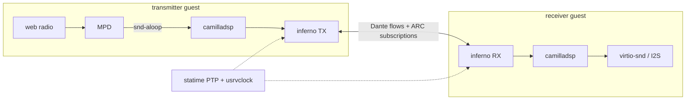

# virgilio — OpenWrt-style firmware for Dante/AES67 DSP speakers

*Virgil is the guide who leads Dante through the Inferno — this firmware is
what guides the [inferno] Dante stack inside an embedded speaker.*

A minimal Linux firmware for a Rockchip RK3506-class target (3× ARM
Cortex-A7 + NEON, 32-bit hard-float, musl), developed and validated in QEMU.
The system stack is OpenWrt's — procd as PID 1, ubus, uci, netifd, ubox —
built with Buildroot. On top of it runs the audio chain:



Status: **end-to-end validated on the bridge rig** — a source guest streams
MPD web radio as Dante flows to a sink guest that plays it on host audio,
both slaved to a native host-side PTP grand master. See `plan/plan.md`
(§10 decision log) for the full trail, including the fixed camilladsp
capture busy-poll (D16/D17).

## Quickstart

```sh
git clone --recursive <this-repo>
./scripts/build.sh                          # Buildroot build (~30-60 min)
# DEFCONFIG=<name>_defconfig ./scripts/build.sh   # other targets; each
# defconfig builds in its own output/<variant>/ dir (required for archs)

# bridge rig (docs/bridge-rig.md has the full walkthrough)
sudo scripts/qemu-bridge.sh up              # br-dante 198.18.100.254/24 + taps
~/.local/bin/statime-gm --config scripts/statime-gm.toml &   # see doc for build

./scripts/run-qemu.sh --net tap:tap0 --mac 00:11:22:33:44:55 --no-mgmt \
    --console telnet:5556 &                 # source guest
./scripts/run-qemu.sh --net tap:tap1 --mac 00:11:22:33:44:66 \
    --audio virtio-snd-pa --no-mgmt --console telnet:5557 &  # sink guest

# per docs/bridge-rig.md §4: configure uci on both, wait for PTP lock, then
mpc add <station-url> && mpc play && mpc repeat 1             # on source
scripts/dante-l2node.py --direct 198.18.100.254 subscribe \
    --to 198.18.100.2 --rx-host rk3506-source --map 1=01 --map 2=02
```

Login on the consoles: `root`, no password. QEMU runs with `-snapshot`;
test boots never modify the built image.

### EQ frontend watch mode

For EQ UI iteration without rebuilding the firmware image, start a slirp guest
with a telnet console on port 5557, then run:

```sh
scripts/webui/watch-eq.sh
```

This runs `vite build --watch`, exposes the generated UMD bundle on the host,
and copies every rebuilt `eq.umd.js.gz` into the running snapshot guest. Open
`http://127.0.0.1:18081/dsp/eq?eq-dev=1` to enable browser auto-reload after
each sync. The helper defaults can be overridden with `EQ_QEMU_CONSOLE_PORT`,
`EQ_WATCH_HTTP_PORT`, and `EQ_QEMU_HOST`.

## Layout

- `plan/` — the plan: `plan.md` (milestones, §10 decision log, §11 next up),
  focused plans (`tmpfs-var-sysinfo-state.md`, …)
- `buildroot/` — Buildroot (git submodule, 2025.02.x LTS)
- `deps/` — pinned application sources (git submodules: camilladsp, inferno,
  statime fork, …); local modifications live as patches in `br-external/`
- `br-external/` — Buildroot external tree:
  - `package/` — OpenWrt stack + apps (uci, procd, netifd, ubox, statime,
    inferno, camilladsp, …) with our patches; `virgilio-base` ships the
    generic base files (procd init/rc.d layout, functions glue, motd) and
    selects the uci/procd stack — app packages ship their own init scripts
    and uci defaults (overridable per board) — see `docs/dependency-map.md`
  - `board/common/` — device-independent post-build (module flattening,
    OpenWrt-style `/var → tmp` tmpfs layout)
  - `board/rk3506qemu/` — kernel/busybox fragments + board-specific rootfs
    overlay (network topology, asound.conf, FIR coeffs, mpd/aoip-bridge rig
    services, NIC fixup)
- `scripts/` — build/run/bridge helpers, `dante-l2node.py` (ARC/Dante
  subscription tool), `statime-gm.toml` (host grand master)
- `configs/` — reference camilladsp configs (crossover experiments)
- `results/` — test reports: dated milestone snapshots (`test-*.md`,
  rig era of their timestamp, not kept in sync) + measurements
- `docs/` — runbooks and component docs:

| doc | content |
|---|---|
| `docs/architecture.md` | **system overview**: boot chain, service model, stack roles |
| `docs/lifecycle.md` | **service lifecycle**: hotplug triggers, state table, failure timelines |
| `docs/patches.md` | **downstream patch inventory**: every patch stack, how each is applied, series discipline |
| `docs/bridge-rig.md` | **the** rig: host GM + tap bridge, full walkthrough |
| `docs/bridge-rig-hw-sink.md` | hw-sink rig variant (physical Dante device) |
| `docs/radio-over-dante.md` | mcast-tunnel rig variant, radio e2e recipe |
| `docs/camilladsp.md` / `docs/inferno.md` / `docs/alsa.md` | component docs + uci schemas |
| `docs/camilladsp-policy.md` | locked-config manifest / policy system |
| `docs/ptp-monitor.md` | usrvclock monitor, ubus object, hotplug policy |
| `docs/webui.md` | webui **user guide** (login, TLS, pages) |
| `docs/dependency-map.md` | package dependency relations |
| `docs/crossover-to-camilladsp.md` | speaker DSP crossover background |

## License

The repository's own files (build recipes, overlay, scripts, docs) are
licensed under **GPL-3.0-or-later** (see `LICENSE`). Files ported from
OpenWrt keep their original GPL-2.0 headers. The integrated upstream
projects retain their licenses: camilladsp (GPL-3.0-or-later), inferno
(GPL-3.0-or-later OR AGPL-3.0-or-later), statime (MIT OR Apache-2.0).

## Key facts

- Audio: 48 kHz lock end-to-end (MPD output resampler), S16_LE Dante flows,
  camilladsp chunksize 2048.
- PTP: statime (fork) with usrvclock export; host `statime-gm` grand master
  on the bridge; guests slave via `ptp-monitor` → ubus + hotplug policy.
- Dante subscriptions persist: uci `inferno.main.state_dir` (→ `INFERNO_STATE_PATH`,
  default `/opt/user_data`) → `inferno_aoip/<device-id>/rx_subscriptions.toml`.
- Volatile state is RAM-only (OpenWrt-style `/var → /tmp`), logs via logd.
