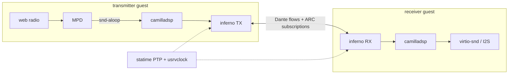
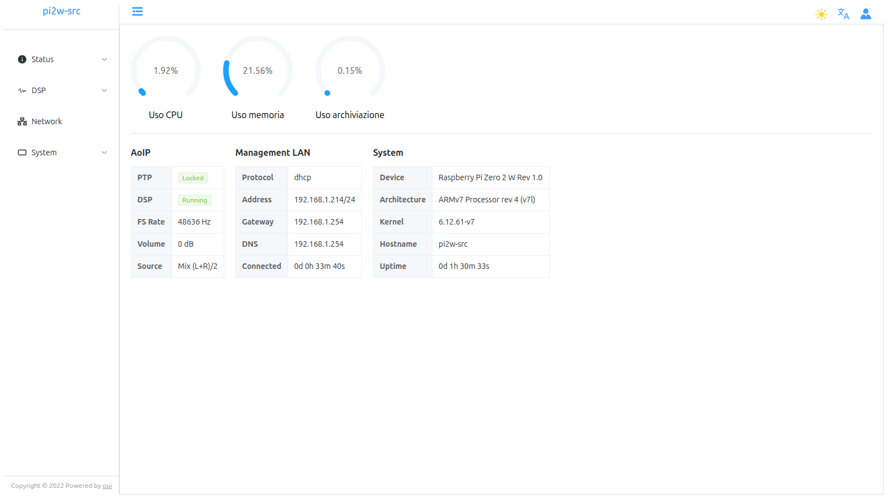
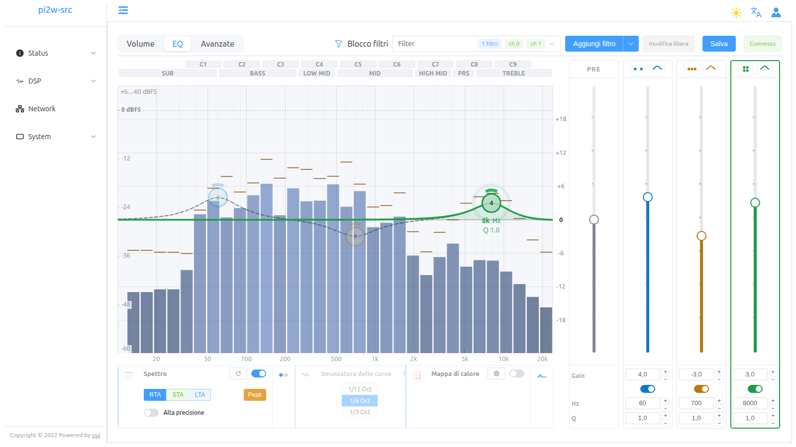
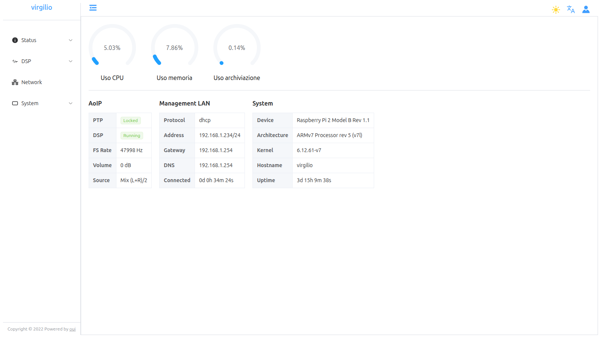
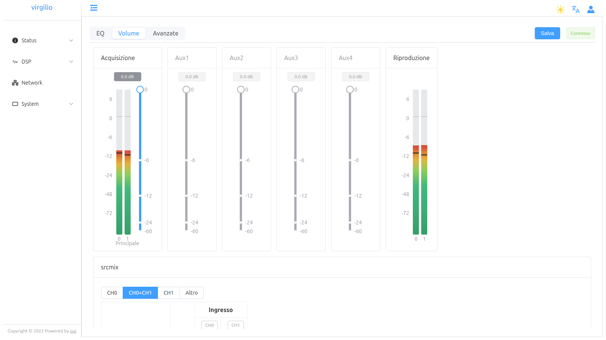
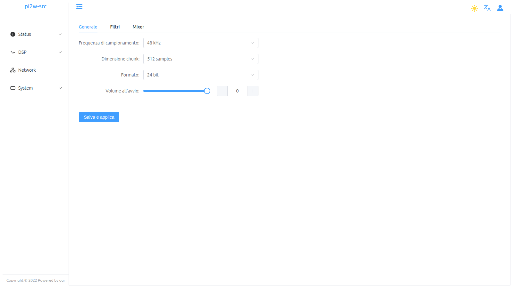
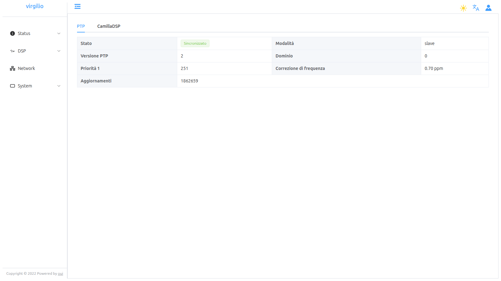

# virgilio — OpenWrt-style firmware for Dante/AES67 DSP speakers

*Virgil is the guide who leads Dante through the Inferno — this firmware is
what guides the [inferno] Dante stack inside an embedded speaker.*

A minimal Linux firmware for a Rockchip RK3506-class target (3× ARM
Cortex-A7 + NEON, 32-bit hard-float, musl), developed and validated in QEMU.
The system stack is OpenWrt's — procd as PID 1, ubus, uci, netifd, ubox —
built with Buildroot. On top of it runs the audio chain:



Status: **end-to-end validated on the bridge rig** — a source guest streams
MPD web radio as Dante flows to a sink guest that plays it on host audio,
both slaved to a native host-side PTP grand master. See `plan/plan.md`
(§10 decision log) for the full trail, including the fixed camilladsp
capture busy-poll (D16/D17).

## Screenshots

Running on hardware: a **source** (RPi Zero 2 W, `pi2w-src` — MPD →
camilladsp → inferno TX) and a **sink** (RPi 2 B, `virgilio` — inferno RX →
camilladsp → I2S). The built-in webui (nginx + ucode gateway + vendored
OUI frontend, see `docs/webui.md`):

| source — status | source — DSP live EQ + spectrum |
|---|---|
|  |  |

| sink — status | sink — Dante RX meters + source select |
|---|---|
|  |  |

| source — DSP configuration | sink — PTP slave status |
|---|---|
|  |  |

The DSP > Live page edits the pipeline in real time (EQ bands on the
plot, RTA spectrum through the DSP); *Save* persists the bands to uci
(constrained by the locked-config policy, `docs/camilladsp-policy.md`).

## Tested devices

| device | role | image | notes |
|---|---|---|---|
| Raspberry Pi Zero 2 W (Rev 1.0) | audio **source**: MPD → camilladsp → inferno TX | `virgilio_rpi02w_defconfig` (32-bit armv7) | RTL8153 USB-Ethernet dongle for the AoIP segment (r8152 + `rtl_nic` firmware, software timestamps); DHCP+zcip combined topology; PTP grand master standalone (`priority1 128`) or rig slave; squashfs read-only root |
| Raspberry Pi 2 Model B (Rev 1.1) | audio **sink**: inferno RX → camilladsp (protected 2-way xover) → analog jack | `virgilio_rpi2b_defconfig` (32-bit armv7) | validated as hw sink on the bridge rig (`docs/bridge-rig-hw-sink.md`); running on the LAN |
| QEMU `rk3506qemu` (3× Cortex-A7, virt) | development + rig target | `rk3506qemu_defconfig` | bridge rig, two-guest PTP, memory matrix, lifecycle validation (`docs/bridge-rig.md`) |
| QEMU `virgilio_srcqemu` | source-role guest | `virgilio_srcqemu_defconfig` | drop-in source for rig subscriptions |

## Current running chain (hardware, captured 2026-10-03)

- **`pi2w-src`** (192.168.1.214, Zero 2 W): MPD → `snd-aloop` →
  camilladsp (48 kHz · 24-bit · chunk 512) → inferno TX; PTPv2 slave,
  Locked; source select Mix (L+R)/2; volume 0 dB.
- **`virgilio`** (192.168.1.234, RPi 2 B): inferno RX →
  camilladsp (protected 2-way) → analog jack; PTPv2 slave, Locked,
  0.70 ppm correction; uptime 3 d+.
- Dante flows carry the uci-advertised depth (24-bit on the source,
  inferno patch `0003`); subscriptions persist across reboots
  (`inferno.main.state_dir`).

## Quickstart

```sh
git clone --recursive <this-repo>
./scripts/build.sh                          # Buildroot build (~30-60 min)
# DEFCONFIG=<name>_defconfig ./scripts/build.sh   # other targets; each
# defconfig builds in its own output/<variant>/ dir (required for archs)

# bridge rig (docs/bridge-rig.md has the full walkthrough)
sudo scripts/qemu-bridge.sh up              # br-dante 198.18.100.254/24 + taps
~/.local/bin/statime-gm --config scripts/statime-gm.toml &   # see doc for build

./scripts/run-qemu.sh --net tap:tap0 --mac 00:11:22:33:44:55 --no-mgmt \
    --console telnet:5556 &                 # source guest
./scripts/run-qemu.sh --net tap:tap1 --mac 00:11:22:33:44:66 \
    --audio virtio-snd-pa --no-mgmt --console telnet:5557 &  # sink guest

# per docs/bridge-rig.md §4: configure uci on both, wait for PTP lock, then
mpc add <station-url> && mpc play && mpc repeat 1             # on source
scripts/dante-l2node.py --direct 198.18.100.254 subscribe \
    --to 198.18.100.2 --rx-host rk3506-source --map 1=01 --map 2=02
```

Login on the consoles: `root`, no password. QEMU runs with `-snapshot`;
test boots never modify the built image.

### EQ frontend watch mode

For EQ UI iteration without rebuilding the firmware image, start a slirp guest
with a telnet console on port 5557, then run:

```sh
scripts/webui/watch-eq.sh
```

This runs `vite build --watch`, exposes the generated UMD bundle on the host,
and copies every rebuilt `eq.umd.js.gz` into the running snapshot guest. Open
`http://127.0.0.1:18081/dsp/eq?eq-dev=1` to enable browser auto-reload after
each sync. The helper defaults can be overridden with `EQ_QEMU_CONSOLE_PORT`,
`EQ_WATCH_HTTP_PORT`, and `EQ_QEMU_HOST`.

## Layout

- `plan/` — the plan: `plan.md` (milestones, §10 decision log, §11 next up),
  focused plans (`tmpfs-var-sysinfo-state.md`, …)
- `buildroot/` — Buildroot (git submodule, 2025.02.x LTS)
- `deps/` — pinned application sources (git submodules: camilladsp, inferno,
  statime fork, …); local modifications live as patches in `br-external/`
- `br-external/` — Buildroot external tree:
  - `package/` — OpenWrt stack + apps (uci, procd, netifd, ubox, statime,
    inferno, camilladsp, …) with our patches; `virgilio-base` ships the
    generic base files (procd init/rc.d layout, functions glue, motd) and
    selects the uci/procd stack — app packages ship their own init scripts
    and uci defaults (overridable per board) — see `docs/dependency-map.md`
  - `board/common/` — device-independent post-build (module flattening,
    OpenWrt-style `/var → tmp` tmpfs layout)
  - `board/rk3506qemu/` — kernel/busybox fragments + board-specific rootfs
    overlay (network topology, asound.conf, FIR coeffs, mpd/aoip-bridge rig
    services, NIC fixup)
- `scripts/` — build/run/bridge helpers, `dante-l2node.py` (ARC/Dante
  subscription tool), `statime-gm.toml` (host grand master)
- `configs/` — reference camilladsp configs (crossover experiments)
- `results/` — test reports: dated milestone snapshots (`test-*.md`,
  rig era of their timestamp, not kept in sync) + measurements
- `docs/` — runbooks and component docs:

| doc | content |
|---|---|
| `docs/architecture.md` | **system overview**: boot chain, service model, stack roles |
| `docs/lifecycle.md` | **service lifecycle**: hotplug triggers, state table, failure timelines |
| `docs/patches.md` | **downstream patch inventory**: every patch stack, how each is applied, series discipline |
| `docs/bridge-rig.md` | **the** rig: host GM + tap bridge, full walkthrough |
| `docs/bridge-rig-hw-sink.md` | hw-sink rig variant (physical Dante device) |
| `docs/radio-over-dante.md` | mcast-tunnel rig variant, radio e2e recipe |
| `docs/camilladsp.md` / `docs/inferno.md` / `docs/alsa.md` | component docs + uci schemas |
| `docs/camilladsp-policy.md` | locked-config manifest / policy system |
| `docs/ptp-monitor.md` | usrvclock monitor, ubus object, hotplug policy |
| `docs/webui.md` | webui **user guide** (login, TLS, pages) |
| `docs/dependency-map.md` | package dependency relations |
| `docs/crossover-to-camilladsp.md` | speaker DSP crossover background |

## Credits

This firmware stands on the shoulders of:

| project | role here |
|---|---|
| [OpenWrt](https://openwrt.org/) | the system stack: procd (PID 1 + hotplug), ubus, uci, netifd, ubox/logd, ucode — carried patchless where possible (`br-external/package/`) |
| [Buildroot](https://buildroot.org/) | cross-build framework (git submodule, 2025.02.x) |
| [CamillaDSP](https://github.com/HEnquist/camilladsp) | the DSP engine (crossovers, FIR, limiters) — carried as a patch stack (manifest policy, ubus, spectrum) |
| [inferno](https://github.com/teodly/inferno) | the unofficial Dante/AES67 AoIP implementation (TX/RX, ARC subscriptions) |
| [statime](https://github.com/teodly/statime) (fork of [pendulum-project/statime](https://github.com/pendulum-project/statime)) | PTP daemon + usrvclock media-clock export |
| [OUI](https://github.com/zhaojh329/oui) | the webui frontend shell (vendored + patched: shadow login, english-only, theme persistence); Vue + Element Plus underneath |
| [CamillaEQ](https://github.com/AlfredJKwack/camillaEQ) | biquad math reference for the live EQ editor (`filterResponse`, fractional-octave smoothing) |
| [ubus-zero](https://github.com/pawelchcki/ubus-zero) | Rust ubus client used by the camilladsp ubus integration |
| [MPD](https://www.musicpd.org/), [nginx](https://nginx.org/), [ALSA](https://www.alsa-project.org/), [busybox](https://busybox.net/) | audio source, web front, sound + core userland |

## License

The repository's own files (build recipes, overlay, scripts, docs) are
licensed under **GPL-3.0-or-later** (see `LICENSE`). Files ported from
OpenWrt keep their original GPL-2.0 headers. The integrated upstream
projects retain their licenses: camilladsp (GPL-3.0-or-later), inferno
(GPL-3.0-or-later OR AGPL-3.0-or-later), statime (MIT OR Apache-2.0).

## Key facts

- Audio: 48 kHz lock end-to-end (MPD output resampler), S16_LE Dante flows,
  camilladsp chunksize 2048.
- PTP: statime (fork) with usrvclock export; host `statime-gm` grand master
  on the bridge; guests slave via `ptp-monitor` → ubus + hotplug policy.
- Dante subscriptions persist: uci `inferno.main.state_dir` (→ `INFERNO_STATE_PATH`,
  default `/opt/user_data`) → `inferno_aoip/<device-id>/rx_subscriptions.toml`.
- Volatile state is RAM-only (OpenWrt-style `/var → /tmp`), logs via logd.
