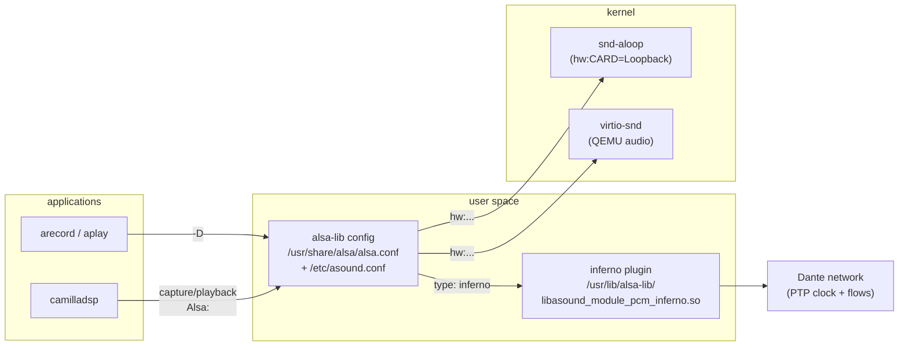

# ALSA in this firmware

Everything audio-related on the Linux side: how devices are named and
resolved, how the inferno virtual Dante device is configured, and how the
kernel sound devices (aloop, virtio-snd) fit in.



## Device names and config resolution

ALSA applications open a device by **name** (`arecord -D <name>`,
`camilladsp` uci `capture='Alsa:<name>'`). The name resolves through
alsa-lib's configuration:

1. `/usr/share/alsa/alsa.conf` — the base config (defines `default`,
   `hw:`, `plughw:`, …);
2. `/etc/asound.conf` — system-wide overrides and custom PCMs (ours lives
   here);
3. `~/.asoundrc` — per-user (not used on this firmware).

A name starting with `hw:`/`plughw:` addresses a kernel PCM directly;
anything else is a **named PCM** defined in the config files. This is why
camilladsp's `Alsa:inferno` and `arecord -D inferno` both end up in the
same place: both strings are passed to `snd_pcm_open()`, which resolves
them through the same config.

## The inferno ALSA plugin

`/usr/lib/alsa-lib/libasound_module_pcm_inferno.so` — a Rust `cdylib`
(`alsa_pcm_inferno` crate, internal name `asound_module_pcm_inferno`).
When a PCM definition says `type inferno`, alsa-lib loads this file
(`/usr/lib/alsa-lib/libasound_module_pcm_<type>.so` is the lookup rule)
and every setting key in the PCM definition is handed to the plugin.

### Where plugin settings come from (precedence!)

The plugin builds its settings from **three sources, first match wins**:

| Priority | Source | Example |
|---|---|---|
| 1 | keys in the PCM definition (`/etc/asound.conf` or explicit args) | `CLOCK_PATH "/tmp/ptp-usrvclock"` |
| 2 | environment of the *application*, with the `INFERNO_` prefix | `INFERNO_RX_CHANNELS=8 arecord …` |
| 3 | built-in defaults | 2 channels, 1 ms latency, … |

For camilladsp (priority 2) the env is set through its init script: add
`list env 'INFERNO_NAME=…'` entries to `config camilladsp 'main'` in
`/etc/config/camilladsp` — procd passes them to the daemon process, and
the plugin picks them up at the next open. Inline per-call settings use
the `inferno2` template instead (priority 1 via args).

This is the answer to *"why is the plugin not in uci?"*: the inferno uci
file only configures the `inferno2pipe` **daemon**, because uci has no way
to inject settings into arbitrary ALSA applications. Applications that
open the `inferno` PCM carry their settings themselves — either baked into
`/etc/asound.conf` (system-wide, effectively the "static" configuration)
or via their own environment (`INFERNO_*`, e.g. set by an init script or
on the command line).

Full settings reference (env names; drop the prefix for ALSA keys):
`BIND_IP`, `DEVICE_ID`, `NAME`, `SAMPLE_RATE`, `PROCESS_ID`, `ALT_PORT`,
`RX_CHANNELS`, `TX_CHANNELS`, `RX_LATENCY_NS`, `TX_LATENCY_NS`,
`CLOCK_PATH`, plus plugin-only `USE_SAFE_CLOCK` and
`TX_SOURCE_BIT_DEPTH` — see the inferno README (deps/inferno).

> Two environment variables are consumed before the first setting is
> read: `RUST_LOG` controls the plugin's own log spam (default `debug` —
> set `RUST_LOG=warn` for quiet operation), and note that with no
> `CLOCK_PATH` the plugin never delivers audio ("no clock available").

## `pcm.inferno` — the parameterless definition

```
pcm.inferno {
	type inferno
	CLOCK_PATH "/tmp/ptp-usrvclock"
	hint {
		show on
		description "Inferno Dante (AoIP) virtual capture device"
	}
}
```

Why it exists: `arecord -L` (device discovery) only lists PCMs **without
`@args`** that carry `hint { show on }`. Parameterized PCMs are invisible
to discovery. So the default device is deliberately fixed:

- `CLOCK_PATH` points at statime's usrvclock socket (mandatory for audio);
- everything else uses defaults or the application's `INFERNO_*` env;
- used as `arecord -D inferno` or `camilladsp` `capture='Alsa:inferno'`.

## `pcm.inferno2` — the parameterized definition

```
pcm.inferno2 {
	type inferno
	@args.NAME         { type string }
	@args.DEVICE_ID    { type string }
	@args.BIND_IP      { type string }
	… (one @args per setting)
	NAME $NAME
	DEVICE_ID $DEVICE_ID
	…
}
```

`@args` is alsa-lib's parameter mechanism: the PCM becomes a **template**
and callers pass values in the device string after a colon —
`<pcm>:<ARG>=<value>[:<ARG>=<value>…]`. Values are substituted where the
definition references `$<ARG>`, then handed to the plugin as normal
settings keys (priority 1 above).

All parameters (strings; unset ones become empty and fall back to
env/defaults):

| Arg | Setting | Meaning |
|---|---|---|
| `NAME` | `INFERNO_NAME` | advertised device name |
| `DEVICE_ID` | `INFERNO_DEVICE_ID` | 16 hex digits identity |
| `BIND_IP` | `INFERNO_BIND_IP` | IP or interface name |
| `SAMPLE_RATE` | `INFERNO_SAMPLE_RATE` | Hz |
| `PROCESS_ID` | `INFERNO_PROCESS_ID` | 0–65535, unique per instance |
| `ALT_PORT` | `INFERNO_ALT_PORT` | UDP port range start for multi-instance |
| `RX_CHANNELS` / `TX_CHANNELS` | `INFERNO_RX/TX_CHANNELS` | channel counts |
| `CLOCK_PATH` | `INFERNO_CLOCK_PATH` | usrvclock socket / PTP device |
| `RX_LATENCY_NS` / `TX_LATENCY_NS` | `INFERNO_RX/TX_LATENCY_NS` | flow latency |

Usage examples:

```sh
# 8-channel capture with an explicit clock path
arecord -D 'inferno2:RX_CHANNELS=8:CLOCK_PATH=/tmp/ptp-usrvclock' \
    -f S32_LE -r 48000 -c 8 -d 10 /tmp/rx8.wav

# an independent second device instance on the same host
arecord -D 'inferno2:NAME=rx2:PROCESS_ID=2:ALT_PORT=4700' …

# camilladsp capturing from a parameterized instance
uci set camilladsp.main.capture="Alsa:inferno2:RX_CHANNELS=2"
```

Caveat (upstream): very long device strings can be **truncated** by some
applications (noticed with PipeWire) — for anything beyond two or three
parameters prefer `/etc/asound.conf` keys or `INFERNO_*` env instead.

## Kernel sound devices

| Device | Module (autoloaded via `/etc/modules.d/audio`) | Use |
|---|---|---|
| `hw:CARD=Loopback,DEV=0/1` | `snd-aloop` | ALSA loopback pair; playback on DEV=0 reappears as capture on DEV=1 (same substream index). Test pipelines, camilladsp soak tests. |
| `hw:CARD=Loopback,DEV=1` → `DEV=0` | `snd-aloop` | Self-loop (aloop→aloop): silence-stable, exercises real ALSA timing on both sides. |
| virtio sound card | `virtio-snd` (QEMU `-device virtio-sound`) | Host audio backends: `none`, `wav` file capture, `pa` (see `run-qemu.sh --audio`). |

Typical chains:

```
inferno (Dante RX) → camilladsp → virtio-snd         (target pipeline, M5)
aloop DEV=1 → camilladsp → aloop DEV=0               (soak test, M3)
test.wav → camilladsp → aloop DEV=0 → … DEV=1 → …    (file-based tests)
```
