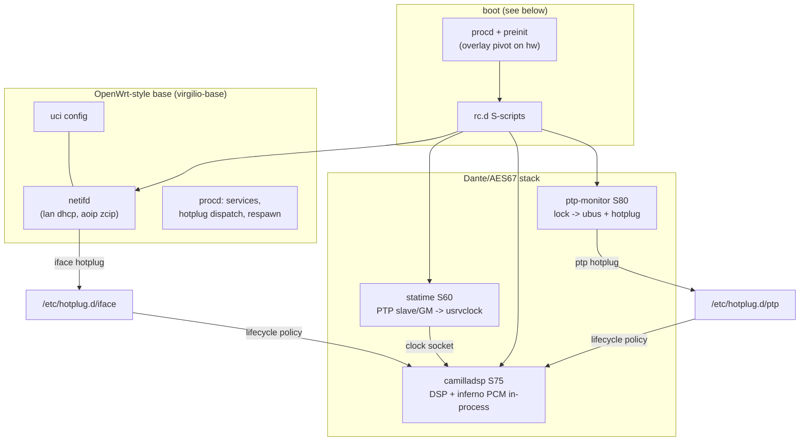

# System architecture

How the virgilio firmware works end-to-end: boot, the service model,
the audio/Dante stack, and how the pieces find each other. This is the
entry point of the documentation set — each section points into the
per-feature docs for depth.



## Boot chain

1. **kernel + init**: procd is PID 1; it first runs `/etc/preinit`.
2. **preinit**: sets the OpenWrt-style board identity
   (`/tmp/sysinfo/{board_name,model}`) and, on hardware, performs the
   production root pivot — a read-only squashfs root with a writable
   overlay on the data partition (`virgilio-data=<dev>` on the cmdline;
   `pivot_root` re-roots every process, the old root stays visible under
   `/rom`). QEMU dev targets skip the pivot and run a plain rw root.
   Details: `plan/squashfs-overlay-userdata.md`.
3. **rc.d**: `/etc/init.d/*` scripts run in `START` order via procd's
   rc — the relevant ladder:

   | seq | service | role |
   |---|---|---|
   | S00–S12 | sysfixtime, boot, system, sysctl, log | base bring-up, logd |
   | S20 | network | starts **netifd** (`lan` dhcp + `aoip`, see addressing below) |
   | S60 | statime | the PTP daemon; exports the media clock |
   | S75 | camilladsp | the DSP engine (hosts inferno in-process) |
   | S80 | ptp-monitor | lock detection → ubus + hotplug |
   | S95+ | done, (mpd), sysntpd | late rig/services |

   Boot starts the audio trio unconditionally; the **event-driven
   lifecycle** ([docs/lifecycle.md](lifecycle.md)) is the backstop that
   stops/starts them around link, address and clock reality.

## The service model (OpenWrt style, built with Buildroot)

- **procd** owns every daemon: init scripts declare instances
  (`procd_open_instance`), respawn policy, env; `service X start/stop`
  is the only sanctioned way to manage processes.
- **uci** (`/etc/config/*`) is the single configuration surface;
  component init scripts render uci into runtime config files under
  `/tmp` at every start (statime.toml, camilladsp.yml/policy/env) —
  nothing hand-edits generated files.
- **hotplug dispatch** is the event bus: netifd execs
  `/sbin/hotplug-call iface` on interface events; procd's inotify
  dispatcher exposes every `/etc/hotplug.d/<subsys>/` dir as a
  `hotplug.<subsys>` ubus object (used by ptp). Policy lives in the
  handlers, not in daemons.
- **ubus** is the runtime API surface (`ubus call ptp status`,
  camilladsp's status object); the webui talks to it through nginx +
  ucode RPC.
- **netifd + the addressing ladder**: `network.lan` (dhcp/static) is
  management; `network.aoip` is the Dante/PTP segment with
  `proto zcip` — an RFC 3927 link-local address is always claimed and
  ARP-defended, so the AoIP side is never addressless (standalone on a
  bare switch included). A global on the same netdev (lan, combined
  topology) is preferred by inferno; PTP multicast is address-agnostic.
  See [docs/inferno.md](inferno.md) §AoIP addressing.

## The audio/Dante stack

Roles (full detail in [docs/inferno.md](inferno.md)):

- **statime** (PTP, the inferno fork) disciplines a *virtual* clock and
  exports it on the **usrvclock** unix socket (`/tmp/ptp-usrvclock`)
  — while slaved to a master, plus 1 Hz while mastering (local patch).
- **inferno** is not a service: every application that opens the
  `inferno` ALSA PCM hosts a receiver/transmitter instance in-process.
  In this product that is camilladsp (capture/playback device type
  `Inferno`); `inferno2pipe` is a standalone debug tool.
- **camilladsp** runs the speaker DSP (crossover, EQ, mixer) with the
  pipeline generated from uci by `camilladsp-genconf`; an optional
  protected-pipeline policy/manifest locks vendor content
  ([docs/camilladsp-policy.md](camilladsp-policy.md)).
- **ptp-monitor** watches the usrvclock socket and reports lock state;
  it never manages services — lifecycle policy lives in the hotplug
  handlers ([docs/ptp-monitor.md](ptp-monitor.md),
  [docs/lifecycle.md](lifecycle.md)).

The media path, source → sink (the rig of `docs/bridge-rig.md`):

```
web radio ── MPD ── loopplay ─⇄── loopcap (snd-aloop)
   └─ camilladsp (DSP) ─ inferno TX (RTP/AES67 flows, clock = usrvclock)
          ~ ~ Dante/PTP segment (PTP clock distribution + mDNS/ARC) ~ ~
   └─ inferno RX ─ camilladsp (DSP) ─ I2S / virtio-snd ─ speakers
```

Everything is timed by the one PTP-derived media clock: 48 kHz flows,
S16_LE on the wire, camilladsp chunksize 2048.

## Configuration and control surfaces

| surface | what lives there |
|---|---|
| `/etc/config/{network,statime,inferno,camilladsp}` | uci — the whole product config |
| hotplug handlers (`/etc/hotplug.d/iface`, `/ptp`) | lifecycle policy: [docs/lifecycle.md](lifecycle.md) |
| webui (nginx + ucode + Vue apps) | operator UI; respects the camilladsp policy model for editable pipeline parts — [docs/webui.md](webui.md) |
| camilladsp websocket + ubus status | live DSP control/telemetry (`docs/camilladsp.md`) |
| `/opt/user_data` | persistent state (inferno subscriptions, filters, user configs) |

## Per-feature docs

| doc | covers |
|---|---|
| [docs/lifecycle.md](lifecycle.md) | the event-driven service lifecycle (this set's policy core) |
| [docs/inferno.md](inferno.md) | Dante stack: statime, inferno, clock chain, uci |
| [docs/camilladsp.md](camilladsp.md) / [docs/camilladsp-policy.md](camilladsp-policy.md) | DSP engine, pipeline uci, protection |
| [docs/alsa.md](alsa.md) | ALSA devices: the inferno PCM, aloop rig PCMs |
| [docs/ptp-monitor.md](ptp-monitor.md) | lock detection, ubus object, hotplug plumbing |
| [docs/bridge-rig.md](bridge-rig.md) | the validation rig (host GM + tap bridge) |
| [docs/dependency-map.md](dependency-map.md) | package layering and build deps |
