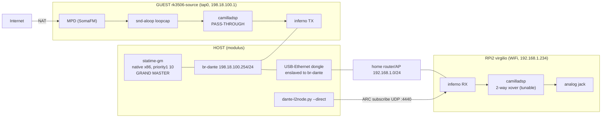

# Bridge rig with a real-hardware sink (RPi2 over WiFi)

Test rig used on 2026-09-28: a QEMU **source guest** streaming MPD web radio
as Dante flows to a **real RPi2** ("virgilio") connected over WiFi, for
validating the protected DSP pipeline on real silicon. Timing quality is
WiFi-bound (PTP over the AP) — fine for DSP-functionality tests, not for
glitch/latency measurements (use the all-QEMU rig in `bridge-rig.md` for
those).



## Where the grand master lives

On the **host** (`modulus`), as a native x86 process bound to `br-dante`:

```sh
~/.local/bin/statime-gm --config scripts/statime-gm.toml
```

- priority1 10 (wins BMCA against everything), identity `0011223344540001`,
  domain 0, PTPv2 over UDP (ipv4), virtual system clock (`monotonic_raw`).
- Both the source guest and the RPi2 run as pure slaves (priority1 251) and
  lock to it. Build/setup notes are in the header of `scripts/statime-gm.toml`.

## Current configuration (as left at end of session)

**Host**
- `br-dante` 198.18.100.254/24 + `tap0`/`tap1` + NAT for 198.18.100.0/24
  (`scripts/qemu-bridge.sh up`).
- USB-Ethernet dongle `enx0c37963a7764` (RTL8153), NetworkManager-unmanaged,
  **enslaved to br-dante**: this merges the rig LAN with the home LAN
  192.168.1.0/24 at L2, so the WiFi-attached RPi2 is L2-adjacent to the guest.
- **bridge multicast_snooping = 0** (critical, see gotchas).
- Host management/internet via WiFi `wlp1s0` (192.168.1.231).
- Guest runs in tmux session `srcguest`, telnet console on `127.0.0.1:5556`.

**Source guest** (`rk3506-source`, image `output/rk3506qemu`)
- `network.aoip`: static 198.18.100.1/24, gw 198.18.100.254, dns 9.9.9.9.
- statime + inferno on `eth0` (single-NIC, `--no-mgmt` + S05 fixup).
- camilladsp: `capture Alsa:loopcap` → **pass-through pipeline** (single
  `gain 0` filter on channels 0+1 — genconf requires at least one step) →
  `playback Inferno`, 48 kHz, S24_3_LE (24-bit wire flows, see "32 vs 24"
  below), chunksize 2048. No policy/manifest:
  the package default ships the protected 2-way pipeline on ALL boards, so
  the xover was stripped here to avoid filtering twice.
- MPD on `/opt/user_data/mpd/` (create `music/` + `playlist/` by hand in the
  QEMU image), playing `https://ice1.somafm.com/groovesalad-128-mp3`,
  `mpc repeat on`.

**RPi2 sink** (`virgilio`, 192.168.1.234 via DHCP on WiFi)
- Single-NIC dual role: `lan` (dhcp) + `aoip` (proto none) both on eth0.
- On-link route (NOT persistent, re-add after every reboot):
  `ip route add 198.18.100.0/24 dev eth0`
- camilladsp: `capture Inferno` → full 2-way chain → `playback Alsa:speaker`.
  Currently the **unprotected variant** for tuning: all `option policy`
  deleted from uci, `user_in0/1` converted to real Filter steps with
  `user_slot_in0/1` (gain 0) placeholder filters, and the stale
  `/tmp/camilladsp.policy` + `/tmp/camilladsp.manifest` removed. Protected
  config backup: `/etc/config/camilladsp.protected.bak`.
- Subscription (RX ch 1,2 ← TX 01,02 of rk3506-source), issued from the host:
  ```sh
  scripts/dante-l2node.py --direct 198.18.100.254 subscribe \
      --to 192.168.1.234 --rx-host rk3506-source --map 1=01 --map 2=02
  # success: ARC reply ... 0001 (CODE_OK); --remove unsubscribes
  ```

## Replication, step by step

```sh
# HOST (root parts need sudo; the tool/shell cannot prompt)
sudo scripts/qemu-bridge.sh up
sudo nmcli dev disconnect enx0c37963a7764 && sudo nmcli dev set enx0c37963a7764 managed no
sudo ip link set enx0c37963a7764 master br-dante && sudo ip link set enx0c37963a7764 up
sudo sh -c 'echo 0 > /sys/class/net/br-dante/bridge/multicast_snooping'   # see gotchas

# grand master
~/.local/bin/statime-gm --config scripts/statime-gm.toml &

# source guest (detached, console on telnet 5556)
tmux new-session -d -s srcguest \
  "./scripts/run-qemu.sh --net tap:tap0 --mac 00:11:22:33:44:55 --no-mgmt \
   --console telnet:5556 2>&1 | tee /tmp/opencode/src-guest.log"
telnet 127.0.0.1 5556   # root, no password
```

Guest console (uci once per boot, `-snapshot` discards it):

```sh
uci -q batch <<'EOF'
set system.@system[0].hostname='rk3506-source'
set network.aoip.device='eth0'
set network.aoip.proto='static'
set network.aoip.ipaddr='198.18.100.1'
set network.aoip.netmask='255.255.255.0'
set network.aoip.gateway='198.18.100.254'
set network.aoip.dns='9.9.9.9'
set statime.main.interface='eth0'
set inferno.main.interface='eth0'
set camilladsp.main.enabled='1'
set camilladsp.main.capture='Alsa:loopcap'
set camilladsp.main.playback='Inferno'
set camilladsp.main.channels='2'
set camilladsp.main.output_channels='2'
set camilladsp.main.samplerate='48000'
set camilladsp.main.chunksize='2048'
set camilladsp.main.format='S24_3_LE'   # TX wire depth: 24-bit (see "32 vs 24")
commit system
commit network
commit statime
commit inferno
commit camilladsp
EOF
hostname rk3506-source
mkdir -p /opt/user_data/mpd/music /opt/user_data/mpd/playlist
/etc/init.d/network restart; service statime restart
# wait: ubus call ptp status -> "locked": true, "mode": "slave"  (NOT master!)
# then strip the default protected pipeline to a pass-through:
cat > /etc/config/camilladsp <<'EOF'
config camilladsp 'main'
	option enabled '1'
	option port '5000'
	option ws_address '0.0.0.0'
	option logspec 'warn,camillalib::alsa_backend::device=warn'
	option samplerate '48000'
	option channels '2'
	option chunksize '2048'
	option format 'S24_3_LE'
	option capture 'Alsa:loopcap'
	option playback 'Inferno'
	option gain '0'

config filter 'bypass'
	option type 'gain'
	option gain '0'

config pipeline_step 'bypass_step'
	option type 'Filter'
	list channels '0'
	list channels '1'
	list names 'bypass'

config pipeline
	list step 'bypass_step'
EOF
rm -f /tmp/camilladsp.policy /tmp/camilladsp.manifest
service mpd enable; service mpd start
service camilladsp restart
ip route add 192.168.1.0/24 dev eth0      # mirror on-link route (direct RTP)
```

RPi2 (serial console / ssh):

```sh
ubus call ptp status        # must be slave + locked to the host GM
ip route add 198.18.100.0/24 dev eth0
# if camilladsp was started while the RPi2 was still lone master, restart it
# BEFORE subscribing (see gotchas). If switching protection off, also:
#   rm -f /tmp/camilladsp.policy /tmp/camilladsp.manifest
service camilladsp restart; pidof camilladsp
```

Host: subscribe + play + verify:

```sh
scripts/dante-l2node.py --direct 198.18.100.254 subscribe \
    --to 192.168.1.234 --rx-host rk3506-source --map 1=01 --map 2=02
# guest console: mpc add https://ice1.somafm.com/groovesalad-128-mp3
#                mpc repeat on && mpc play
# RPi2: ubus call camilladsp status   -> state Running, capture_rate ~48000,
#       buffer_level > 0
#       logread | grep -ci xrun       -> 0
#       cat /proc/asound/card0/pcm0p/sub0/status -> RUNNING
```

## 32 vs 24 (boundary format vs wire depth)

Two different "bit depths" coexist and must not be confused:

- **ALSA boundary** (`uci format` for file devices): the inferno plugin
  exposes S32 only — camilladsp opens it as S32 whatever the uci says,
  and alsa-lib shifts at the boundary for anything else. A mismatch
  works (padding/truncation), it never fails.
- **Dante wire depth** (TX only): since inferno patch
  `0003-bits-per-sample-configurable`, genconf maps the same `format`
  option to `INFERNO_TX_BITS_PER_SAMPLE` when playback is `Inferno` —
  `S16_LE` ⇒ 16, 24-bit spellings ⇒ 24, `S32_LE` ⇒ 32, unset ⇒ 24. That
  is the depth this box **advertises and packs** as a transmitter. On the
  wire it shows up as packet size: 2ch/48k ≈ 201 B/packet at 24-bit,
  ~134 B at 16, ~268 B at 32 (same fpp).
- The **RX side is never configured**: the RPi2 sink subscribes and
  unpacks whatever the source advertises (`flows_rx.rs` picks
  S16/S24/S32 readers per flow). Its own `format` option is purely the
  (unused, playback being `Alsa`) boundary declaration — set to `S32_LE`
  in the shipped overlay for a shift-only chain, a wire no-op.

## Gotchas found the hard way (2026-09-28 session)

1. **Bridge multicast snooping eats PTP/mDNS**: with
   `multicast_snooping=1` (default) and no querier, the guest never hears
   the GM and stays `mode: master` — and the RPi2 never leaves lone-master.
   Symptom: flows subscribe but time out, or nothing locks. Always set it
   to 0 for the session.
2. **On-link routes, both directions**: neither the home router nor the
   guests know the other subnet. RPi2 needs
   `ip route add 198.18.100.0/24 dev eth0` (lost at every reboot), guest
   needs `ip route add 192.168.1.0/24 dev eth0`. Without them the
   flows_control request dies with `failed to request flow ... TimedOut`
   while ping/ARC (host-relayed) still work.
3. **Sink clock epoch**: the PTP hotplug only fires on unlocked→locked. When
   the RPi2 flips lone-master→slave without unlocking, its camilladsp keeps
   the old clock epoch — flows get created but no media is accepted
   (`flow index=0 timeout (not receiving media packets)` → orphan loop).
   Restart the sink camilladsp BEFORE subscribing. After subscribing, never
   restart it: remove + re-issue the subscription instead.
4. **First flow request can race** (request → handle → 13 s media timeout →
   orphan). inferno re-resolves on its own; re-firing the ARC subscribe
   speeds it up.
5. **NetworkManager collateral**: unmanaging the dongle can drop the WiFi
   IPv4 routes (address stays, routes vanish). Fix:
   `sudo nmcli device reconnect wlp1s0`.
6. **MPD DNS failure = silence, not an error state**: `mpc status` showed
   `[playing]` while decoding had failed with "Could not resolve host".
   Check `logread | grep mpd` and re-run `mpc play` once the guest has
   internet.
7. **genconf always needs a pipeline**: an empty uci (no `config pipeline`)
   fails validation ("pipeline order missing"). Use the single `bypass`
   gain-0 step for a pass-through source.
8. **Unprotecting at runtime**: protection = `option policy` in uci +
   `/tmp/camilladsp.policy` + `--manifest`. Stripping policies in uci is not
   enough if a stale `/tmp/camilladsp.policy` from a protected start exists
   ("manifest generation failed, config kept" and the service never starts).
   `rm -f /tmp/camilladsp.policy /tmp/camilladsp.manifest` too. Policy-only
   user slots (`user_in*` without `option type`) are rejected in unprotected
   mode: give them `type Filter` + concrete filter names.
9. **Package default ships the protected pipeline everywhere** — including
   the QEMU source guest. Strip it on the source or you cascade the
   crossover twice (once source, once sink).
10. **Process hygiene from the tooling**: `pkill -f qemu-system-arm` matches
    the invoking shell itself (hangs the terminal); use `pkill -x
    qemu-system-arm`. Long-lived guests belong in tmux, not in the tool's
    process tree.
11. **camilladsp 0004 ubus fix**: the ubus status-object thread used to
    spin `poll_one()` (non-blocking) at ~1.3 cores; fixed by parking in
    `wait_recv()` (patch 0004, image ≥ 2026-09-28 12:17). Idle CPU of the
    whole engine is now a few percent on the Pi2.

## Teardown

```sh
tmux kill-session -t srcguest        # or poweroff in the guest console
pkill -f statime-gm
sudo ip link set enx0c37963a7764 nomaster
sudo scripts/qemu-bridge.sh down
sudo nmcli dev set enx0c37963a7764 managed yes && sudo nmcli dev connect enx0c37963a7764
```
