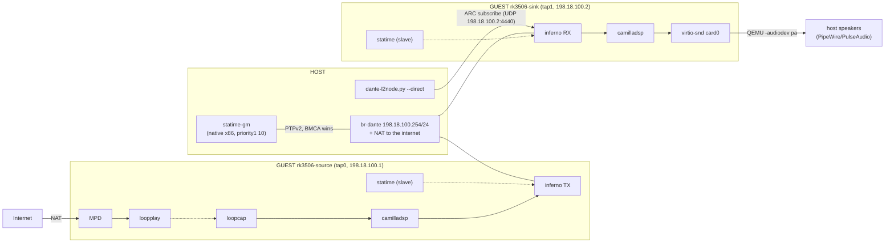

# Bridge rig — glitch-free radio over Dante (host grand master)

The preferred rig: a **native x86 statime grand master** on a host bridge, two
single-NIC guests on taps, everyone slaving to the host clock. This removes
the two big rig noise sources of the mcast-tunnel setup (translated QEMU
master + UDP tunnel, see plan D14/D15) — measured result: playback without
glitches.



All addresses on **198.18.100.0/24** (RFC 2544 benchmark range — never
collides with real LANs/VPN except Cloudflare-WARP-style clients).

## One-time host preparation

```sh
# 1. build the native grand master (~1 min; recipe + fork quirks in the
#    file header)
git -C deps/statime submodule update --init --recursive
(cd deps/statime && CARGO_TARGET_DIR=/tmp/opencode/statime-target \
   cargo build --release --bin statime)
cp /tmp/opencode/statime-target/release/statime ~/.local/bin/statime-gm
# 2. let it bind PTP port 319 (UDP <1024) — MUST be on a home path,
#    file capabilities are ignored on /tmp (nosuid)
sudo setcap cap_net_bind_service,cap_net_admin+ep ~/.local/bin/statime-gm
```

## Bring-up (each session)

```sh
# 0. clean stale guests
pgrep -af qemu-system-arm          # kill leftovers

# 1. bridge + taps + NAT (root, idempotent)
sudo scripts/qemu-bridge.sh up

# 2. host grand master
~/.local/bin/statime-gm --config scripts/statime-gm.toml &

# 3. guests, one terminal each (console = that terminal)
./scripts/run-qemu.sh --net tap:tap0 --mac 00:11:22:33:44:55 --no-mgmt
./scripts/run-qemu.sh --net tap:tap1 --mac 00:11:22:33:44:66 \
    --audio virtio-snd-pa --no-mgmt
```

Background alternative: append `--console telnet:5556` / `:5557` and attach
with `telnet 127.0.0.1 PORT` any time.

### 4. Guest configuration (single NIC — mind the eth0 caveat)

With `--no-mgmt` the lone tap enumerates as **eth0** (not eth1). Since the
image ships `single-nic-fixup` (S05) this is handled automatically at boot
(lan → none, aoip/statime/inferno → eth0); on older images set it by hand
per the uci blocks below.

Source:

```sh
hostname rk3506-source
uci set system.@system[0].hostname='rk3506-source'
uci set network.aoip.device='eth0'
uci set network.aoip.proto='static'
uci set network.aoip.ipaddr='198.18.100.1'
uci set network.aoip.netmask='255.255.255.0'
uci set network.aoip.gateway='198.18.100.254'
uci set network.aoip.dns='9.9.9.9'
uci set statime.main.interface='eth0'
uci set inferno.main.interface='eth0'
uci set camilladsp.main.capture='Alsa:loopcap'
uci set camilladsp.main.playback='Inferno'
uci set camilladsp.main.channels='2'
uci set camilladsp.main.output_channels='2'
uci set camilladsp.main.samplerate='48000'
uci set camilladsp.main.chunksize='2048'
uci set camilladsp.main.format='S16_LE'
uci commit
/etc/init.d/network restart
service statime restart
```

Sink:

```sh
hostname rk3506-sink
uci set system.@system[0].hostname='rk3506-sink'
uci set network.aoip.device='eth0'
uci set network.aoip.proto='static'
uci set network.aoip.ipaddr='198.18.100.2'
uci set network.aoip.netmask='255.255.255.0'
uci set network.aoip.gateway='198.18.100.254'
uci set network.aoip.dns='9.9.9.9'
uci set statime.main.interface='eth0'
uci set inferno.main.interface='eth0'
uci set camilladsp.main.capture='Inferno'
uci set camilladsp.main.playback='Alsa:default'
uci set camilladsp.main.samplerate='48000'
uci set camilladsp.main.chunksize='2048'
uci set camilladsp.main.format='S16_LE'
uci commit
/etc/init.d/network restart
service statime restart
```

No `priority1` needed anywhere — the host GM (10) rules BMCA; every guest is
a pure slave, which is exactly what killed the "loaded master poisons all"
failure mode. The sink captures the **inferno PCM directly**
(`capture='Inferno'`, S16_LE): since the camilladsp package patch
`0001-capture-use-poll-descriptors-revents.patch` makes
`FileDescriptors::wait` translate events through
`snd_pcm_poll_descriptors_revents`, the capture thread sleeps properly
(plan D17; ~850 R-state → ~52 S-state ticks/8 s). **Fallback**: if the
patch is ever dropped, enable the `aoip-bridge` service (S96, disabled by
default) and set `capture='RawFile:/tmp/aoip.fifo'` `format='S32_LE'` —
a kernel FIFO bridge that sidesteps the userspace PCM entirely (~38
ticks/8 s). camilladsp starts via the ptp hotplug within ~60 s of locking
(or `service camilladsp start` after checking the lock):

```sh
ubus call ptp status        # both guests: "locked": true, "mode": "slave"
```

> **RULE**: never restart the sink's camilladsp once subscribed — remove and
> re-issue the subscription instead (see below).

### 5. Subscribe + radio

```sh
# host — plain UDP via the bridge address (no tunnel, no raw L2)
scripts/dante-l2node.py --direct 198.18.100.254 subscribe \
    --to 198.18.100.2 --rx-host rk3506-source --map 1=01 --map 2=02
# success: "ARC reply ... 0001" (CODE_OK); --remove unsubscribes

# source console — radio with auto-reconnect
mpd-ctl load radio && mpd-ctl repeat 1
```

### 6. Verify

```sh
# sink console: playback streaming to the host sound server
cat /proc/asound/card0/pcm0p/sub0/status   # RUNNING, hw_ptr advancing ~48k/s
logread | grep -ci xrun                    # stay at 0
# sink lock quality (under load expect gentle wobble, no kalman resets)
logread | grep -c "too far from state"     # must stop growing
```

## How to connect to the guests

| target | how | notes |
|---|---|---|
| guest console | the terminal running `run-qemu.sh`, or `telnet 127.0.0.1 5556/5557` with `--console telnet:PORT` | serial console, root, no login |
| camilladsp (source) | `ws://198.18.100.1:5000` from the host | no `--fwd` needed — host is adjacent; camillagui backend → this URL |
| camilladsp (sink) | `ws://198.18.100.2:5000` from the host | same |
| MPD control | guest console: `mpd-ctl ...` | MPD binds 127.0.0.1 only (by design) |
| ARC subscriptions | `dante-l2node.py --direct 198.18.100.254 subscribe ...` | host tool |
| guest → internet | automatic via `198.18.100.254` NAT | MPD radio, wget, etc. |
| host → guest shell-less checks | `ping 198.18.100.1`, `curl 198.18.100.1:5000/...` | no sshd in the guests |

## Teardown

```sh
# guests: poweroff in each console (or kill the QEMU processes)
# host GM:
pkill -f statime-gm
# bridge (root):
sudo scripts/qemu-bridge.sh down
```

## Notes

- Measured on this rig: raw offsets ±1 ms collapse to tens–400 µs when a
  guest is idle; the residual wobble under load is the guest's own software
  RX timestamps under TCG (D15) — gentle corrections, zero xruns, glitch-free
  playback. On real silicon this vanishes (µs-class, or load-independent
  with the RK3506 dwmac PTP hardware clock).
- The mcast-tunnel rig (`docs/radio-over-dante.md`) still works and stays
  rootless — keep it for multi-guest topologies beyond two taps or when
  sudo isn't available.
