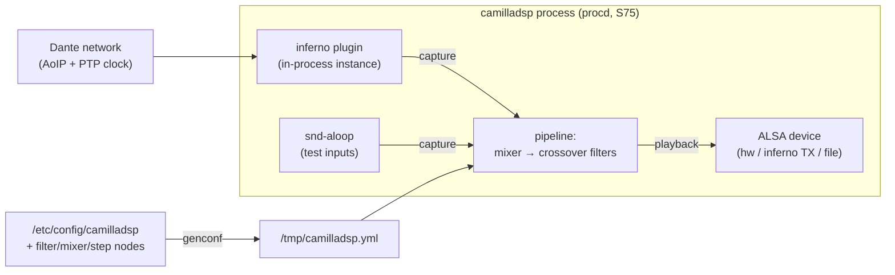
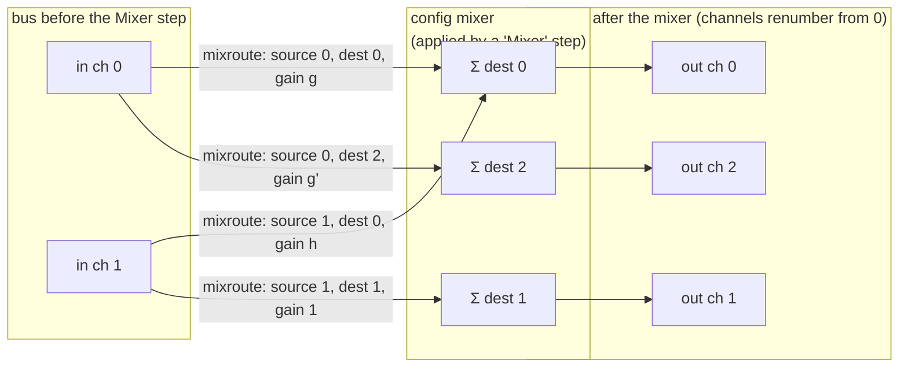
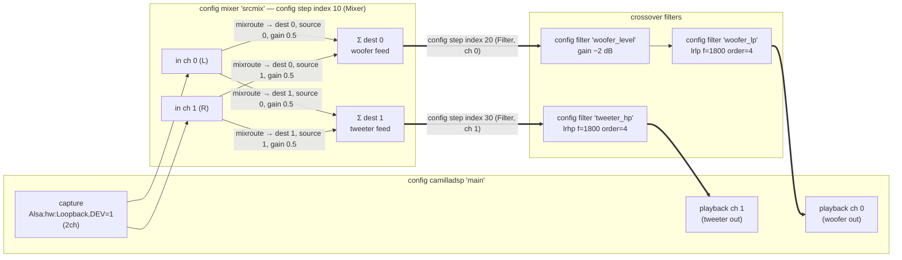

# camilladsp — the DSP engine

[CamillaDSP](https://github.com/HEnquist/camilladsp) is the audio
processing engine of this firmware: it captures audio (Dante via the
inferno plugin, ALSA loopback, files), applies the speaker pipeline
(source routing mixer, active crossover filters, future EQ) and plays it
out. This page is the complete reference — package, runtime behaviour and
the UCI configuration.

Related pages: [inferno](inferno.md) (Dante/clock side),
[alsa](alsa.md) (device resolution, plugin settings precedence),
[crossover analysis](crossover-to-camilladsp.md) (real filter design).

## Role in the firmware



- **procd service** `/etc/init.d/camilladsp` (`START=75`, after statime's
  S60; respawn; stdout/stderr → `logread`).
- At every start the init script runs `/usr/bin/camilladsp-genconf`,
  which renders `/tmp/camilladsp.yml` (pipeline) and
  `/tmp/camilladsp.env` (`INFERNO_*` settings for `Inferno` devices) from
  uci.
- **Websocket control** on `0.0.0.0:<port>` (default 5000, forwarded to
  the host in `run-qemu.sh`) — the future web UI reads/edits the running
  pipeline here (EQ between mixer and crossover).
- **Config reload** without restart: `service camilladsp reload`
  regenerates the config and sends SIGHUP (procd); camilladsp applies new
  settings without interrupting processing when possible. NB: FIR
  coefficient files are cached by *filename* — to update coefficients,
  change the path (or use `restart`).

## Package and build

| | |
|---|---|
| Version | v4.1.3 pin (`05e9cfc`), git |
| Features | default (`websocket`) + `32bit` (float32 processing — recommended on 32-bit CPUs); ALSA backend always built on Linux |
| Toolchain | Buildroot cargo infra, rustc ≥ 1.90; target `armv7-unknown-linux-musleabihf` |
| CPU tuning | `RUSTFLAGS -C target-cpu=cortex-a7 -C target-feature=+neon` (the armv7 rust target does **not** enable NEON by default); dynamic musl linking (`-crt-static`) |
| Vendoring | disabled (no `Cargo.lock` in the tag → network build) |
| Binary | `/usr/bin/camilladsp`, ~5.6 MB stripped; **RSS ≈ 5.4 MB** running a live pipeline (M3/M5.5 datapoint) |
| License | GPL-3.0 or MPL-2.0 |

## Version-4 API notes (learned the hard way)

- the config file is a **positional** argument (`camilladsp FILE`);
  `-c` is short for `--check`, *not* "config";
- playback file devices are a single `File` type (`format` +
  `wav_header`); there is **no Null device** — use
  `RawFile:/dev/zero` → `File:/dev/null` for idle pipelines;
- sample formats are `S16_LE` / `S24_4_RJ_LE` / `S24_4_LJ_LE` /
  `S24_3_LE` / `S32_LE` / `F32_LE` / `F64_LE`;
- the websocket port/address are CLI-only (`-p`, `-a`);
- filters: `Gain` (dB, `inverted`/`mute`), `Biquad` (HP/LP/shelf/peak/
  notch/allpass), `BiquadCombo` (LinkwitzRiley/Butterworth HP/LP with
  order, Tilt, 5-point PEQ, graphic EQ), `Conv` (raw/wav coefficients),
  `Delay`, `Volume` (fader-based), `Loudness`, `Dither`.

## UCI configuration

Apply changes:

```sh
uci set camilladsp.main.<key>='<value>'
uci commit camilladsp
service camilladsp reload       # regen config + SIGHUP, no process restart
```

`reload` regenerates `/tmp/camilladsp.yml` and signals the daemon (SIGHUP via
procd): camilladsp applies the new settings without interrupting processing
when possible; device changes (e.g. capture/playback/samplerate) restart the
processing internally but keep the same process/PID.
Use `service camilladsp restart` for a full stop/start (new PID).

> **FIR caveat**: FIR coefficients are cached by filename. Updating the
> *contents* of a conv filter's `filename` is not picked up by reload — point
> it to a different path (or use restart).

### Keys (`config camilladsp 'main'`)

| Key | Default | Description |
|---|---|---|
| `enabled` | `1` | `0` = init script does nothing at boot. |
| `port` | `5000` | Websocket control port (bound on 0.0.0.0; CLI `-p`). |
| `logspec` | `warn,camillalib…=error` | flexi_logger spec passed as `--custom_log_spec` (camilladsp ignores `RUST_LOG`). Default silences the inferno PCM short-read warnings. |
| `samplerate` | `44100` | Pipeline sample rate (Hz). |
| `channels` | `2` | Capture channel count. |
| `output_channels` | *(= channels)* | Playback channel count (set when the chain changes the count, e.g. a mixer). |
| `chunksize` | `1024` | Processing block size in frames. |
| `format` | `S16_LE` | Sample format for `RawFile`, `File`, `Stdin`, `Stdout`. One of: `S16_LE`, `S24_4_RJ_LE`, `S24_4_LJ_LE`, `S24_3_LE`, `S32_LE`, `F32_LE`, `F64_LE`. |
| `wav_header` | `1` | For `File` playback: write a WAV header (`1`) or raw (`0`). |
| `capture` | `Inferno` | Capture device spec (below). |
| `playback` | `File:/dev/null` | Playback device spec (below). |
| `env` *(list)* | *(empty)* | Extra environment variables for the daemon (`KEY=VALUE`, no spaces). Intended for `INFERNO_*` settings consumed by the inferno ALSA plugin when capture/playback is `Alsa:inferno*` — e.g. `INFERNO_NAME`, `INFERNO_RX_CHANNELS`, `INFERNO_BIND_IP` (see docs/alsa.md). |

### Chain nodes

The audio chain is a generic directed pipeline built from uci sections; no
special modes. With no nodes, capture passes straight to playback.

### `config filter` — one filter node

| Option | Description |
|---|---|
| `name` | Filter name (referenced from steps; must be unique). |
| `type` | One of the types below. |
| `f` | Frequency (Hz). |
| `q` / `order` / `slope` | Shape parameter, per type. |
| `gain` | Level in dB (gain/shelf/peak types). |
| `inverted`, `mute` | `1` = set (gain type only). |
| `filename` | Coefficient file, text one per line (conv type). |

| `type` | camilladsp filter | Needs | Defaults |
|---|---|---|---|
| `gain` | Gain | `gain` | — |
| `conv` | Conv (Raw TEXT) | `filename` | — |
| `hp` / `lp` | Biquad High/Lowpass | `f` | `q=0.707` |
| `lrhp` / `lrlp` | BiquadCombo LinkwitzRiley HP/LP | `f` | `order=4` |
| `hs` / `ls` | Biquad High/Lowshelf | `f`, `gain` | `q=0.707` or give `slope` |
| `peak` | Biquad Peaking | `f`, `gain` | `q=1.0` |
| `notch` / `ap` | Biquad Notch / Allpass | `f` | `q=0.707` |

### `config mixer` + `config mixroute` — routing matrix

A `mixer` node (`name`, `in`, `out`) transforms `in` channels into `out`
channels. Each `mixroute` section is one contribution: `option mixer` (which
mixer), `dest` (output channel), `source` (input channel), `gain` (**linear**,
default 1.0), optional `inverted`/`mute` (`1`). Several mixroutes with the
same `dest` sum into that output. Unrouted outputs are silent.

Per sample the mixer computes:

```
out[dest][n] = Σ over routes → dest   route.gain · in[route.source][n] · (route.inverted ? -1 : 1) · (route.mute ? 0 : 1)
```

Routing recipes: **L** = source 0 gain 1; **R** = source 1 gain 1;
**Mix** = two mixroutes to the same dest, source 0 + source 1, gain 0.5 each.

Generic model (a 2-in / 3-out mixer; each arrow = one `config mixroute`):



Notes:

- mixer `gain` is **linear** (0.5 = −6 dB), unlike filter `gain` which is in dB;
- a `Mixer` step **renumbers the bus**: following `Filter` steps address the
  mixer's *output* channels;
- a mixer with `out` &lt; `in` downmixes, `out` &gt; `in` upmixes/routes to
  more ways (e.g. one mixer feeding woofer + tweeter + a future sub);
- set `option output_channels` in `main` to the mixer `out` when the playback
  channel count differs from the capture count.

### `config step` — pipeline steps

| Option | Description |
|---|---|
| `index` | Execution order (sorted numerically; gaps fine). |
| `type` | `Filter` or `Mixer`. |
| `channels` (list, Filter) | Input channels of the step. Omit = all. |
| `names` (list, Filter) | Filters applied **in series** to those channels. |
| `name` (Mixer) | Which mixer node to apply. |

The future web UI inserts EQ etc. at runtime via websocket as additional
Filter steps between the routing mixer and the crossover — the static UCI
chain below is the base audio path.

### Example — 2-way speaker (stereo in → Mix → LR4 crossover @1.8 kHz)

Signal flow, annotated with the UCI nodes that produce each part:



Rendered `/etc/config/camilladsp`:

```
config camilladsp 'main'
	option enabled '1'
	option port '5000'
	# flexi_logger spec (--custom_log_spec); default silences the inferno
	# PCM short-read warnings (~2000 lines/s at warn)
	option logspec 'warn,camillalib::alsa_backend::device=error'
	option samplerate '44100'
	option channels '2'
	option output_channels '2'
	option chunksize '1024'
	option format 'S16_LE'
	option wav_header '1'
	option capture 'Alsa:hw:CARD=Loopback,DEV=1'
	option playback 'Alsa:hw:CARD=Loopback,DEV=0'

config mixer
	option name 'srcmix'
	option in '2'
	option out '2'

config mixroute                # way 1 (woofer) = (L+R)/2
	option mixer 'srcmix'
	option dest '0'
	option source '0'
	option gain '0.5'

config mixroute
	option mixer 'srcmix'
	option dest '0'
	option source '1'
	option gain '0.5'

config mixroute                # way 2 (tweeter) = (L+R)/2
	option mixer 'srcmix'
	option dest '1'
	option source '0'
	option gain '0.5'

config mixroute
	option mixer 'srcmix'
	option dest '1'
	option source '1'
	option gain '0.5'

config filter
	option name 'woofer_level'
	option type 'gain'
	option gain '-2.0'

config filter
	option name 'woofer_lp'
	option type 'lrlp'          # Linkwitz-Riley lowpass
	option f '1800'
	option order '4'

config filter
	option name 'tweeter_hp'
	option type 'lrhp'          # Linkwitz-Riley highpass
	option f '1800'
	option order '4'

config step
	option index '10'
	option type 'Mixer'
	option name 'srcmix'

config step
	option index '20'
	option type 'Filter'
	list channels '0'
	list names 'woofer_level'
	list names 'woofer_lp'

config step
	option index '30'
	option type 'Filter'
	list channels '1'
	list names 'tweeter_hp'
```

Apply changes: edit the file (or use `uci`), then `service camilladsp reload`.

### Device specs — `TYPE[:VALUE]`

| Type | Direction | `VALUE` | Generated YAML |
|---|---|---|---|
| `Inferno` | both | — | Dante RX/TX via the inferno ALSA plugin (`type: Alsa`, `device: inferno`); settings from `/etc/config/inferno` (below) |
| `WavFile` | capture | file path | `type: WavFile` (rate/channels/fmt from the file header) |
| `RawFile` | capture | file path | `type: RawFile` + `channels`, `format` |
| `Alsa` | both | ALSA device string, e.g. `hw:CARD=Loopback,DEV=1` | `type: Alsa` + `channels`, `device` |
| `Stdin` | capture | — | raw from stdin, `channels`, `format` |
| `File` | playback | file path | `type: File` + `channels`, `format`, `wav_header` |
| `Stdout` | playback | — | raw to stdout, `channels`, `format` |

### `Inferno` devices and `/etc/config/inferno`

`capture='Inferno'` = Dante **RX**, `playback='Inferno'` = Dante **TX**:
the generated `Alsa:inferno` device boots an inferno instance *inside the
camilladsp process* when the device is opened (no daemon — see
docs/alsa.md). The instance settings come from `/etc/config/inferno`,
derived by `camilladsp-genconf` into `/tmp/camilladsp.env` and passed to
the daemon by the init script:

| Key | Default | Derived `INFERNO_*` | Description |
|---|---|---|---|
| `name` | *(empty)* | `INFERNO_NAME` | Advertised device name; empty = **system hostname**. |
| `interface` | `eth1` | `INFERNO_BIND_IP` | IP **or interface name** to bind (mandatory on route-less networks). |
| `clock_path` | `/tmp/ptp-usrvclock` | `INFERNO_CLOCK_PATH` | usrvclock socket exported by statime. |
| `rx_channels` | *(empty)* | `INFERNO_RX_CHANNELS` | Empty = camilladsp `channels` **when capture is `Inferno`**, else **0**. |
| `tx_channels` | *(empty)* | `INFERNO_TX_CHANNELS` | Empty = camilladsp `output_channels` **when playback is `Inferno`**, else **0** (a RX-only setup never advertises TX). |

Plus, always exported when an `Inferno` device is present:
`INFERNO_SAMPLE_RATE` = camilladsp `samplerate` (Dante and the pipeline
share one Fs) and `RUST_LOG=warn` (quiets the *plugin's* debug logging —
NB: this env configures only the inferno tracing subscriber hosted inside
camilladsp; camilladsp itself uses flexi_logger, configured by the
`logspec` uci option passed as `--custom_log_spec`, default
`warn,camillalib::alsa_backend::device=error` to silence the inferno
PCM's short-read warnings which would otherwise flood syslog at ~2000
lines/s).

Rendered `/etc/config/inferno` (default):

```
config inferno 'main'
	option name ''
	option interface 'eth1'
	option clock_path '/tmp/ptp-usrvclock'
	option rx_channels ''
	option tx_channels ''
```

Example — Dante RX with 8 channels feeding the speaker chain (TX disabled):

```
# /etc/config/camilladsp
	option capture 'Inferno'
	option channels '8'

# /etc/config/inferno  (all defaults: name = hostname, bind eth1,
#                       rx = 8 via camilladsp, tx = 0)
```

Explicit override example — TX enabled on the playback side:

```
# /etc/config/inferno
	option tx_channels '2'
```

Note: camilladsp v4 has **no Null device** — `RawFile:/dev/zero` → `File:/dev/null`
is the silent idle pipeline. Device files (`/dev/zero`, `/dev/null`) work as
infinite sink/source.

### Pipeline examples

Idle (shipped default — Dante RX armed, silent until flows are subscribed):

```
option capture  'Inferno'
option playback 'File:/dev/null'
```

Pure-null idle (no Dante network attached):

```
option capture  'RawFile:/dev/zero'
option playback 'File:/dev/null'
```

File→file FIR test (M3 DoD) — gain/FIR are now ordinary filter nodes:

```
option capture  'WavFile:/opt/user_data/test.wav'
option playback 'File:/tmp/out.wav'
option format   'F32_LE'

config filter
	option name 'gain_all'
	option type 'gain'
	option gain '-3.0'
config filter
	option name 'fir_1'
	option type 'conv'
	option filename '/opt/user_data/fir.txt'
config filter
	option name 'fir_2'
	option type 'conv'
	option filename '/opt/user_data/fir.txt'
config step
	option index '10'
	option type 'Filter'
	list channels '0'
	list channels '1'
	list names 'gain_all'
config step
	option index '20'
	option type 'Filter'
	list channels '0'
	list names 'fir_1'
config step
	option index '30'
	option type 'Filter'
	list channels '1'
	list names 'fir_2'
```

ALSA loopback soak (aloop→aloop):

```
option capture  'Alsa:hw:CARD=Loopback,DEV=1'
option playback 'Alsa:hw:CARD=Loopback,DEV=0'
option format   'S16_LE'
```

Dante receiver (see the `Inferno` device type and `/etc/config/inferno`
above; requires statime + a PTP network — docs/inferno.md):

```
option capture 'Inferno'
option channels '8'
```

## Autoboot

The service starts at boot via the baked-in symlink
`/etc/rc.d/S75camilladsp → ../init.d/camilladsp` (procd runs `/etc/rc.d/S*`
sequentially). The symlink ships in the rootfs overlay
(`br-external/.../rootfs-overlay/etc/rc.d/`) — that file is the source of
truth for the golden image.

- Disable at runtime: `uci set camilladsp.main.enabled='0' && uci commit && service camilladsp disable` (note: runtime `disable`/`enable` only touches `/etc/rc.d` in the running instance and is lost on the next `-snapshot` boot).
- Remove from boot permanently: delete the `S75camilladsp`/`K25camilladsp` symlinks from the overlay and rebuild.

One-shot runs bypassing the service:

```sh
camilladsp-genconf /tmp/camilladsp.yml   # or write YAML by hand
camilladsp --check /tmp/camilladsp.yml   # NB: -c is NOT the config file in v4!
camilladsp /tmp/camilladsp.yml           # config file is a positional arg
```

## Performance and tuning

First datapoints from the 3× Cortex-A7 QEMU guest (M3/M5.5 will extend
these):

| Metric | Value |
|---|---|
| RSS, live aloop→aloop pipeline | 5.4 MB |
| CPU (null→null idle pipeline) | negligible (one wake-up per chunk) |

Knobs under memory/CPU pressure (see plan M5.5):

- `chunksize` (frames per block; 512–4096) — smaller = lower latency,
  higher wake-up rate;
- `samplerate` — Dante is typically 48 kHz; the whole chain shares one Fs
  (`INFERNO_SAMPLE_RATE` follows this value for `Inferno` devices);
- `queuelimit` — skip when queues back up instead of falling behind;
- the `32bit` feature halves in-memory sample size vs float64 (already
  enabled);
- FIR length and the number of convolution filters dominate CPU: prefer
  IIR biquads for the crossover, keep FIR for corrective EQ.

The camilladsp websocket API exposes live levels/parameters — the planned
web UI will tune EQ without touching uci.
