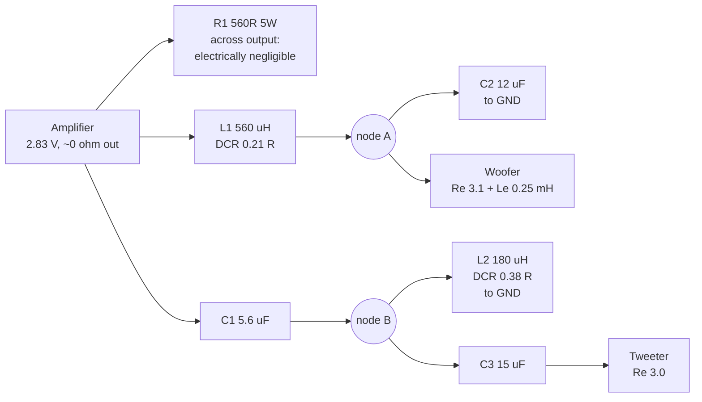
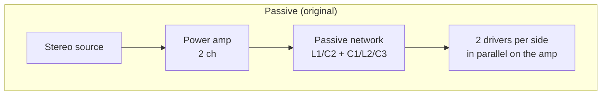
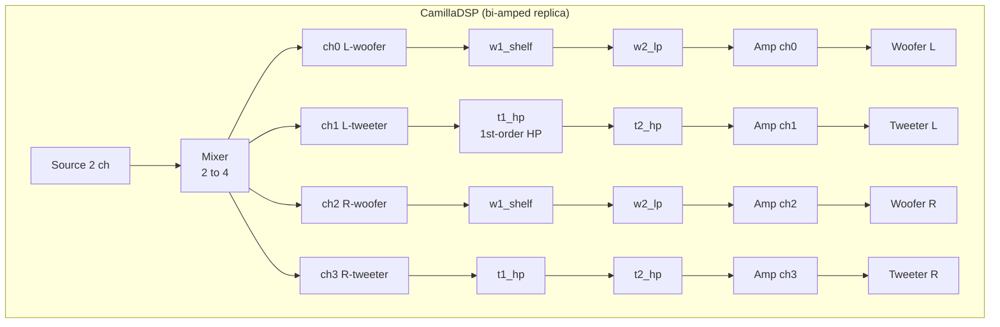
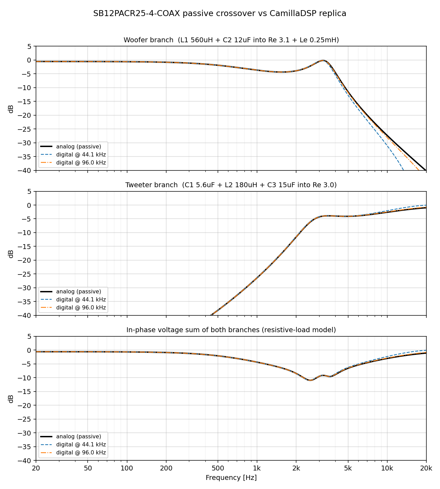
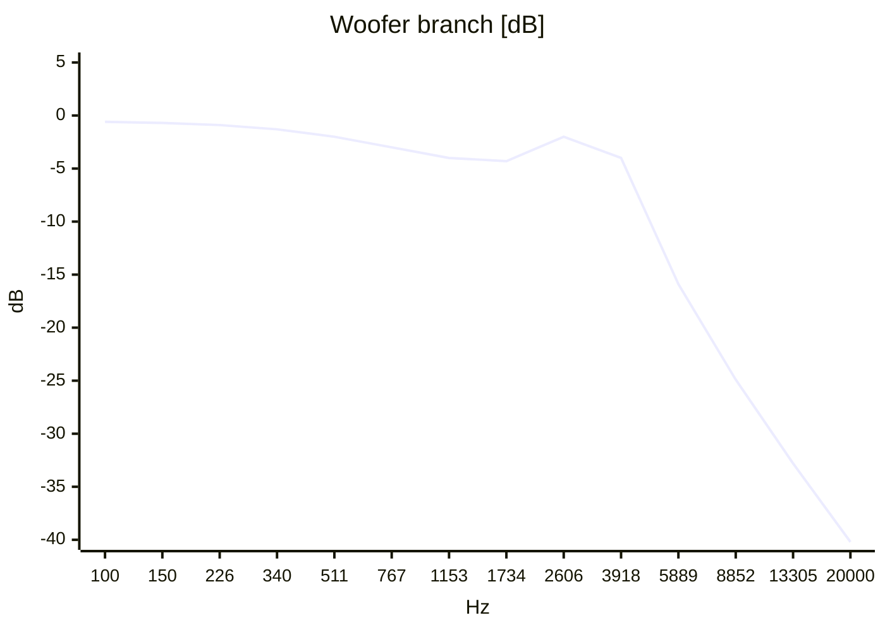
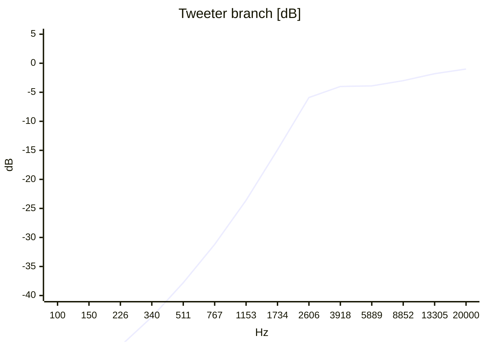
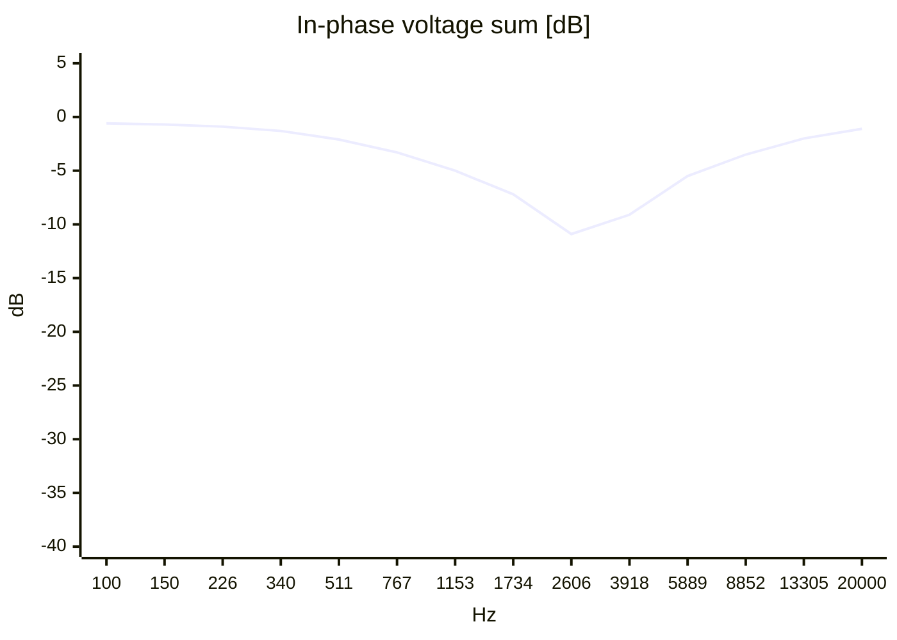
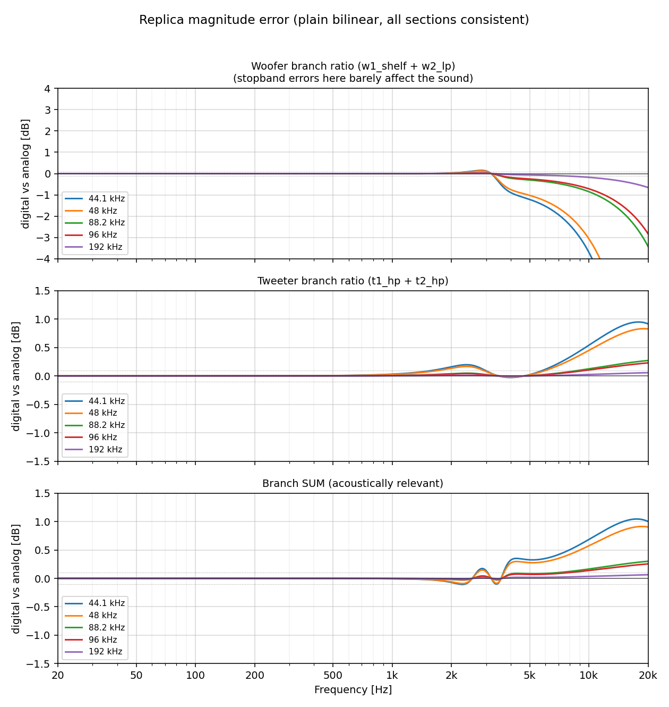

# SB12PACR25-4-COAX: passive crossover → CamillaDSP conversion

This document describes the analysis of the passive crossover of the SB Acoustics
**SB12PACR25-4-COAX** 4" coaxial driver and its translation into an equivalent
**CamillaDSP** IIR filter set. All numbers below were cross-computed with
Wolfram (symbolic) and the included Python script (numeric); the two agree to
<1e-5 on every coefficient.

| Artifact | Path |
|---|---|
| Coefficient generator script | `scripts/camilladsp_xo_coeffs.py` |
| Ready-to-use config @ 96 kHz | `docs/img/xo_config_96k.yaml` |
| **Native (Fs-independent) mono config** | `configs/camilladsp_replica_native.yaml` |
| Provisional active crossover (mono) | `configs/camilladsp_active_v1.yaml` |
| Magnitude comparison plots | `docs/img/xo_comparison.png`, `docs/img/xo_error.png` |

---

## 1. Driver data (from datasheet)

### Woofer

| Parameter | Value |
|---|---|
| Nominal impedance | 4 Ω |
| Re (DC resistance) | 3.1 Ω |
| Le (voice-coil inductance) | 0.25 mH |
| Fs | 55 Hz |
| Sensitivity (2.83 V / 1 m) | 87.5 dB |
| Qms / Qes / Qts | 4.84 / 0.38 / 0.35 |
| Mms | 5.6 g |
| Bl | 4.0 T·m |
| Vas | 4.3 L |
| Cms | 1.49 mm/N |
| Rms | 0.4 kg/s |
| Sd | 45 cm² |
| Voice coil diameter | 25.4 mm |
| Recommended enclosure | Closed 1.5 L / Reflex 1.3 L (fb ≈ 50 Hz) |

### Tweeter (coaxial, coincident with woofer — X=Y=Z=0 in the factory sim)

| Parameter | Value |
|---|---|
| Nominal impedance | 4 Ω |
| Re | 3.0 Ω |
| Le | not specified in datasheet |
| Fs | 1300 Hz |
| Sensitivity (2.83 V / 1 m) | 87.5 dB |

Both drivers have equal sensitivity (87.5 dB), so no attenuation pad is needed.

---

## 2. The passive crossover



* **Woofer branch**: 2nd-order lowpass — L1 (560 µH, 0.21 Ω) series, C2 (12 µF) shunt.
  With a purely resistive 3.1 Ω load this would be f₀ = 1/(2π√(L·C)) = **1941 Hz**, Q = R·√(C/L) = **0.454**.
* **Tweeter branch**: 3rd-order highpass (C-L-C) — C1 (5.6 µF) series, L2 (180 µH, 0.38 Ω) shunt, C3 (15 µF) series.
  The values are *not* a textbook 18 dB/oct Butterworth (that would need C≈21 µF and L≈509 µH at 2.5 kHz on 3 Ω); the factory tuning leans on the drivers' actual impedances (see §9).
* **R1** (560 Ω across the amp) does essentially nothing: with a near-zero-ohm source it is not part of any transfer function. Not replicated in DSP.
* Both drivers are connected with the same polarity (+/+). The DSP replica keeps both channels non-inverted.

---

## 3. Method and assumptions

Each branch is modelled as a **voltage divider** loaded by the driver impedance,
evaluated in the Laplace domain (s in rad/s), then the resulting rational
function is split into first/second-order sections and **bilinear-transformed**
into CamillaDSP biquads.

Load models:

$$Z_W(s) = R_{eW} + s\,L_{eW} = 3.1 + s \cdot 0.25\times10^{-3} \qquad \text{(woofer: Re + Le)}$$

$$Z_T(s) = R_{eT} = 3.0 \qquad \text{(tweeter: Re only, Le not specified, impedance peak at } F_s = 1300\text{ Hz not modelled)}$$

The woofer's mechanical resonance (55 Hz) is far below the crossover band and is ignored.

---

## 4. Analog transfer functions — derivation

### 4.1 Woofer

$$H_W(s) = \frac{Z_p}{Z_{L1} + Z_p}, \qquad Z_p = Z_W \parallel Z_{C2}, \quad Z_{L1} = R_{L1} + s L_1,\quad Z_{C2} = \frac{1}{s C_2}$$

Expanding (this is the general formula — plug in any component values):

$$H_W(s) = \frac{R_{eW} + s\,L_{eW}}{d_3 s^3 + d_2 s^2 + d_1 s + d_0}$$

$$d_3 = L_1 L_{eW} C_2 \qquad d_2 = R_{L1} L_{eW} C_2 + L_1 R_{eW} C_2$$
$$d_1 = R_{L1} R_{eW} C_2 + L_1 + L_{eW} \qquad d_0 = R_{L1} + R_{eW}$$

With the schematic values (L1 = 560 µH, R_L1 = 0.21 Ω, C2 = 12 µF):

$$H_W(s) = \frac{3.1 + 2.5\times10^{-4}\,s}{3.31 + 8.17812\times10^{-4}\,s + 2.1462\times10^{-8}\,s^2 + 1.68\times10^{-12}\,s^3}$$

Hand-checks: d₃ = 560e-6 · 0.25e-3 · 12e-6 = **1.68e-12** ✓; d₁ = 0.21·3.1·12e-6 + 560e-6 + 250e-6 = **817.812 µ** ✓; d₀ = 3.31 ✓.

### 4.2 Tweeter

$$H_T(s) = \frac{Z_A}{Z_{C1} + Z_A}, \qquad Z_A = \left(Z_{C3} + Z_T\right) \parallel Z_{L2},\quad Z_{L2} = R_{L2} + s L_2$$

Expanding and clearing denominators:

$$H_T(s) = \frac{C_1\left(n_1 s + n_2 s^2 + n_3 s^3\right)}{1 + \delta_1 s + \delta_2 s^2 + \delta_3 s^3}$$

$$n_1 = C_1 R_{L2} \qquad n_2 = C_1\left(R_{L2} R_{eT} C_3 + L_2\right) \qquad n_3 = C_1 L_2 R_{eT} C_3$$
$$\delta_1 = R_{eT} C_3 + R_{L2} C_3 + C_1 R_{L2} \qquad \delta_2 = L_2 C_3 + C_1\left(R_{L2} R_{eT} C_3 + L_2\right) \qquad \delta_3 = n_3$$

With the schematic values (C1 = 5.6 µF, C3 = 15 µF, L2 = 180 µH, R_L2 = 0.38 Ω):

$$H_T(s) = \frac{2.128\times10^{-6}\,s + 1.10376\times10^{-9}\,s^2 + 4.536\times10^{-14}\,s^3}{1 + 5.2828\times10^{-5}\,s + 3.80376\times10^{-9}\,s^2 + 4.536\times10^{-14}\,s^3}$$

Hand-checks: n₁ = 5.6e-6·0.38 = **2.128 µ** ✓; n₃ = 5.6e-6·180e-6·3·15e-6 = **4.536e-14** ✓; δ₁ = 3·15e-6 + 0.38·15e-6 + 5.6e-6·0.38 = 45e-6 + 5.7e-6 + 2.128e-6 = **52.828 µ** ✓.

---

## 5. Poles, zeros and section factorisation

Roots of the polynomials above (`np.roots` / `NSolve` — both agree):

| Branch | Roots | Value |
|---|---|---|
| Woofer | zero | **1973.5 Hz** (= R_eW/2πL_eW — the driver's inductance pole) |
| | real pole | **696.8 Hz** (4378.0 rad/s) |
| | complex pair | **3376.3 Hz**, Q = **2.5264** |
| | DC gain | 3.1/3.31 = 0.93656 (−0.569 dB, coil DCR loss) |
| Tweeter | zeros | 0 Hz (DC), **336.0 Hz**, **3536.8 Hz** |
| | real pole | **11447.4 Hz** (71926.4 rad/s) |
| | complex pair | **2786.4 Hz**, Q = **1.4674** |

The filter chains factor as (grouping one real root + the complex pair per branch):

$$H_W(s) = \underbrace{\frac{1 + s/\omega_z}{1 + s/\omega_{p1}}}_{W_1\ \text{(shelf)}} \cdot \underbrace{\frac{g}{1 + \frac{s}{Q\omega_0} + \left(\frac{s}{\omega_0}\right)^2}}_{W_2\ \text{(2nd-order LP)}}$$

$$\omega_z = 12399.96\ \text{rad/s},\quad \omega_{p1} = 4378.0\ \text{rad/s},\quad \omega_0 = 21213.6\ \text{rad/s},\quad Q = 2.5264,\quad g = 0.93656$$

$$H_T(s) = \underbrace{\frac{s}{s + p_t}}_{T_1\ \text{(1st-order HP)}} \cdot \underbrace{\frac{s^2 + \beta_1 s + \beta_0}{s^2 + \alpha_1 s + \alpha_0}}_{T_2\ \text{(biquad HP)}}$$

$$p_t = 71926.4\ \text{rad/s},\quad \beta_1 = 24333.3,\ \beta_0 = 4.69136\times10^7,\quad \alpha_1 = 11930.7,\ \alpha_0 = 3.06507\times10^8$$

Sanity checks: W₁ DC gain = 1, HF gain = ω_p1/ω_z = 0.3531; W₂ DC gain = g;
T₁+T₂ HF gain = 1, DC gain = 0.

---

## 6. Bilinear transform → CamillaDSP coefficients

Each section is discretised with the bilinear transform

$$s \leftarrow K\frac{z-1}{z+1}, \qquad K = 2 f_s$$

A section N(s)/D(s) of degree m maps to a z-polynomial:

$$N'(z) = \sum_{i=0}^{m} c_i\, K^i (z-1)^i (z+1)^{m-i}$$

Sections of degree < 2 (W₁, W₂'s numerator) are padded with exact-cancelling
(z+1) factors so everything fits the biquad form

$$H(z) = \frac{b_0 + b_1 z^{-1} + b_2 z^{-2}}{1 + a_1 z^{-1} + a_2 z^{-2}}$$

with b = k·N' descending, a₁ = k·D'(z¹), a₂ = k·D'(z⁰), k = 1/D'(z²).

**All four sections — including T₁ — use this same plain bilinear map.**
T₁ is emitted as a first-order Freeform biquad (b₂ = a₂ = 0):

$$T_1:\quad b_0 = \frac{K}{K + p_t},\quad b_1 = -b_0,\quad a_1 = \frac{p_t - K}{p_t + K}$$

A native `HighpassFO` is deliberately **not** used: CamillaDSP pre-warps its
native biquads internally (`biquad.rs`, `k = tan(ω/2)`), which lands the corner
exactly at the requested frequency but tilts the level of everything below it.
Mixing one pre-warped section with plain-bilinear sections breaks the relative
levels between the branches (up to ~2 dB near the crossover at 44.1 kHz). With
one consistent transform the whole replica behaves like the analog network on a
slightly stretched frequency axis — every feature moves the same way, so branch
levels and the crossover sum are preserved.

### 6.1 Worked example — W₂ @ 96 kHz (hand-checkable)

K = 192000. Denominator s² + (ω₀/Q)s + ω₀² with ω₀ = 21213.6, ω₀/Q = 8395.4, ω₀² = 4.50031e8:

```
D'(z) = K²(z−1)² + (ω₀/Q)·K·(z²−1) + ω₀²(z+1)²
z²: K² + (ω₀/Q)K + ω₀² = 3.68640e10 + 1.61192e9 + 4.5003e8 = 3.89271e10
z¹: 2ω₀² − 2K²        = 9.00061e8 − 7.37280e10        = −7.28279e10
z⁰: K² − (ω₀/Q)K + ω₀² = 3.68640e10 − 1.61192e9 + 4.5003e8 = 3.56931e10
k = 1/3.89271e10
b₀ = k·g·ω₀² = 0.936556 · 4.50031e8 / 3.89271e10 = 0.0108276   ✓
b₁ = 2b₀ = 0.0216553,  b₂ = b₀
a₁ = −7.28279e10 / 3.89271e10 = −1.87092                       ✓
a₂ = +3.56931e10 / 3.89271e10 = 0.917165                        ✓
```

### 6.2 Worked example — W₁ @ 96 kHz

```
N(s) = 1 + s/ωz → (z+1) + (K/ωz)(z−1),  K/ωz = 192000/12399.96 = 15.4840
D(s) = 1 + s/ωp1 → (z+1) + (K/ωp1)(z−1), K/ωp1 = 192000/4378.0 = 43.8539
pad both with (z+1):
N' = (16.484z − 14.484)(z+1) = 16.484z² + 2z − 14.484
D' = (44.854z − 42.854)(z+1) = 44.854z² + 2z − 42.854
k = 1/44.854:
b₀ = 16.484/44.854 = 0.367488,  b₁ = 2/44.854 = 0.0445876,  b₂ = −14.484/44.854 = −0.322900
a₁ = 2/44.854 = 0.0445876,     a₂ = −42.854/44.854 = −0.955412
DC gain = (b₀+b₁+b₂)/(1+a₁+a₂) = 1.0000 ✓   HF gain = ωp1/ωz = 0.3531 ✓
```

### 6.3 Coefficient tables (generated by `scripts/camilladsp_xo_coeffs.py`)

**fs = 44100 Hz**

| Filter | b0 | b1 | b2 | a1 | a2 |
|---|---|---|---|---|---|
| w1_shelf | 0.383659 | 0.0945799 | −0.289079 | 0.0945799 | −0.905420 |
| w2_lp | 0.0469882 | 0.0939764 | 0.0469882 | −1.634180 | 0.834866 |
| t1_hp | 0.550815 | -0.550815 | 0.0 | -0.101629 | 0.0 |
| t2_hp | 1.091300 | −1.692340 | 0.621573 | −1.635520 | 0.769691 |

**fs = 48000 Hz**

| Filter | b0 | b1 | b2 | a1 | a2 |
|---|---|---|---|---|---|
| w1_shelf | 0.381281 | 0.0872304 | −0.294051 | 0.0872304 | −0.912770 |
| w2_lp | 0.0402476 | 0.0804953 | 0.0402476 | −1.674150 | 0.846047 |
| t1_hp | 0.571679 | -0.571679 | 0.0 | -0.143358 | 0.0 |
| t2_hp | 1.087280 | −1.719010 | 0.649326 | −1.670340 | 0.785271 |

**fs = 88200 Hz**

| Filter | b0 | b1 | b2 | a1 | a2 |
|---|---|---|---|---|---|
| w1_shelf | 0.368732 | 0.0484352 | −0.320297 | 0.0484352 | −0.951565 |
| w2_lp | 0.0127535 | 0.0255069 | 0.0127535 | −1.855890 | 0.910360 |
| t1_hp | 0.710355 | -0.710355 | 0.0 | -0.420711 | 0.0 |
| t2_hp | 1.057510 | −1.853380 | 0.801463 | −1.837890 | 0.874459 |

**fs = 96000 Hz** ← recommended

| Filter | b0 | b1 | b2 | a1 | a2 |
|---|---|---|---|---|---|
| w1_shelf | 0.367488 | 0.0445876 | −0.322900 | 0.0445876 | −0.955412 |
| w2_lp | 0.0108276 | 0.0216553 | 0.0108276 | −1.870920 | 0.917165 |
| t1_hp | 0.727475 | -0.727475 | 0.0 | -0.454951 | 0.0 |
| t2_hp | 1.053770 | −1.865990 | 0.816978 | −1.852830 | 0.883901 |

**fs = 176400 Hz**

| Filter | b0 | b1 | b2 | a1 | a2 |
|---|---|---|---|---|---|
| w1_shelf | 0.360995 | 0.0245144 | −0.336480 | 0.0245144 | −0.975486 |
| w2_lp | 0.00329589 | 0.00659177 | 0.00329589 | −1.939590 | 0.953668 |
| t1_hp | 0.830652 | -0.830652 | 0.0 | -0.661305 | 0.0 |
| t2_hp | 1.031910 | −1.929250 | 0.898797 | −1.925230 | 0.934733 |

**fs = 192000 Hz**

| Filter | b0 | b1 | b2 | a1 | a2 |
|---|---|---|---|---|---|
| w1_shelf | 0.360358 | 0.0225451 | −0.337813 | 0.0225451 | −0.977455 |
| w2_lp | 0.00278884 | 0.00557768 | 0.00278884 | −1.945420 | 0.957329 |
| t1_hp | 0.842241 | -0.842241 | 0.0 | -0.684482 | 0.0 |
| t2_hp | 1.029560 | −1.935210 | 0.906888 | −1.931810 | 0.939855 |

`t1_hp` is a first-order Freeform biquad (`b2 = a2 = 0`) of the real pole at
**11447.4 Hz** — coefficients are in the tables above. For any other rate run the
script (`python3 scripts/camilladsp_xo_coeffs.py -f <rate>`).

### 6.4 Fs-independent alternative: native filters only

Freeform coefficients are rate-specific. If the config must survive samplerate
changes without shipping per-rate coefficient sets, every section can be
re-expressed using CamillaDSP's native filter types (parameters computed by
CamillaDSP at load time, valid at any `samplerate`):

| Section | Native equivalent | Fidelity |
|---|---|---|
| W1 (pole 697 Hz / zero 1973.5 Hz) | `HighshelfFO { freq: 1172.7, gain: -9.04 }` | exact — `HighshelfFO` *is* a real pole/zero shelf (pole = ampl·K·tan(πf/fs), zero = K·tan(πf/fs)/ampl, corner = √(pole·zero)) |
| W2 (pair 3376.3 Hz Q2.526, DC gain 0.9366) | `Lowpass { freq: 3376.3, q: 2.526 }` + `Gain { -0.57 }` | exact |
| T1 (real pole 11447.4 Hz) | `HighpassFO { freq: 11447.4 }` | exact |
| T2 (real zeros 336.0 / 3536.8 Hz + pair 2786.4 Hz Q1.467) | `Highpass { freq: 2786.4, q: 1.467 }` + `LowshelfFO { freq: 1118.4, gain: +20.0 }` + `LowshelfFO { freq: 237.9, gain: +6.0 }` | ≤0.05 dB above 1 kHz (checked @1k/2k/4k); below ~400 Hz the shelves saturate, i.e. the tweeter receives *less* LF than the exact replica — safe direction, branch is −40 dB there |

The T2 decomposition works because its numerator factors as
$$(1+\omega_1/s)(1+\omega_2/s),\quad \omega_1 = 2111,\ \omega_2 = 22222\ \text{rad/s}$$
and each factor coincides exactly with a first-order low-shelf above the
shelf's saturation pole (chosen at ω/10 for +20 dB, ω/2 for +6 dB — 353.7 Hz
and 168.4 Hz).

Caveat — native filters pre-warp each section at its own corner. The only
corner high enough to matter is T1's 11.4 kHz pole, which tilts the tweeter's
1–3 kHz region by:

| Fs | tilt |
|---|---|
| 44.1 kHz | −2.3 dB |
| 48 kHz | −1.9 dB |
| 88.2 kHz | −0.5 dB |
| 96 kHz | −0.4 dB |
| 192 kHz | −0.1 dB |

At ≥88.2 kHz this is negligible; at 44.1/48 kHz compensate by lowering
`t1_hp` freq to ~9600/9800 (one parameter). A ready-to-use mono config using
only native filters is in `configs/camilladsp_replica_native.yaml`; the
parameters are also printed by `python3 scripts/camilladsp_xo_coeffs.py`.

---

## 7. DSP chain vs passive crossover





Passive → DSP section mapping:

| Passive element | DSP equivalent | Why |
|---|---|---|
| L1 + C2 + woofer Re/Le interaction | `w1_shelf` + `w2_lp` | pole @697 Hz cancels against the Le zero @1973 Hz (shelf), resonant pair @3376 Hz Q2.53 (LP) |
| coil DCR 0.21 Ω loss | −0.569 dB DC gain inside `w2_lp` | 3.1/3.31 voltage divider |
| C1 + L2 + C3 + tweeter Re | `t1_hp` + `t2_hp` | real pole @11.4 kHz + zero pair @336/3537 Hz + resonant pair @2786 Hz Q1.47 |
| R1 560 Ω | nothing | across a ~0 Ω source: no effect |

The complete config is in [`docs/img/xo_config_96k.yaml`](img/xo_config_96k.yaml)
(generated with `python3 scripts/camilladsp_xo_coeffs.py -f 96000 --full`).
Set `playback.device` to your 4-channel DAC and adjust `capture` to your source.

---

## 8. Frequency response: analog vs DSP replica



Approximate charts rendered inline (mermaid `xychart-beta` has a linear x-axis;
the PNGs above are the authoritative log-frequency plots):







### 8.1 Analog reference response (resistive-load model)

| f [Hz] | 100 | 500 | 1000 | 1500 | 2000 | 2500 | 3000 | 4000 | 6000 | 10000 | 20000 |
|---|---|---|---|---|---|---|---|---|---|---|---|
| Woofer [dB] | −0.64 | −1.93 | −3.71 | −4.39 | −3.94 | −2.46 | −0.53 | −4.63 | −16.34 | −27.38 | −40.25 |
| Tweeter [dB] | −57.10 | −38.13 | −26.37 | −18.16 | −11.53 | −6.60 | −4.31 | −4.00 | −3.90 | −2.60 | −0.97 |
| Sum [dB] | −0.64 | −2.06 | −4.35 | −6.28 | −8.47 | −10.87 | −9.49 | −8.85 | −5.36 | −3.00 | −1.05 |

Note the woofer shape is *not* a monotonic lowpass: it dips ~4.4 dB at 1.5–2 kHz,
recovers to −0.5 dB at 3 kHz (the Q = 2.53 resonance), then falls steeply. −3 dB
crossings: 771 / 2349 / 3797 Hz (woofer), 8708 Hz (tweeter).

### 8.2 Digital replica accuracy



The three panels show the digital-to-analog magnitude ratio of each branch and
of the **branch sum** (the acoustically relevant one). Note the woofer panel's
errors above ~6 kHz occur where that branch is already >15 dB down — they
barely move the sum, which is what the third panel shows.

| fs | max sum error, 20 Hz – 20 kHz |
|---|---|
| 44.1 kHz | 1.04 dB |
| 48 kHz | 0.91 dB |
| 88.2 kHz | 0.30 dB |
| **96 kHz** | **0.26 dB** |
| 176.4 kHz | 0.08 dB |
| 192 kHz | 0.06 dB |

The residual error is bilinear frequency-axis stretching concentrated above
~5 kHz at low rates (every feature lands at digital frequency
2·atan(ω/K) instead of ω, and the steep tweeter flank magnifies the shift).
Run the DSP at ≥ 96 kHz for a near-perfect match; at 44.1/48 kHz the deviation
stays below ~1 dB and only above 5 kHz.

---

## 9. Caveats — read before deploying

1. **The replica reproduces the electrical transfer functions** of the passive
   network into the modelled loads (Re + Le). It is *not* a model of the
   acoustic result in the real loudspeaker.
2. The factory network is strongly **load-dependent**: the tweeter's impedance
   peak at F_s = 1300 Hz and the woofer's inductive rise reshape the actual
   passive crossover in situ. This is visible in the model as the deep ~10 dB
   in-phase sum dip at 2.5 kHz on resistive loads — the real drivers' impedance
   behaviour is what makes the factory design sum properly.
3. **Measure** (REW + umik, gated) after switching over. If the 2–3 kHz region
   measures with a dip, replace the replica with textbook filters (e.g.
   `ButterworthLowpass` order 2 @ ~1.9 kHz + `ButterworthHighpass` order 3 @
   ~2.5 kHz) and tune by ear — the beauty of DSP.
4. Bi-amp wiring: remove **all** passive components, one amp channel per driver,
   polarity as in the schematic (both non-inverted).
5. Freeform coefficients are **sample-rate specific** — regenerate with the
   script when changing `samplerate`.

---

## 10. Regenerating everything

```bash
# coefficient tables + verification for all common rates
python3 scripts/camilladsp_xo_coeffs.py

# full CamillaDSP config for one rate
python3 scripts/camilladsp_xo_coeffs.py -f 192000 --full

# regenerate the plots in docs/img/
python3 scripts/camilladsp_xo_coeffs.py --plot docs/img

# mermaid xychart data for this document
python3 scripts/camilladsp_xo_coeffs.py --mermaid
```

The default output uses the consistent plain-bilinear transform described in
§6. `--prewarp` switches to per-root pre-warping (each feature lands exactly at
its analog frequency); for this network it is *worse* — the T₁ pole at 11.4 kHz
sits close enough to Nyquist at low rates that pre-warping tilts the whole
1–3 kHz region by up to 2 dB — so it is kept only for experimentation.

Component values and driver models are defined at the top of the script
(`C1, C3, L2, R_L2, C2, L1, R_L1, RE_W, LE_W, RE_T, LE_T`); edit them to
re-derive everything for a different network.
