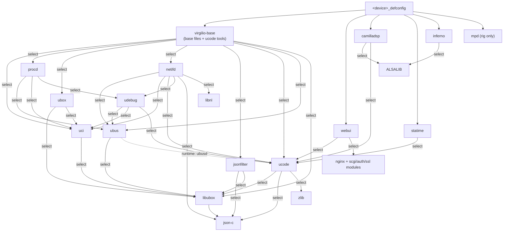

# Package dependency map

How the Buildroot external tree (`br-external/`, external name
**VIRGILIO**, variable `BR2_EXTERNAL_VIRGILIO_PATH`) is layered for
multi-device builds. System overview: `docs/architecture.md`; the
runtime service lifecycle driven by these packages:
`docs/lifecycle.md`.

## Layering rules

| Layer | Location | Role | Ordering |
|---|---|---|---|
| common packages | `package/*` | board-independent software + `virgilio-base` (common rootfs files) | installed during package phase |
| board dir | `board/<device>/` | kernel/busybox fragments, genimage cfg, post-image | build/image phase |
| board overlay | `board/<device>/rootfs-overlay/` | device files (network topology, rig services) and **overrides** of package files | copied after all packages — wins over `virgilio-base` |
| common post-build | `board/common/post-build.sh` | device-independent target fixups (module flattening, `/var`→tmpfs, factory snapshot) | after overlays |

A new device/SoC revision = new defconfig in `configs/` + new
`board/<device>/` dir; everything common stays in `virgilio-base` and
`board/common/`. Run `DEFCONFIG=<name>_defconfig scripts/build.sh`.

## Kconfig select graph

libubox/ubus come from Buildroot upstream; everything else lives in
`br-external/package/`.

## virgilio-base contents → requirements

| Files (under `package/virgilio-base/files/`) | Needs |
|---|---|
| `etc/rc.common`, `etc/init.d/*`, `etc/rc.d/*`, `etc/preinit`, `etc/inittab`, `etc/hotplug*.json` | **procd** (PID 1), **jsonfilter** (status/network getters), **ubox** (`validate_data` via `lib/functions/procd.sh`, kmodloader via `modules-boot.d`) |
| `usr/lib/functions.sh`, `usr/lib/functions/{system,service}.sh`, `usr/sbin/{service,devstatus,reload_config,hotplug-call}` | **uci**, **ubus**, **procd** |
| `usr/lib/functions/network.sh`, `usr/sbin/{ifup,ifdown,ifreload,ifstatus}` | **netifd**, **ubus**, **jsonfilter** |
| `etc/config/system` | **uci** (hostname/timezone defaults) |
| `etc/{profile,motd,rc.local}`, `etc/profile.d/`, `usr/libexec/login.sh`, `etc/resolv.conf` → `/tmp` | shell only (resolv.conf written by netifd dhcp.script at runtime) |

App packages also ship their service wiring (init scripts, rc.d links,
uci defaults, tools). The uci defaults are generic; a device overrides
any of them by placing a file at the same path in its board rootfs
overlay (the overlay is applied after all packages, so it wins). Binaries
for app packages are selected by the defconfig, not by virgilio-base
(`camilladsp`, `statime`, `inferno`; `webui` ships its own init/config):

| Package ships | Needs |
|---|---|
| **camilladsp**: `usr/bin/camilladsp-genconf` (uci → camilladsp YAML/policy/env generator), `usr/lib/camilladsp/inferno-net.sh` (netdev/address resolution shared by init + hotplugs), `etc/init.d/camilladsp` + rc.d links (incl. the custom `check` lifecycle command), `etc/config/camilladsp`, `etc/hotplug.d/ptp/10-camilladsp` + `etc/hotplug.d/iface/{40-statime-net,60-camilladsp}` (event gates — see `docs/lifecycle.md`) | ucode (+ `uci`/`fs` modules), **uci**, **procd**, **jsonfilter** (the `check` command's PTP-lock query), **statime** runtime (started/stopped by the iface hotplug) |
| **statime**: `usr/bin/ptp-monitor` (usrvclock → ubus/hotplug bridge), `etc/init.d/{statime,ptp-monitor}` + rc.d links, `etc/config/{statime,ptp-monitor}` | ucode (+ `struct`/`socket`/`uloop`/`ubus` modules), **ubus**, **procd** |
| **inferno**: `etc/config/inferno` | **uci** |

webui apps are Kconfig options of the webui package (`BR2_PACKAGE_WEBUI_APP_*`,
login always ships with the shell); only enabled apps are built and their
daemon modules installed:

| App option | Apps | Selects |
|---|---|---|
| `WEBUI_APP_HOME` | home (LAN dashboard) | **netifd** |
| `WEBUI_APP_STATUS` | status (system overview) | — (camilladsp ubus object shown when present, soft dep) |
| `WEBUI_APP_SYSTEM` | system settings/password/maintenance | — |
| `WEBUI_APP_NETSTAT` | netstat (interface stats) | **netifd** |
| `WEBUI_APP_NETWORK` | network (uci editor) | **netifd** |
| `WEBUI_APP_LOGS` | logs (logread viewer) | **ubox** (ships logread) |
| `WEBUI_APP_DSP` | dsp filter/profile editors + dsp-live EQ view | **camilladsp** (pipeline RPCs = genconf dry-runs; live view = nginx `/_dsp` websocket proxy to :5000) |
| `WEBUI_APP_INFERNO` | inferno node status | **inferno**, **camilladsp** (settings-apply coupling — rework tracked in `plan/webui-app-inferno-decoupling.md`) |

## Board overlay contents (rk3506qemu) → requirements

| Board overlay file | Replaces / adds |
|---|---|
| `etc/config/network` | netifd topology (lan dhcp on eth0, aoip raw on eth1) |
| `etc/asound.conf` | **inferno** ALSA plugin, statime `usrvclock` (`/tmp/ptp-usrvclock`), snd-aloop (loopplay/loopcap rig PCMs) |
| `usr/share/camilladsp/coeffs/` | vendor FIRs referenced by the default locked uci pipeline |
| `etc/init.d/single-nic-fixup` + `etc/rc.d/S05…` | QEMU rig topologies (rewrites uci when eth1 absent) |
| `etc/init.d/mpd` + `etc/rc.d/K30mpd` + `etc/mpd.conf` | **mpd** (web-radio transmitter rig, off by default) |
| `etc/init.d/aoip-bridge` | inferno2pipe FIFO debug path (deprecated) |
| `etc/modules.d/audio` | `snd-aloop`, `virtio_snd` (QEMU audio) |
