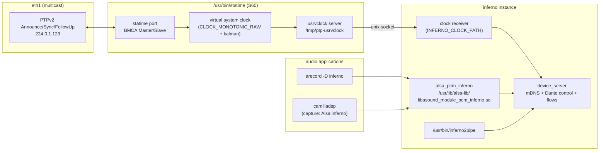

# inferno — Dante (AoIP) receiver implementation

This document describes how the Dante stack is implemented in this
firmware: the **inferno** packages, the **statime** PTP daemon they depend
on, and how the two cooperate through a shared clock.

## Overview

[inferno](https://github.com/teodly/inferno) is an unofficial Rust
implementation of the Audinate Dante audio-over-IP protocol. A Dante
receiver needs two things from the system:

1. a **PTP media clock** — Dante streams are timed by IEEE 1588 (PTP);
   without a synced clock no audio flows, and
2. **network access with multicast** — PTP (224.0.1.129) and Dante
   discovery/control (mDNS, 224.0.0.251) both use it.

In this firmware the clock is provided by [statime] (the
[`inferno-dev`](https://github.com/teodly/statime) fork), which exports it
over a small unix socket protocol called **usrvclock**; inferno consumes
that socket.



## Packages (br-external)

### statime (`package/statime`)

| | |
|---|---|
| Source | `github.com/teodly/statime`, branch `inferno-dev`, pinned `244f20a` |
| Submodules | `clock-steering`, `timestamped-socket` (also teodly forks — `GIT_SUBMODULES = YES`) |
| Binary | `/usr/bin/statime` (only `statime-linux` member is built; the stm32 member is skipped) |
| License | Apache-2.0 OR MIT |

Build notes:

- Built with the same cargo pattern as camilladsp (NEON `RUSTFLAGS`,
  network build, vendoring disabled — the fork pulls the `usrvclock` crate
  from gitlab at build time).
- **usrvclock 32-bit re-pin** (build fix, statime only):

  statime's `Cargo.lock` pins `usrvclock 0.1.1` from
  `git+https://gitlab.com/lumifaza/usrvclock-rs#24da792`. That revision
  computes nanosecond timestamps as:

  ```rust
  timespec.tv_sec().wrapping_mul(1_000_000_000)
      .wrapping_add(timespec.tv_nsec())
  ```

  `libc`'s `timespec` accessors return `i64` for both fields on 64-bit
  targets, but on 32-bit ARM musl `tv_nsec()` returns `i32` — so the
  `wrapping_add` mixes `i64 + i32` in a context that requires `i64`, and
  compilation fails with `expected i64, found i32` (E0308). The crate was
  evidently only ever built on 64-bit hosts.

  Upstream fixed exactly this in commit `53116cb`
  ("make it compatible with 32-bit systems", the commit right after
  `24da792`) by casting both fields explicitly:

  ```rust
  (timespec.tv_sec() as i64).wrapping_mul(1_000_000_000i64)
      .wrapping_add(timespec.tv_nsec() as i64)
  ```

  Since we build with network access (no `--locked`), the package
  re-pins the dependency before building via a pre-build hook in
  `br-external/package/statime/statime.mk`:

  ```make
  define STATIME_UPDATE_USRVCLOCK
      cd $(@D) && cargo update -p usrvclock \
          --precise 53116cb61f4f09d5a6da4c893bf11ea4eb5c958a
  endef
  STATIME_PRE_BUILD_HOOKS += STATIME_UPDATE_USRVCLOCK
  ```

  If the fork's `Cargo.lock` is ever updated to `53116cb` or newer, the
  hook becomes a no-op error-free and can be dropped.

Configuration — **fully uci-driven** (`/etc/config/statime`, rendered
into `/tmp/statime.toml` by `/etc/init.d/statime` at every start):

- defaults: `interface eth1`, `network-mode ipv4`,
  `hardware-clock auto` (virtio-net has no PHC → software timestamping),
  `virtual-system-clock` on `monotonic_raw`, `usrvclock-export on`,
  `priority1 251`, `protocol PTPv2`;
- lower `priority1` wins BMCA — set it below the peers' value on the
  instance that should be GrandMaster;
- full key table and rendered examples:
  [UCI configuration](#uci-configuration).
- `/etc/init.d/statime` (S60, before inferno): procd service, respawn,
  logs to logd.
- **PTPv1 vs PTPv2**: the fork does not implement *acting as master* in
  PTPv1. With only our own instances on the wire we use **PTPv2**
  (master and slave both implemented). PTPv1 remains available via
  `option protocol 'PTPv1'` for real Dante networks — Dante devices speak
  PTPv1 (or dual-mode) and will provide the clock.

### inferno (`package/inferno`)

| | |
|---|---|
| Source | `github.com/teodly/inferno`, branch `dev`, pinned `75d9198` |
| Submodules | `alsa-sys-all`, `searchfire`, `usrvclock-rs` (`GIT_SUBMODULES = YES`) |
| Binaries | `/usr/bin/inferno2pipe` |
| Plugin | `/usr/lib/alsa-lib/libasound_module_pcm_inferno.so` |
| Depends on | alsa-lib |
| License | GPL-3.0 or AGPL-3.0 |

The whole workspace is built (members: `inferno_aoip`, `searchfire`,
`inferno2pipe`, `alsa_pcm_inferno`); only the two artifacts above are
installed.

## Runtime pieces

### The clock chain

1. statime participates in PTPv2 BMCA on `eth1`. Whichever instance has
   the lowest `priority1` becomes GrandMaster and sends Sync/FollowUp.
2. Slaves steer a **virtual** system clock (a kalman-filtered overlay on
   `CLOCK_MONOTONIC_RAW` — the wall clock is never stepped).
3. statime exports the clock over the **usrvclock** unix socket
   `/tmp/ptp-usrvclock` (path: `usrvclock::DEFAULT_SERVER_SOCKET_PATH`).
4. Every inferno instance connects a clock receiver to that socket
   (`INFERNO_CLOCK_PATH`) and derives the 48 kHz media clock from it.
   Without it the plugin logs `no clock available` forever and delivers
   **no audio at all**.

NB: upstream, the socket only carries updates while statime's servo
actively steers (i.e. while slaved to a master) — a grandmaster exports
nothing. We patch statime
(`br-external/package/statime/0001-export-usrvclock-overlay-while-master.patch`)
to re-send the overlay at 1 Hz while mastering, so leading and lone nodes
are valid clock sources too. The `/usr/bin/ptp-monitor` daemon watches
that socket to expose lock status over ubus and to trigger
`/etc/hotplug.d/ptp/*` handlers; see `docs/ptp-monitor.md`.

### Settings (per instance)

All inferno settings are environment variables with the `INFERNO_` prefix
(or ALSA plugin keys, or defaults):

| Env | Meaning | Default |
|---|---|---|
| `INFERNO_NAME` | advertised device name | `<app> <ip>` |
| `INFERNO_BIND_IP` | IP or interface name to bind; with multiple IPv4 on the interface (zcip + DHCP/static) the **first global** wins over 169.254/16 (local patch 0004) | auto (needs a route!) |
| `INFERNO_CLOCK_PATH` | usrvclock socket or PTP device | unset |
| `INFERNO_RX_CHANNELS` / `INFERNO_TX_CHANNELS` | channel counts | 2 / 2 |
| `INFERNO_RX_LATENCY_NS` / `INFERNO_TX_LATENCY_NS` | flow latency | 1 ms / 1 ms |
| `INFERNO_TX_BITS_PER_SAMPLE` | TX-advertised wire depth, one of 16/24/32; the RX side is always source-driven (per-flow reader follows the remote advertisement) and never consults it (local patch `0003-bits-per-sample-configurable`) | 24 |
| `INFERNO_DEVICE_ID`, `INFERNO_PROCESS_ID`, `INFERNO_ALT_PORT` | identity/ports for multi-instance setups | derived |
| `INFERNO_STATE_PATH` | base dir for persistent state (`<path>/inferno_aoip/<device-id>/rx_subscriptions.toml`) | XDG state dir / `~/.local/state` (local patch `0002-state-storage-env-path`) |

> **`INFERNO_BIND_IP` on isolated links**: the auto-detection resolves the
> local IP via a routing query; on a network without a default route it
> panics with `LocalIpAddressNotFound`. Always set it there (IP or the
> netdev name — genconf exports the resolved `network.aoip.device`).
> A named interface that is up but still addressless (zcip probing,
> DHCP not yet granted) panics the same way; the hotplug lifecycle
> guards around it (camilladsp is only started once the netdev carries
> an IPv4 — see [docs/lifecycle.md](lifecycle.md)), and procd's respawn
> absorbs the boot-time window.

### `/etc/asound.conf`

Two PCM definitions (details, precedence and usage:
[docs/alsa.md](alsa.md)):

Two PCM definitions:

- `pcm.inferno` — **parameterless** (so `arecord -L` lists it), with
  `CLOCK_PATH /tmp/ptp-usrvclock` baked in. This is the device normal
  applications (and camilladsp) use.
- `pcm.inferno2` — the upstream parameterized form (`@args.NAME`,
  `@args.RX_CHANNELS`, …) for explicit device strings like
  `'inferno2:RX_CHANNELS=8'`. PCMs with `@args` are *not* listed by
  `arecord -L` — that is why both exist.

### Services and uci

| File | Role |
|---|---|
| `/etc/init.d/statime` (S60) | renders + runs statime, respawn, logs → logread |
| `/etc/config/statime` | see [UCI configuration — statime](#uci-configuration-statime) |
| `/etc/config/inferno` | see [UCI configuration — inferno](#uci-configuration-inferno) |

There is **no inferno init service**: every application that opens the
`inferno` PCM hosts its own inferno instance in-process (see
[docs/alsa.md](alsa.md)); `/usr/bin/inferno2pipe` is a manual debug
tool (below). The uci file only carries the shared instance settings that
camilladsp-derived instances receive as environment. The clock, however,
must exist first — that is what the statime service provides.

### Lifecycle (hotplug-driven)

camilladsp and statime are managed **event-driven** after boot, with a
single rendering/decision point: the camilladsp init script's
`start_service` resolves and records the advertised-address baseline at
every start, and its custom `check` command decides starts (PTP locked
+ ≥1 IPv4 + not running) and drift restarts. The hotplug handlers are
thin event gates: netifd iface hotplug
(`/etc/hotplug.d/iface/60-inferno-net`) reacts to link/address events
on the resolved inferno netdev (stop on ifdown, statime lifecycle,
delegate to `check`), the ptp hotplug
(`/etc/hotplug.d/ptp/10-camilladsp`) maps `locked` → `check` and
`lost` → stop. Full state table, guards and failure timelines:
**[docs/lifecycle.md](lifecycle.md)**.

## UCI configuration — statime

`statime` is configured with a plain uci file. Apply changes by editing
`/etc/config/statime` (or with the `uci` CLI) followed by
`service statime restart`; the init script re-renders `/tmp/statime.toml`
on every start.

All runtime settings live here; `/etc/init.d/statime` renders the whole
`/tmp/statime.toml` from these options at every start (no template file).
Single-port setup — one `[[port]]` section is generated.

| Key | Default | Rendered toml key | Description |
|---|---|---|---|
| `loglevel` | `info` | `loglevel` | `trace`/`debug`/`info`/`warn`/`error`. |
| `domain` | `0` | `domain` | PTP domain number. |
| `sdo_id` | `0` | `sdo-id` | SDO id (0–4095). |
| `priority1` | `251` | `priority1` | BMCA priority — **lower wins GrandMaster** (Dante hardware uses 249; 251 = "slave unless nobody better"). Set e.g. `128` on the instance that should master. |
| `slave_only` | `0` | `slave-only` | `1` = never become master, even if best. |
| `interface` | `eth1` | `port.interface` | Port interface name. |
| `network_mode` | `ipv4` | `port.network-mode` | `ipv4` / `ipv6` / `ethernet`. |
| `hardware_clock` | `auto` | `port.hardware-clock` | `auto` / `required` / `none` / PHC index. virtio-net has no PHC → keep `auto`. |
| `protocol` | `PTPv2` | `port.protocol-version` | `PTPv1` or `PTPv2`. The fork cannot *act as master* in PTPv1, so a PTPv1 network requires real Dante devices to provide the clock. |
| `virtual_system_clock` | `1` | `virtual-system-clock` | Virtual (non-wall) media clock — required for the usrvclock export. |
| `virtual_system_clock_base` | `monotonic_raw` | `virtual-system-clock-base` | `TAI` / `monotonic` / `monotonic_raw` / `monotonic_coarse`. |
| `usrvclock_export` | `1` | `usrvclock-export` | Export the clock on the usrvclock socket (what inferno consumes). |
| `usrvclock_path` | `/tmp/ptp-usrvclock` | `usrvclock-path` | Socket path — must match inferno's `clock_path` / `CLOCK_PATH`. |
| `observation_path` | `/tmp/statime-observe.sock` | `observation-path` | statime observation socket: one JSON blob of the instance state (port states, datasets) per client connect; consumed by `ptp-monitor` for `ubus call ptp status` (`mode`, `domain`, `priority1`). |

Rendered file (default — slave-capable instance):

```
config statime 'main'
	option loglevel 'info'
	option domain '0'
	option sdo_id '0'
	option priority1 '251'
	option slave_only '0'
	option interface 'eth1'
	option network_mode 'ipv4'
	option hardware_clock 'auto'
	option protocol 'PTPv2'
	option virtual_system_clock '1'
	option virtual_system_clock_base 'monotonic_raw'
	option usrvclock_export '1'
	option usrvclock_path '/tmp/ptp-usrvclock'
```

Rendered file (GrandMaster instance, e.g. guest B of the two-guest test):

```
config statime 'main'
	option loglevel 'info'
	option priority1 '128'
	option protocol 'PTPv2'
	… (rest as above)
```

## UCI configuration — inferno

`/etc/config/inferno` holds the **shared instance settings** consumed by
`/usr/bin/camilladsp-genconf` whenever a camilladsp device type is
`Inferno` (see [docs/camilladsp.md](camilladsp.md) for the
derivation into `/tmp/camilladsp.env`). It configures no process by
itself — there is no inferno service.

| Key | Default | Derived `INFERNO_*` | Description |
|---|---|---|---|
| `name` | *(empty)* | `INFERNO_NAME` | Advertised device name; empty = **system hostname** (`system.@system[0].hostname`). |
| `interface` | `aoip` | `INFERNO_BIND_IP` | **Logical netifd interface name**, resolved by genconf against `/etc/config/network` (`network.<name>.device`); a raw netdev name or an IP literal also passes through. Mandatory on route-less networks (else the instance panics with `LocalIpAddressNotFound`). |
| `clock_path` | `/tmp/ptp-usrvclock` | `INFERNO_CLOCK_PATH` | usrvclock socket exported by statime — must match statime's `usrvclock_path`. |
| `rx_channels` | *(empty)* | `INFERNO_RX_CHANNELS` | Empty = camilladsp `channels` when capture is `Inferno`, else **0**. |
| `tx_channels` | *(empty)* | `INFERNO_TX_CHANNELS` | Empty = camilladsp `output_channels` when playback is `Inferno`, else **0** (RX-only setups never advertise TX). |

`INFERNO_SAMPLE_RATE` (= camilladsp `samplerate`) and `RUST_LOG=warn` are
exported additionally and are not configurable here.

### AoIP addressing: link-local fallback + address preference

The AoIP interface (`network.aoip`) follows the same ladder as a real
Dante device — it is never addressless:

- **product default**: `proto 'zcip'` (netifd handler +
  `/usr/lib/netifd/zcip.script`, busybox RFC 3927 applet) keeps an
  ARP-defended 169.254/16 address on the segment at all times —
  standalone on a bare switch included. Probing takes a few seconds;
  netifd marks `aoip` available once the address is claimed.
- **management / preferred address**: `network.lan` (DHCP or static)
  may share the same device (combined single-port topology) or live on
  another port (split: `network.aoip.device eth1`). inferno picks the
  **first global IPv4** of the bound device and only falls back to
  link-local when none exists (patch 0004) — reachable from managed
  networks, standalone-capable otherwise.
- **rig**: `proto 'static'` on `aoip` skips zcip entirely.

inferno and statime both bind the logical `aoip` interface
(`network.aoip.device`): moving the Dante segment to the other port is
that single uci option. genconf refuses to render a split clock/media
setup (inferno and statime resolving to different netdevs).

Rendered file (default — name from hostname, channels follow camilladsp):

```
config inferno 'main'
	option name ''
	option interface 'aoip'
	option clock_path '/tmp/ptp-usrvclock'
	option rx_channels ''
	option tx_channels ''
```

Rendered file (explicit identity for a dedicated RX device):

```
config inferno 'main'
	option name 'livingroom-rx'
	option interface 'aoip'
	option clock_path '/tmp/ptp-usrvclock'
	option rx_channels '8'
	option tx_channels '0'
```

### inferno2pipe — debug tool, not a service

`/usr/bin/inferno2pipe` is the same `inferno_aoip` library compiled into a
minimal standalone receiver: it subscribes to flows and writes interleaved
32-bit float samples to a file. **It is a diagnostic tool, not an
autostart service** — there is no init script and no uci config for it
(an always-on file recorder makes no sense in the product). Run it by
hand when you want to sniff/record the Dante network:

```sh
INFERNO_NAME=sniffer INFERNO_BIND_IP=eth1 \
    inferno2pipe -c 8 -o /tmp/rx.raw
```

(`-c` channels, `-o` output file; other settings via `INFERNO_*` env as
usual — `BIND_IP` is mandatory on networks without a default route.)
`RUST_LOG=warn` quiets its debug logging.

### How camilladsp reads from the inferno PCM

The dedicated `Inferno` device type in `/etc/config/camilladsp` wraps this
(`capture='Inferno'` = Dante RX, `playback='Inferno'` = Dante TX): the
generated `Alsa:inferno` device boots the whole inferno stack inside the
camilladsp process on open (see [docs/alsa.md](alsa.md)). Settings come
from the shared `/etc/config/inferno` (name defaults to the **system
hostname**, RX/TX channel counts follow the camilladsp `channels` /
`output_channels` — and fall back to **0** for the side that is not
`Inferno` —, Fs from `samplerate`); derivation and full schema:
[docs/camilladsp.md](camilladsp.md).

```
# /etc/config/camilladsp
option capture 'Inferno'          # Dante RX: plugin boots in-process
option channels '8'               # = INFERNO_RX_CHANNELS
```

with the crossover/mixer pipeline in the `filter`/`mixer`/`step` nodes
as usual. **Precondition**: statime must be running (it is, S60 < S75 —
the plugin waits for the clock and proceeds once it appears). Without a
PTP master on the network the plugin never delivers audio — camilladsp
waits silently, which is harmless: the default config keeps this enabled
and simply records network silence to the null playback.

## Networking

- **slirp (default `--net user`)**: statime runs and logs, but there is no
  external PTP master, so no media clock → plugin delivers nothing. Fine
  for boot/service testing only.
- **QEMU socket link (rootless)**: two instances share an L2 segment via
  `-netdev socket,listen|connect=127.0.0.1:12345`; multicast works; this is
  what the M4 test uses — see `docs/test-two-guests-ptp.md`.
- **tap/bridge (needs root)**: for real Dante networks or the
  `dockerized_trx` container suite (`scripts/qemu-bridge.sh`, D15).

## Testing

- `scripts/test-two-guests.sh` → described in
  [docs/test-two-guests-ptp.md](test-two-guests-ptp.md).
- Quick single-guest checks (slirp): `pidof statime`, `ls
  /tmp/ptp-usrvclock`, `logread | grep statime`, `arecord -L | grep -A1
  inferno`, `service inferno enable && service inferno start`.
- End-to-end reference (containers, no PTP — fake clock):
  `deps/inferno/test/dockerized_trx`.
