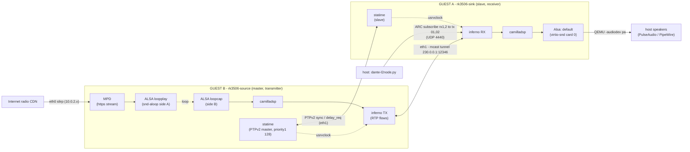
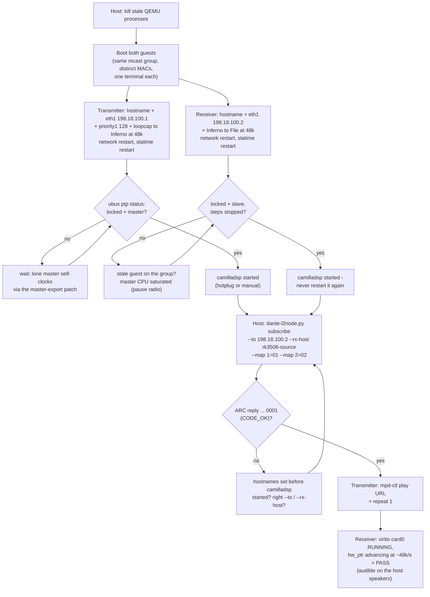

# Web radio over Dante — full two-guest recipe

> **Prefer the bridge rig** (`docs/bridge-rig.md`): native x86 host grand
> master + taps — measured glitch-free, single-NIC guests with internet.
> This mcast-tunnel variant stays useful for rootless / >2-guest setups.

End-to-end: an MPD web-radio stream pulled by the **transmitter** guest over
its slirp management NIC (eth0), played into the ALSA loopback, captured by
camilladsp, clocked by statime (PTP master), and shipped as Dante flows over
the isolated mcast segment (eth1) to the **receiver** guest, which plays
them on the host sound server (or records to a wav file — variant in §3).



**Bring-up sequence at a glance:**



The chain is **rate-locked at 48000**: MPD's ALSA output is format-locked
(`format "48000:16:2"` in `/etc/mpd.conf`), so any source — 44.1 kHz radio
stations, 22.05 kHz files, whatever — is resampled to 48k before it reaches
the aloop. Native-48k sources pass through with no conversion cost. Switch
sources freely; camilladsp and the Dante side never need to change.

**Everything below is runtime configuration** — guests run with `-snapshot`,
so all `uci` changes evaporate at poweroff. That is intentional for tests; to
make a setup permanent, put it in
`br-external/board/rk3506qemu/rootfs-overlay/` and rebuild.

## 0. Host prep (each session)

```sh
cd ~/Documenti/Progetti/dante
pgrep -af qemu-system-arm        # kill any stale guest STILL on the mcast group:
kill <pid>                       # a leftover master makes PTP lock onto a ghost
# image up to date? (needs: mpd-ctl URL support, libcurl TLS + CA bundle,
# libsndfile, MPD 48k output lock — ./scripts/build.sh after any pull)
#   ./scripts/build.sh
```

## 1. Boot both guests (two terminals)

```sh
# terminal 1 — transmitter (master + radio source); console is this terminal.
# --fwd exposes its camilladsp websocket server on host port 5001
./scripts/run-qemu.sh --net socket-mcast --peer 230.0.0.1:12346 \
    --mac 00:11:22:33:44:55 --fwd 5001:5000
# terminal 2 — receiver (slave): plays on the HOST sound server via
# virtio-snd backed by the host PulseAudio/PipeWire socket.
# --fwd 5002:5000 exposes the sink's camilladsp on host port 5002
./scripts/run-qemu.sh --net socket-mcast --peer 230.0.0.1:12346 \
    --mac 00:11:22:33:44:66 --audio virtio-snd-pa --fwd 5002:5000
```

Background variant: append `--console telnet[:port]` to either command and
attach any time with `telnet 127.0.0.1 PORT`. Not needed when each guest
has its own terminal.

Distinct `--mac` values are mandatory (statime also rejects
locally-administered MACs). eth0 = slirp internet (10.0.2.15, host 10.0.2.2),
eth1 = the Dante/PTP segment — present in every rig-mode boot.

## 2. Transmitter: rk3506-source (paste one line at a time!)

```sh
hostname rk3506-source
uci set system.@system[0].hostname='rk3506-source'
uci set network.aoip.proto='static'
uci set network.aoip.ipaddr='198.18.100.1'
uci set network.aoip.netmask='255.255.255.0'
uci set statime.main.priority1='128'
uci set camilladsp.main.capture='Alsa:loopcap'
uci set camilladsp.main.playback='Inferno'
uci set camilladsp.main.channels='2'
uci set camilladsp.main.output_channels='2'
uci set camilladsp.main.samplerate='48000'
ici set camilladsp.main.chunksize='2048'
uci set camilladsp.main.format='S16_LE'
uci commit
/etc/init.d/network restart
service statime restart
```

(`network.aoip` is the overlay stanza for eth1 — the audio-over-IP
segment interface.)

Wait for the clock to come up (a lone master self-clocks via the
master-export patch):

```sh
ubus call ptp status          # "locked": true, "mode": "master"
```

camilladsp is started automatically by the ptp hotplug handler once locked
(~a minute, it re-emits every 60 s) — or start it manually:

```sh
service camilladsp start
```

## 3. Receiver: rk3506-sink — plays on the host speakers

`--audio virtio-snd-pa` gives the guest a virtio-snd card backed by the
host sound server; it enumerates as **card 0** (`cat /proc/asound/cards` →
`SoundCard`), so `Alsa:default` routes the decoded Dante audio straight to
the host audio output.

```sh
hostname rk3506-sink
uci set system.@system[0].hostname='rk3506-sink'
uci set network.aoip.proto='static'
uci set network.aoip.ipaddr='198.18.100.2'
uci set network.aoip.netmask='255.255.255.0'
uci set camilladsp.main.capture='Inferno'
uci set camilladsp.main.playback='Alsa:default'
uci set camilladsp.main.samplerate='48000'
ici set camilladsp.main.chunksize='2048'
uci set camilladsp.main.format='S16_LE'
uci commit
/etc/init.d/network restart
service statime restart
```

Variant — record to a file instead (boot the receiver WITHOUT
`--audio virtio-snd-pa`):

```sh
uci set camilladsp.main.playback='File:/tmp/rx.wav'
uci set camilladsp.main.wav_header='1'
```

Wait for the lock:

```sh
ubus call ptp status          # "locked": true, "mode": "slave"
```

Again, hotplug starts camilladsp within ~60 s (`service camilladsp start`
works too).

> **RULE: from here on, NEVER restart the receiver's camilladsp.** A
> restarted receiver-hosted inferno does not re-fetch subscribed flows; the
> subscription would have to be removed and re-issued. Restarts are only safe
> on the transmitter side (before or between subscriptions).

Sanity-check the lock quality before going further:

```sh
logread | grep -c "Stepped clock"      # sample twice: must STOP growing
```

Constant per-second steps = master CPU-saturated (see Troubleshooting).

## 4. Subscribe the receiver to the transmitter (host)

```sh
scripts/dante-l2node.py --mcast 230.0.0.1:12346 subscribe \
    --to 198.18.100.2 --rx-host rk3506-source --map 1=01 --map 2=02
```

- `--to` = the RECEIVER's IP; `--rx-host` = the TRANSMITTER's hostname
  (inferno device name — this is why the hostnames had to be distinct!)
- factory TX channel names are `01`, `02`, ...
- success looks like:

```
resolved 198.18.100.2 -> 00:11:22:33:44:66
sent subscription packet to 198.18.100.2:4440 (2 mapping(s), tx host 'rk3506-source')
ARC reply from 198.18.100.2:5440: 27ff...0001     <- trailing 0001 = CODE_OK
```

- `--remove` unsubscribes (needed before re-subscribing after any receiver
  restart)

## 5. Start the radio (transmitter)

No playlist ships in the image — streams are user data. Add one at
runtime (or drop an `.m3u` into `/var/lib/mpd/playlist/`):

```sh
mpd-ctl play https://<station-url>   # add + play a stream directly
mpd-ctl repeat 1             # auto-reconnect when the CDN drops the stream
mpd-ctl status               # state: play; "audio:" shows the SOURCE rate
                              # (48000 for this station; other rates are
                              # resampled to 48k automatically — fine)
```

Full command set (any raw MPD command passes through `mpd-ctl`):

```sh
mpd-ctl play "https://cdn06-us-east.radio.cloud/..._hq"   # add stream + play
mpd-ctl add "https://.../stream"                          # queue without playing
mpd-ctl play 2                # play queue entry N (station 2 of `radio`)
mpd-ctl currentsong           # what is playing (file/Name/Title)
mpd-ctl playlistinfo          # the whole queue
mpd-ctl pause | stop | next | prev | clear
```

## 6. Verify

Transmitter:

```sh
logread | grep -iE 'flow|tx' | tail       # flow / scheduler activity
cat /proc/asound/card1/pcm0p/sub0/status  # loopplay (MPD): state RUNNING
cat /proc/asound/card1/pcm1c/sub0/status  # loopcap (camilladsp): state RUNNING,
                                          # hw_ptr advancing
top -b -n1 | head -8                      # camilladsp + mpd busy
```

Receiver (host-audio variant — this is the pass condition):

```sh
cat /proc/asound/card0/pcm0p/sub0/status   # virtio-snd: state RUNNING
cat /proc/asound/card0/pcm0p/sub0/status   # read twice: hw_ptr advancing
                                           # ~48000 frames/s = audio flowing
                                           # to the host sound server
logread | grep -i flow | tail              # flow started / subscription
```

…and the radio is audible on the host speakers. Receiver (File variant):

```sh
logread | grep -i flow | tail
wc -c /tmp/rx.wav                         # growing
tail -c 400000 /tmp/rx.wav | tr -d '\0' | wc -c   # >> 0 = real audio
```

## 7. camilladsp control & spectrum from the host

camilladsp listens on **port 5000** in every guest (bound to 0.0.0.0) and
speaks a JSON-over-websocket protocol — config get/set, signal levels and
spectrum all come from that single endpoint. `--fwd` (see §1) maps it to
the host:

| guest | boot flag | endpoint from the host |
|---|---|---|
| source | `--fwd 5001:5000` | `ws://127.0.0.1:5001` |
| sink | `--fwd 5002:5000` | `ws://127.0.0.1:5002` |

Quick check (with `websocat ws://127.0.0.1:5001`, then type):

```json
{"GetVersion":null}
```

replies

```json
{"GetVersion":{"result":"Ok","value":"4.1.3"}}
```

For real work use **camillagui** (the official web UI,
github.com/HEnquist/camillagui): serve its static files on the host and
point its backend setting at `ws://127.0.0.1:5001` / `:5002` — config
editing, level meters and spectrogram all work against this protocol.

Two caveats:

- **Live (websocket) config changes are transient**: `/tmp/camilladsp.yml`
  is regenerated from uci at every service start. Prototyping filters over
  the websocket is exactly right — but to keep one, encode it as uci
  `filter`/`mixer`/`step` nodes (see docs/camilladsp.md) or drop the
  generated yml into the overlay.
- `hostfwd` binds 127.0.0.1 on the host only (loopback) — nothing is
  exposed to the network.

## 8. Teardown

```sh
# host: find and kill both guests
pgrep -af qemu-system-arm
kill <pid1> <pid2>
```

(Or `poweroff` inside a guest and Ctrl-A X in its QEMU if attached with stdio.)

## Troubleshooting

| Symptom | Cause | Fix |
|---|---|---|
| `panicked ... BIND_IP has no IPv4 addresses` (camilladsp crash loop) | eth1 has no IP — the wan/aoip uci lines were not applied (mangled paste) or network wasn't restarted | apply §2/§3 again, one line at a time; `ip -4 addr show eth1` must show the address before starting camilladsp |
| PTP slave locks but steps the clock every second ("Measurement too far from state") | master CPU-saturated under TCG (radio decoding) or a stale guest still on the mcast group | `mpd-ctl pause` on the transmitter until the lock is stable, then resume; kill stale QEMU processes; ensure the transmitter has `priority1 128` so BMCA is deterministic |
| `ACK [2@0] {play} Integer expected: <url>` | old `mpd-ctl` (no URL support) | rebuild the image (`./scripts/build.sh`) |
| `ACK {add} Unsupported URI scheme` or cert errors (`not correctly signed`) | old libcurl (no TLS backend / no CA bundle) | rebuild: defconfig needs `LIBCURL_OPENSSL` + `CA_CERTIFICATES` (see D12) |
| CDN drops the stream after ~30 s ("Decoder is too slow") | TCG emulation can't decode at 1× | `mpd-ctl repeat 1` reconnects; on real silicon this disappears |
| many small glitches in the sink audio | the SOURCE's camilladsp/inferno-TX load delays the master's PTP TX timestamps → slaves see ±1 ms noise → constant servo corrections (freq_ppm swinging tens of ppm, kalman resets) | `renice -10 $(pidof statime)` on both guests (baked into newer images), `chunksize 2048` on both. Diagnose with a lean third guest (statime only, `camilladsp.main.enabled='0'`): if IT also sees ±1 ms raw_sync_offsets, the problem is upstream of the sink. Residual ~300-500 us slowly-varying offsets are the QEMU mcast-tunnel baseline (emulation ceiling — gentle corrections, no glitches; disappears on real HW). MPD/radio decode is NOT a significant contributor (verified by pause test) |
| audio arrives pitch-shifted (old images) | mpd.conf used to carry `auto_resample "no"`, which bypasses the `format` lock and forwards the source rate raw into the aloop | rebuild — the output is now locked to `48000:16:2` and MPD resamples every source |
| wav over HTTP fails (`Seek failed: Not seekable`) | libsndfile needs a seekable stream; python's `http.server` has no HTTP Range support | local files instead: `wget -O /var/lib/mpd/music/x.wav http://10.0.2.2:8000/x.wav && mpd-ctl update`, then `mpd-ctl add x.wav` — or serve with a Range-capable server; MP3/AAC radio streams are unaffected |
| `ERROR: no ARP reply` from dante-l2node | wrong `--to` IP, wrong `--mcast` group, or guest down | check the receiver's eth1 IP and that both QEMUs use the same `--peer` |
| subscription OK but sink stays silent / `rx.wav` stays zeros | `--rx-host` does not match the transmitter's hostname; or the receiver's camilladsp was restarted after subscribing | hostname must be set on the transmitter **before** its camilladsp starts; `--remove` then re-subscribe |
| sink runs (card0 RUNNING, hw_ptr advancing) but nothing audible on the host | QEMU cannot reach the sound server (started over SSH / no user session) | run `run-qemu.sh` from the desktop session, or point it at the server: `PULSE_SERVER=unix:/run/user/1000/pulse/native ./scripts/run-qemu.sh ...`. QEMU's `set_sink_input_volume() failed` log lines are benign |
| uci changes vanished after reboot | guests run `-snapshot` by design | re-apply, or persist in the rootfs overlay and rebuild |

## Notes

- MPD control: `mpd-ctl status | currentsong | playlistinfo | clear | pause |
  play [N|url] | add <url> | load radio` — any raw MPD command passes through.
- Local test assets (any sample rate) work too: drop the file into
  `/var/lib/mpd/music/` (e.g. `wget` from the host server on 10.0.2.2),
  `mpd-ctl update`, `mpd-ctl add <name>`, `mpd-ctl play` — MPD resamples it
  to the locked 48k (verified: 44.1 kHz wav → aloop opens at 48000).
- The radio stream is the guest's own internet (eth0/slirp) — the Dante
  segment stays isolated on eth1.
- The transmitter can host several subscribers: repeat §4 with the other
  guest's IP (e.g. a third receiver at 198.18.100.3).
- Host listening (this recipe's default) was validated end-to-end:
  playlist → subscription → sink card0 RUNNING at ~48k frames/s on the
  QEMU `pa` audiodev. The `File:` variant in §3 records instead.
