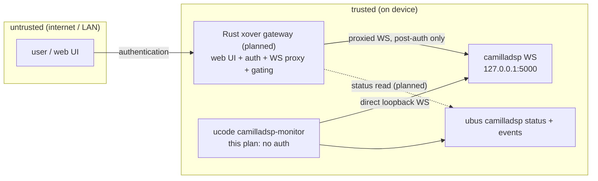

# Plan — camilladsp-monitor (ucode ubus daemon)

> **SUPERSEDED** by `plan/camilladsp-native-ubus.md`: the ucode daemon
> was never implemented; camilladsp now provides the `camilladsp` ubus
> object natively (patch 0004, `ubus-zero`). Consumers keep the same
> interface (`ubus call camilladsp status`); only `ubus listen`
> transition events are still unimplemented — poll `status` instead.
> The loopback-bind hardening note in §1 remains valid.

Goal: a small ucode daemon that reads camilladsp status over its
loopback WebSocket and republishes it via **ubus** — exactly the
pattern ptp-monitor established for statime. Consumers: the dynamic
login banner, watchdog/LED policy, the rig's health probes, and later
the Rust crossover gateway (which owns anything user-facing).

## 1. Architecture & trust model



- The monitor is **local trusted plumbing**: it talks to camilladsp's WS
  directly on loopback — no auth, no dependency on the gateway.
- The gateway (see plan/protected-xover-pipeline.md) is the *only*
  externally reachable path: web UI + authenticated WS proxy + xover
  gating implemented in Rust. This plan deliberately does not grow into
  that; it stays ucode, like ptp-monitor.
- Hardening note: today camilladsp starts with `-a 0.0.0.0` (WS without
  auth, reachable from the network). With this topology it should bind
  **127.0.0.1 only** — do it in this change unless a rig workflow still
  needs hostfwd access (none known: the rig never used the WS).

## 2. Design

### 2.1 ucode WebSocket client (~250 lines)

- `ustream` + `uloop`: async socket, reconnect with backoff
  (0.5 s → 30 s cap; also covers "camilladsp not started yet", since it
  hotplug-starts on PTP lock).
- Handshake: HTTP/1.1 Upgrade with `Sec-WebSocket-Key`; verify server
  accept via `digest` (sha1). Target `ws://127.0.0.1:<port>/`.
- Framing (client role): outgoing frames MASKED; incoming frames
  UNMASKED (the simple direction). Handle opcode text, ping→pong,
  close→reconnect; treat fragmentation defensively (accumulate until
  FIN; camilladsp messages are small JSON in practice).
- JSON in/out via ucode's native json module.

### 2.2 Data & subscriptions

On connect: `GetVersion`, `GetState`; then `SubscribeToState`
(transitions pushed). Optional `SubscribeToCapturePeak` /
`SubscribeToPlaybackPeak` — **off by default**, ubus event rate limited
(peaks arrive continuously; only useful when someone is watching).

### 2.3 ubus surface (mirrors ptp-monitor)

```
ubus call camilladsp status     # cached snapshot, instant reply
{
  "ws_connected": true,
  "state": "Running",           # Running | Inhibited | Starting | Stopped | Failed
  "stop_reason": null,
  "samplerate": 48000,          # actual rate reported by camilladsp
  "volume": -12.5, "mute": false,
  "version": "4.1.3",
  "peaks": null                 # or { capture: [..], playback: [..] } when enabled
}
ubus listen camilladsp          # events on state TRANSITIONS only:
                                # { "action": "state", "state": "Failed", ... }
```

Transition handling doubles as the watchdog feed: `Running → Failed`
fired as a ubus event (and, if useful later, via the hotplug dispatcher
like `hotplug.ptp`) — this is how LED/UI policy and the future gateway
learn that the protected pipeline aborted.

### 2.4 uci schema

```
config camilladsp-monitor 'main'
	option host '127.0.0.1'
	option port '5000'
	option peaks '0'          # enable peak subscriptions (rate-limited events)
	option event_interval '2' # min seconds between emitted events
```

(port defaults stay in sync with camilladsp uci `port` if unset — read
both, explicit wins.)

### 2.5 Service

`/etc/init.d/camilladsp-monitor` — S85, USE_PROCD, respawn; tolerates
camilladsp starting late (hotplug after PTP lock) via the reconnect
loop; banner integration: profile.d/10-status.sh gains
`cdsp : Running@48000` in its `svc` line.

## 3. Files

| file | change |
|---|---|
| `usr/bin/camilladsp-monitor` | new ucode daemon |
| `etc/init.d/camilladsp-monitor` + rc.d S85 | service |
| `etc/config/camilladsp-monitor` | uci defaults |
| `etc/init.d/camilladsp` | bind WS to 127.0.0.1 |
| `etc/profile.d/10-status.sh` | banner line |
| `docs/` | component doc (ubus schema + trust model) |

## 4. DoD (rig)

1. boot → PTP lock → camilladsp starts → within ~2 s
   `ubus call camilladsp status` shows Running@48000.
2. `service camilladsp restart` → monitor reconnects, status recovers.
3. kill -9 camilladsp → `Failed/Disconnected` state + one transition
   event; respawn observed.
4. Radio e2e unchanged (WS consumer adds no measurable CPU; thread
   count of camilladsp unchanged).
5. Banner shows the camilladsp line on login shells.
6. WS from the network is refused (loopback bind) — hostfwd check.

## 5. Risks / open questions

- ucode WS implementation is bespoke: framing edge cases (fragmented /
  control frames interleaved) handled defensively; tested against
  camilladsp 4.1.3 only — a version bump could change the API.
- Peak subscriptions flood ubus if naively forwarded — gated by config
  and rate limiting; default off.
- camilladsp WS protocol errors (CommandError) on unsupported commands
  (peaks on file devices?) — degrade gracefully, mark fields null.
- Sequencing vs the Rust gateway: monitor lands first (no dependency);
  gateway later consumes `ubus call camilladsp status` for UI state and
  does its own proxied WS only for config operations — document this
  contract in the gateway plan when written.
