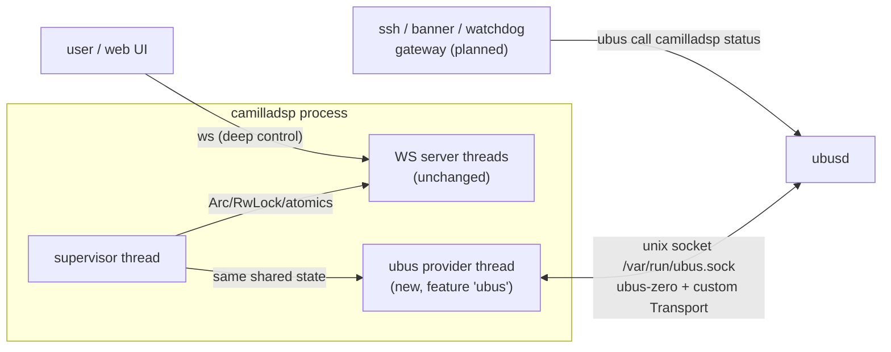

# Plan — camilladsp native ubus status object

> **Status 2026-10-02**: implemented — patch `0004-add-ubus-status-object.patch`,
> feature `ubus`. Deviations discovered during implementation:
> - **Socket discovery** instead of a fixed default: buildroot's ubusd
>   listens on `/var/run/ubus/ubus.sock`, OpenWrt's on
>   `/var/run/ubus.sock` — `--ubus-socket` (no default) probes
>   `/var/run/ubus.sock`, `/var/run/ubus/ubus.sock`, `/tmp/run/ubus.sock`,
>   `/tmp/run/ubus/ubus.sock` per attempt (rbctl-dsl's approach).
> - The feature implies `websocket` (`ubus = ["dep:ubus", "websocket"]`)
>   because `SharedData` lives in the websocket-gated `socketserver`
>   module; refactoring it out was not worth the extra diff.
> - **Int32 coercion**: the ubus CLI encodes JSON integers as INT32, so
>   `volume_set` accepts all integer widths + double (arg_number).
> - Verified: unit tests (10), host rig against ubusd-rs
>   (ubus-zero's differentially-tested broker), and QEMU e2e — all DoD
>   items pass (statefile item N/A: the init script runs without
>   `--statefile`).

Goal: a small in-process ubus provider inside camilladsp itself (new
patch `0004`), running in parallel with the WebSocket server. Exposes
the light status surface (`status`, volume get/set) for on-device
consumers (banner, watchdog/LED policy, gateway). Deep inspection
stays on the WS. Library: [ubus-zero](https://github.com/pawelchcki/ubus-zero)
(pure Rust, `no_std + alloc`, provider side `UbusObject`/`UbusConnection`).

**Reference implementation**: rbctl-dsl
(`~/Documenti/Progetti/Analisi remote_board/rbctl-feed/rbctl-dsl`)
already uses ubus-zero in production shape — reuse its patterns:
- `crates/rbctl_dsl/src/utils/ubus_transport.rs` — `UnixUbusTransport`
  (non-blocking `UnixStream`, `rx_buf`, EOF→`Closed`, 5 s send deadline)
- `crates/rbctl_dsl/src/utils/ubus.rs` — socket discovery +
  `connect_and_register` treated as optional
- `crates/rbctl_dsl/src/daemon/ubus_object.rs` — object builder with
  `BlobBuilder::open_table(None) … finish_table()` replies

Two deviations for camilladsp: reconnect with backoff (rbctl-dsl
registers once and gives up) and a real `wait_recv` park via
`nix::poll` (rbctl-dsl sleeps 1 ms; its daemon polls once per tick,
while our dedicated thread blocks inside `poll_one` and would spin at
1 kHz).

**Supersedes** `plan/camilladsp-monitor.md` (ucode daemon bridging
WS→ubus). That plan was never implemented; the native object removes
its bespoke ucode WebSocket client, its extra daemon, and its
reconnect plumbing in one stroke. Consumers keep the same call shape:
`ubus call camilladsp status`.

## 1. Architecture



- The provider thread reads the **same `SharedData` Arcs** the WS
  server serves (src/socketserver.rs:51) — no websocket round trip, no
  extra copies, no polling between the two servers.
- All handler reads are RwLock reads or atomics (`ProcessingParameters`
  stores volume/load as `AtomicU32` bits, src/lib.rs:252) — µs-scale,
  safe inside the sync ubus poll loop.
- Reconnect with backoff (0.5 s → 30 s cap) covers ubusd restarting
  and boot ordering; the object re-registers automatically.

## 2. ubus surface

```
ubus call camilladsp status       # no args
ubus call camilladsp volume_get   # no args
ubus call camilladsp volume_set   # { "volume": -10.5, "mute": false }  (both optional)
ubus call camilladsp mute_toggle  # no args → { "mute": true }
```

### 2.1 `status` reply

| field | type | source (SharedData) |
|---|---|---|
| `state` | str `Running\|Paused\|Inactive\|Starting\|Stalled` | `capture_status.read().state` |
| `stop_reason` | str, `None\|Done\|CaptureError\|PlaybackError\|UnknownError\|CaptureFormatChange\|PlaybackFormatChange` | `processing_status.read().stop_reason` |
| `stop_detail` | str, only when the reason carries a message | same |
| `config_path` | str or null | `active_config_path.lock()` |
| `capture_rate` | i32 | `capture_status.read().measured_samplerate` |
| `rate_adjust` | double | `capture_status.read().rate_adjust` |
| `buffer_level` | i32 | `playback_status.read().buffer_level` |
| `clipped_samples` | i64 | `playback_status.read().clipped_samples` |
| `processing_load` | double % | `processing_params` atomic |
| `resampler_load` | double % | `processing_params` atomic |
| `volume` | double dB (Main fader) | `processing_params` atomic |
| `mute` | bool | `processing_params` atomic |
| `version` | str | `clap::crate_version` |

`clipped_samples` is the closest thing to an xrun counter (CamillaDSP
has none); `buffer_level` vs the config's `target_level` is the
health signal.

### 2.2 `volume_set` / `mute_toggle` semantics

`volume_set` replicates `WsCommand::SetVolume`/`SetMute`
(src/socketserver.rs:1062) exactly: clamp volume to −150..+50 dB,
`set_target_volume(0, v)` / `set_mute(0, b)`, then
`unsaved_state_change.store(true)` + `state_change_notify.try_send(())`
so the statefile persists the change. Main fader only; aux faders
stay WS-only.

`mute_toggle` mirrors `WsCommand::ToggleMute`: it is a dedicated
method (not just a `volume_set` flag) because
`ProcessingParameters::toggle_mute` is a single race-free
`fetch_xor` (src/lib.rs:321) — the obvious "read mute, write !mute"
round trip via `volume_get`+`volume_set` has a TOCTOU race, which
matters for button bindings and scripts polling concurrently. NB:
`fetch_xor` returns the **old** value; the handler replies with
`!old` (same as the WS does), plus the same statefile side effects.
Returns the new state so callers don't need a follow-up `status`.

### 2.3 Out of scope (deliberate)

- **`reload`** — `/etc/init.d/camilladsp reload` is the canonical path
  (regenerates yml from uci, re-checks the manifest, then SIGHUP). An
  in-process reload would re-read /tmp/camilladsp.yml without genconf,
  bypassing that flow. WS `Reload` remains for power use.
- **`stop`/`exit`** — procd owns the lifecycle.
- **Signal RMS/peak, spectrum, config get/set** — WS territory
  (`GetSignalLevels*`, spectrum comes from patch 0002).
- **ubus events on state transitions** — ubus-zero's client has no
  event-send API yet (lookup/invoke only). Watchdog/banner poll
  `status` (≥1 s interval is plenty). Revisit if ubus-zero grows it.

## 3. Implementation steps

Dev workflow: edit the `deps/camilladsp` submodule working tree (which
carries patches 0001–0003 uncommitted; the shipped stack later grew to
0001–0005, see `docs/patches.md`), then export the delta as a new patch
file — same as the existing patches.

### 3.1 Cargo.toml

```toml
[target.'cfg(target_os="linux")'.dependencies]
# NOT on crates.io (README badge is aspirational) — pin the same git rev
# rbctl-dsl validated against.
ubus = { package = "ubus-zero", git = "https://github.com/pawelchcki/ubus-zero",
         rev = "68b55de7", optional = true, default-features = false }

[features]
ubus = ["dep:ubus"]
```

Notes:
- Linux-gated like `zbus`; ubus only exists on OpenWrt-style systems.
- `default-features = false`: crate is `no_std + alloc`, deps are just
  `thiserror` + `spin` — negligible for the cross build.
- Apache-2.0 dep inside the GPL-3/MPL-2 dual license: compatible.
- Buildroot build already runs with network (no Cargo.lock in the
  tree), so cargo fetching the git dep at build time is a non-issue.

### 3.2 New `src/ubusserver.rs` (~200 lines)

1. **`UnixUbusTransport`** — port rbctl-dsl's implementation
   (utils/ubus_transport.rs, itself modeled on ubus-zero's testkit):
   - non-blocking `UnixStream`, internal `rx_buf: Vec<u8>` with cap
     `MAX_MSG_LEN * 2`, EOF → `UbusError::Closed`, `send` with 5 s
     deadline handling EAGAIN/Interrupted;
   - frame (de)serialisation delegated to `ubus::wire::Codec`;
   - one change: `wait_recv` uses `nix::poll` (POLLIN, 250 ms) instead
     of rbctl-dsl's 1 ms sleep — our dedicated thread parks inside
     `poll_one`, and 1 kHz wakeups would show up on a media device.
     nix is already a dependency with the `poll` feature.
2. **Object + handlers**: `UbusObject::new("camilladsp")`
   `.method("status", …)` `.method("volume_get", …)`
   `.method("volume_set", …)` `.method("mute_toggle", …)`. Handlers are
   `Box<dyn FnMut(&[u8]) -> Result<BlobMsgTable, _>>` and **not Send**
   (ubus-zero server.rs:21) → build the object *inside* the provider
   thread, closing over a cloned `SharedData`. Args parsed with
   `ubus::blobmsg::lookup(req, "volume")?.as_f64()`; replies built with
   `BlobBuilder` (rbctl-dsl pattern: `open_table(None)` …
   `close_table()` … `finish_table()`). Unit-test the status reply
   builder against a fixture `SharedData` (rbctl-dsl does this for its
   `metrics` reply).
3. **Thread loop**: connect → `connect_and_register` → loop
   `poll_one()`. On error/Closed: drop connection, backoff (0.5 s
   doubling to 30 s cap, reset on success), rebuild object,
   reconnect. rbctl-dsl gives up after the first failure — we add the
   retry loop because camilladsp outlives ubusd restarts. Socket path
   from `--ubus-socket` (default `/var/run/ubus.sock`). One info log
   on first connect and on backoff-cap transitions, otherwise debug.

### 3.3 `src/bin.rs` hook

- Move the `state_change_notify` channel creation (`tx_state`/`rx_state`,
  bin.rs:1144) out of the `#[cfg(feature = "websocket")]` block so the
  ubus feature can fire statefile saves without requiring WS (the
  statefile saver thread stays where it is).
- After the WS block (~bin.rs:1181):
  ```rust
  #[cfg(feature = "ubus")]
  ubusserver::start(ubus_socket_path, socketserver::SharedData { … });
  ```
  spawns the provider thread. Independent of `-p` (works with WS off).
- CLI: `--ubus-socket <path>` arg, cfg-gated like `--cert`/`--pass`,
  default `/var/run/ubus.sock`; literal `off` disables. The init script
  needs no change.
- `src/lib.rs`: `#[cfg(feature = "ubus")] pub mod ubusserver;`.

### 3.4 Export patch + Buildroot

- Export the submodule delta (Cargo.toml, bin.rs, lib.rs, new
  ubusserver.rs) as
  `br-external/package/camilladsp/0004-add-ubus-status-object.patch`,
  same diff format as 0001–0003.
- `camilladsp.mk`: `CAMILLADSP_CARGO_BUILD_OPTS = --features 32bit,ubus`.
- No Cargo.lock in the tree (build already runs with network), so
  `ubus-zero` resolves at build time — nothing to vendor.
- `plan/camilladsp-monitor.md`: add a superseded-by note at the top.
- `docs/camilladsp.md`: document the ubus schema (mirroring §2).

## 4. Files

| file | change |
|---|---|
| `deps/camilladsp/Cargo.toml` | optional `ubus-zero` dep + `ubus` feature |
| `deps/camilladsp/src/ubusserver.rs` | new: transport, handlers, thread |
| `deps/camilladsp/src/lib.rs` | cfg-gated module decl |
| `deps/camilladsp/src/bin.rs` | `--ubus-socket` arg, thread spawn, channel move |
| `br-external/package/camilladsp/0004-add-ubus-status-object.patch` | new (exported) |
| `br-external/package/camilladsp/camilladsp.mk` | add `ubus` feature |
| `plan/camilladsp-monitor.md` | superseded note |
| `docs/camilladsp.md` | ubus schema doc |

## 5. DoD (rig)

1. `scripts/build.sh` passes; `ubus list` in qemu shows `camilladsp`
   with `status`, `volume_get`, `volume_set`, `mute_toggle`.
2. With the radio flow running, `ubus call camilladsp status` shows
   `state:"Running"`, `capture_rate:48000`, sane loads; fields agree
   with a parallel WS `GetState`/`GetCaptureRate` query.
3. `ubus call camilladsp volume_set '{"volume":-10}'` → WS `GetVolume`
   reports −10 and the statefile is updated within ~1 s.
4. `ubus call camilladsp mute_toggle` → returns the new state, WS
   `GetMute` agrees, statefile updated; a second call flips it back.
4. `ubus call camilladsp mute_toggle` → returns the new state, WS
   `GetMute` agrees, statefile updated; a second call flips it back.
5. `ubusd` restart → object re-registers within the backoff window;
   `ubus call camilladsp status` works again.
6. Host build (no /var/run/ubus.sock): single info log, quiet retries,
   no CPU spin (verified via `top`), WS functionality unchanged.
7. Build without the `ubus` feature still compiles (no regressions;
   CI shape of upstream default features).
8. Docs updated; monitor plan marked superseded.

## 6. Risks / open questions

- **ubus-zero is pre-1.0 and not on crates.io** — git-rev pin is
  mandatory (same `68b55de7` rbctl-dsl validated against); re-test the
  wire behavior against the device ubusd before bumping. Differentially
  tested upstream against OpenWrt reference binaries, and already
  proven on-device by rbctl-dsl, which lowers the risk.
- **Transport edge cases** (partial frames, EAGAIN storms, ubusd
  restart mid-call) — mitigated by reconnect-on-error + the 250 ms
  park; handlers are pure reads so a dropped call is retryable.
- **`MethodHandler` not Send** — object must be constructed on the
  provider thread (design constraint, not a problem).
- **No event emission** — watchdog must poll; acceptable at 1 Hz,
  documented in §2.3.
- **Upstreamability**: patch carries `cfg(target_os="linux")` + feature
  gate + default-off, so it is offerable to HEnquist/camilladsp later
  (general interest for OpenWrt users); if refused, it stays a
  downstream patch like the rest of the stack (0001–0005).
