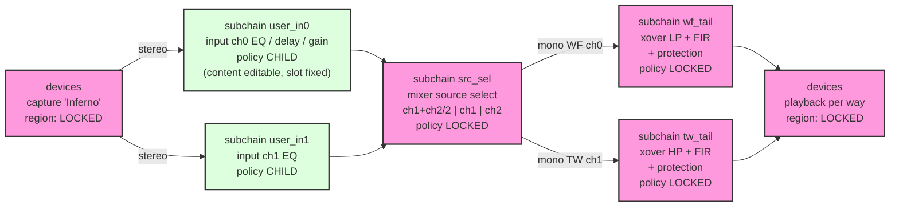

# Plan — locked sub-chain pipeline (driver protection vs user EQ)

> **Status 2026-10-02**: implemented, but **body predates the 2026-09-29
> placeholder-free rework** (camilladsp 0005 + genconf). Shipped model:
> every step is a real uci `config pipeline_step` section (no
> `user_slot_*` placeholder anchors, no `config subchain`/`child`
> policy — editable steps are `policy 'free'`, attributed by step
> description; free gaps are slot indexes), user edits persist in uci
> via webui M4 (no preset daemon), and the `GetPolicy` WS command
>   exposes the manifest. Current truth: the `camilladsp-genconf` header
> comment + patch 0005 + shipped `/etc/config/camilladsp`; the policy
> reference is `docs/camilladsp-policy.md` (rewritten for the new
> model, 2026-10-02).

Goal: a camilladsp pipeline partitioned into logical **sub chains**
(groups), each carrying one of three **policies**. The speaker-design
and driver-protection chain (routing mixer, final crossover + FIR +
safety limiting, device bindings) lives in **locked** sub chains and
is mandatory and tamper-proof; the user only ever gets well-defined
editable slots (**child** policy — content editable, position fixed).
Third-party websocket/HTTP tools must not be able to remove, disable,
edit or reposition anything outside what a sub chain's policy allows.

Key point: the sub chain is a **configuration-level concept only**.
camilladsp still receives and runs the same flat
devices/mixers/filters/pipeline YAML — internal processing is
invariant. The partition, policies and per-sub chain constraints live
in uci and in the manifest; enforcement is pure config validation.

## 1. Sub chains — the logical model

A sub chain is a named, contiguous, ordered group of pipeline steps
with a policy and, when editable, a set of constraints. Three
policies:

|  | `locked` | `child` *(our case)* | `free` |
|---|---|---|---|
| child (content) edits | no — pinned by hash | yes, within constraints | yes, within constraints |
| group position in parent chain | pinned | pinned — slot fixed | movable, within allowed gaps |
| group removable / splittable | never | never | never |
| placeholder anchor | — | required (marks group start) | required (marks group start) |
| may render empty | no | yes (placeholder only) | yes |

Notes:

- "child" = child-only editing: the group's *contents* are editable
  but the group's *position* in the parent chain is fixed.
- "free" = full unlock: contents editable AND the group can be
  repositioned. Defined by the model, not used by the shipped speaker
  config (v1 ships `locked` + `child`).
- content-locked + position-free is deliberately **not** a valid
  combination: locked content is only meaningful at a pinned position
  (a crossover moved is a different speaker).

Invariants (checked by `camilladsp-genconf` at render time AND by the
daemon on every config apply):

1. every pipeline step belongs to exactly one sub chain; a sub chain
   is a contiguous run of the ordered pipeline. The **set** of sub
   chains (names, policies) is manifest-fixed: no group can be added,
   removed, renamed or split at runtime — runtime edits are content
   edits (and repositioning for `free`) only;
2. anchor order: `locked` groups appear verbatim in manifest order
   (they anchor the gaps); a `child` group must stay in its slot (the
   gap it is declared in — slot 0, before the first locked anchor, is
   a valid slot: that is where the input-channel user EQ groups live);
   a `free` group may relocate — whole run — into one of its
   vendor-allowed gaps, never after the last locked group;
3. every editable group (`child`/`free`) renders a placeholder step
   `user_slot_<name>` (Gain 0 dB) as its **first** step — this is the
   group identification anchor; user steps append after it. Several
   editable groups may share one gap (e.g. both input EQ slots in
   gap 0);
4. the last sub chain (highest first-step index) must be `locked`:
   nothing can be appended after the protection tail;
5. filters referenced by locked steps are part of the locked content;
   filters referenced only by editable steps must be allow-listed
   types; locked conv filters must reference coefficient files under
   the vendor read-only path (§6) — user conv filters may point
   anywhere (e.g. /opt/user_data);
6. devices are implicitly locked; the mixers region is pinned up to
   the route gains of mixers explicitly marked `user_gains` in the
   policy/manifest — the source-mix selection (100% ch0 / 100% ch1 /
   (ch0+ch1)/2) is a pure gain preset, and the locked protection tails
   still clamp whatever the mix feeds them. Mixers NOT marked are
   fully locked, gains included (the default).

## 2. Signal chain (target)

User EQ lives on the **input channels** — two editable groups, one per
input channel, BEFORE the mixer — then the source-select mix and the
locked xover+FIR+limiter tails per way:



Rendered flat pipeline (indices at first render; the two tails
interleave as channel-filtered Filter steps, as today):

```
idx 10  user_in0  user_slot_user_in0   (child, slot 0: before first anchor)
idx 15  user_in1  user_slot_user_in1   (child, slot 0)
idx 20  src_sel   Mixer srcmix         (locked anchor 1)
idx 30  wf_tail   Filter ch0: LP FIR … (locked anchor 2)
idx 40  tw_tail   Filter ch1: HP FIR … (locked anchor 3 — last)
```

User steps injected at runtime must land inside their slot, after
their placeholder; anything else is a violation.

## 3. Threat model

| actor | vector | mitigation |
|---|---|---|
| network third-party tool | camilladsp WS config commands (no HTTP API in v4) | WS bound to **loopback only** (product init); no auth exists upstream — loopback is the perimeter |
| local service daemon (preset loader, unprivileged) | WS `SetConfig`/`PatchConfig` | **manifest validation** (§4): it can only write inside editable sub chains |
| buggy local tool (non-root) | WS config write / editing /tmp/camilladsp.yml + Reload | same validation on EVERY config-apply path; on-disk tamper → **abort** (§5) |
| user via uci/ssh | uci itself | out of scope: uci IS the vendor surface (sub chains and policies defined there) |
| local root (device fully hacked) | edit yml AND manifest together, swap coeff files, edit uci | out of scope **by decision** — root is the vendor surface; on a hacked device the driver-safety promise does not apply |

Scope note (drives the decisions below): the goal is **mistake-
proofing** — a user or buggy tool must not be able to touch the active
crossover through any camilladsp config path — not hardening against a
rooted device. Runtime volume/mute/fader controls are state, not
pipeline structure, and are deliberately **not lockable** (at worst
they cause silence or muting, never a protection bypass); mixer route
gains are the same kind of state (source-mix selection — see §1
invariant 6). The trust
boundary for the /tmp artifacts is file ownership: genconf writes yml
and manifest root-owned 0644 in sticky /tmp — non-root cannot replace
them; root tampering is the row above.

## 4. Manifest (what each policy means, machine-checkably)

Generation chain (implemented as `--make-manifest`):

1. `camilladsp-genconf` renders from uci:
   - `/tmp/camilladsp.yml` — the full config, **format unchanged from
     today**; locked steps rendered from uci as-is, editable sub chains
     rendered as placeholder `user_slot_*` Gain-0dB steps;
   - `/tmp/camilladsp.policy.yml` — the partition declaration, no
     hashing in shell: ordered subchains; a `locked` entry carries its
     step range in the rendered pipeline (`name`, `first_step`,
     `steps`); `child`/`free` entries carry `channels`, `allow`,
     `max_steps` (free also `gaps`: anchor names it may relocate
     after);
2. `camilladsp /tmp/camilladsp.yml --make-manifest
   /tmp/camilladsp.policy.yml > /tmp/camilladsp.manifest` — **the
   daemon generates its own manifest** (v2): hashes + embedded locked
   step structures (the anchors the validator matches) + constraints
   for editable groups. Using the same binary to generate and to
   validate means the canonical form has ONE implementation (no
   cross-language float/format drift — `PrcFmt` is even f32 under the
   `32bit` feature), and generation self-checks by validating the
   source config against the result:

   ```json
   {
     "version": 2,
     "devices": {"sha256": "…"},
     "mixers":  {"sha256": "…"},
     "subchains": [
       {"name": "src_sel", "policy": "locked", "sha256": "…",
        "steps": [ {"type": "Mixer", "name": "srcmix"} ]},
       {"name": "user_wf", "policy": "child", "slot": 1, "channels": [0],
        "allow": ["Gain", "Biquad", "BiquadCombo", "Conv", "Delay"],
        "max_steps": 8},
       {"name": "wf_tail", "policy": "locked", "sha256": "…", "steps": […]},
       {"name": "user_tw", "policy": "child", "slot": 2, "channels": [1],
        "allow": ["Gain", "Biquad", "BiquadCombo", "Conv", "Delay"],
        "max_steps": 8},
       {"name": "tw_tail", "policy": "locked", "sha256": "…", "steps": […]}
     ]
   }
   ```

- a `locked` sub chain's `sha256` is the canonical serialization of
  its ordered steps (incl. channel bindings and `bypassed`/
  `description`) AND the filter/mixer definitions they reference —
  moving/renaming/re-tuning any of it invalidates the hash. Canonical
  form (implemented once in `src/config/manifest.rs`, used for both
  generation and validation): JSON with nulls stripped, keys sorted,
  whole-valued floats normalized to integers, compact serialization →
  sha256 hex; locked run body = `{"name":…, "steps":[…],
  "filters":{…}, "mixers":{…}}`;
- `slot` = gap index after locked anchor #slot (anchors numbered from
  1 in order) — where a `child` group is pinned; a `free` group
  carries `gaps`: the slots it may be relocated to;
- working example triple: `configs/camilladsp_protected_2way.yaml` +
  `configs/camilladsp_protected_2way.policy.yml` +
  `configs/camilladsp_protected_2way.manifest.json` (generated by the
  real binary).

(One rendering ⇒ config and manifest can never disagree. uci reloads
regenerate both atomically, so `reload_service` stays safe.)

## 5. Enforcement — camilladsp patch (0003-locked-config-manifest.patch)

The fork already carries patches; this adds a *config gate*:

1. `--manifest <path>` CLI option; loaded at startup.
2. Validation function `config_matches_manifest(cfg, manifest)`:
   - devices/mixers canonical hashes equal to the manifest;
   - walk the pipeline step list: match each `locked` sub chain
     verbatim (names, types, param hashes, channel bindings, order,
     and the per-step `bypassed`/`description` flags — a locked step
     flipped to `bypassed: true` is a protection bypass and must be
     rejected) — the matched runs are the anchors and must appear in
     manifest order; they define the gaps;
   - each gap must contain: the `child` group assigned to that slot
     (placeholder present and first, constraints satisfied) plus any
     `free` groups whose `gaps` include this slot (placeholder-headed,
     constraints satisfied), in any relative order;
   - each editable step must satisfy its group's constraints:
     channels ⊆ allowed, filter type ∈ allow-list, count ≤ max_steps
     (placeholders always valid); a step with omitted `channels`
     applies to ALL bus channels — valid only if the slot owns every
     channel (normally a violation);
   - any step that lands in no group (after the tail, inside a locked
     run, in a gap with no matching group, or before its group's
     placeholder) → violation;
   - filters: locked-referenced filters pinned; filters referenced
     only by editable steps must be allow-listed types.
3. Gates — audited against the fork's actual WS command set
   (src/socketserver.rs; v4 has **no HTTP config API**, WS only).
   Every config-mutating path converges on ONE shared function,
   `config::validate_config` (config/utils.rs), before sending
   `ControllerMessage::ConfigChanged` to the processing thread. The
   manifest check hooks into that single function → one change gates
   all of: `SetConfig`, `SetConfigJson`, `PatchConfig`,
   `SetConfigValue`, `Reload`, `SetConfigFilePath`, plus startup via
   `load_validate_config`:
   - startup (manifest present): on-disk config vs manifest →
     mismatch = **abort** (exit non-zero; procd respawn keeps
     retrying — silence, speakers safe; log CRIT with the offending
     sub chain);
   - WS commands: violation = reject with `ConfigValidationError`,
     keep the running config, log CRIT (audio never stops for a
     refused edit). `PatchConfig`/`SetConfigValue` rebuild the FULL
     candidate configuration before validation, so partial edits
     (e.g. `SetConfigValue` on `/filters/wf_lp/parameters/freq`) are
     caught by the same sub-chain walk;
   - non-config commands (`Stop`, `Exit`, volume/mute/faders) are
     process/runtime-state control: at worst silence or a procd
     respawn — deliberately not gated (§3 scope note).

   This is the abort-vs-reject split the requirement implies:
   *runtime* tampering is refused (service continues), *persistent*
   tampering halts the pipeline.
4. No manifest option passed → behaviour identical to upstream (feature
   is opt-in; keeps the patch upstream-submittable as "locked config").

## 6. User state, coefficients, preset daemon

Decisions (v1):

- **runtime user edits are memory-only**: they live in the running
  daemon and are not persisted — a uci reload or reboot regenerates
  the config and slots reset to placeholders. Accepted for v1;
  auto-re-apply of presets on boot/reload is the future persistence
  story;
- **protection FIR coefficients live under a vendor-owned read-only
  path** (e.g. `/usr/share/camilladsp/coeffs/`, squashfs): genconf
  refuses a locked conv filter pointing anywhere else; vendor
  coefficient updates = OPKG/uci → genconf → manifest regen (both
  artifacts move together);
- preset daemon (later milestone): speaks WS on loopback — ReadConfig
  → splice preset steps into editable sub chains, after their
  placeholders → WriteConfig (validation passes: locked sub chains
  untouched, child slots in place); presets live in
  `/opt/user_data/presets/` (survive factory reset); exposes safe
  operations over ubus (load/preview/list) — never raw config writes;
  runs unprivileged; no uci access.

## 7. uci schema (extends D4 chain-node schema)

```
config subchain
	option name 'user_in0'   # input ch0 user EQ
	option policy 'child'    # content editable, slot fixed
	option channels '0'      # bus channels this slot may touch
	option allow 'gain peak hs ls notch ap conv delay'  # uci filter types
	option max_steps '8'

config subchain
	option name 'src_sel'
	option policy 'locked'

config step                 # editable slot: bare step, renders the placeholder
	option index '10'
	option subchain 'user_in0'

config step
	option index '20'
	option subchain 'src_sel'
	option type 'Mixer'
	option name 'srcmix'

config step
	option index '30'
	option subchain 'wf_tail'
	option type 'Filter'
	list channels '0'
	list names 'wf_lp_fir'
```

Mixroute `gain` is **linear** in uci (0.5 = −6 dB, default 1.0);
genconf renders every route with an explicit `scale: linear` (v4
reads a bare gain as dB).

For a `free` group the section would also declare relocation gaps by
anchor name, e.g. `list allowed_after 'src_sel' 'wf_tail'` (translated
to slot indices in the manifest).

`camilladsp-genconf` assigns and checks roles at render time — early
failure at config time, not runtime. It refuses to render when:

- any step has a missing/unknown `subchain` while subchain sections
  exist;
- a sub chain's steps are non-contiguous by index (another sub chain's
  step interleaves);
- the last sub chain is not `locked` (invariant 4);
- an editable sub chain lacks `channels`/`allow`, or has more than its
  single bare slot step, or the slot step carries type/filters;
- a sub chain is declared but has no steps;
- a `free` group's `allowed_after` names a non-locked or non-existent
  anchor;
- a locked conv filter's `filename` is outside the vendor read-only
  coefficient path.

## 8. Test plan (DoD)

1. Render: uci per §7 → yml + manifest; camilladsp starts clean.
2. WS tamper matrix (small python WS client, loopback):
   - delete a locked step → rejected, audio continues, CRIT logged;
   - edit locked FIR file path / params → rejected;
   - move a locked step (e.g. after a user step) → rejected;
   - insert step after the locked tail → rejected;
   - user EQ inside a `child` slot (allowed type + channel) →
     accepted, audible;
   - user step on a channel the slot doesn't own → rejected;
   - non-allow-listed filter type in a slot → rejected;
   - user step with omitted `channels` (applies to all) → rejected;
   - exceed `max_steps` → rejected;
   - Processor step / processors section anywhere → rejected (slots
     accept Filter steps only; processors are outright forbidden);
   - extra Mixer step in a slot → rejected;
   - empty editable sub chain (placeholders only) → accepted;
   - move a `child` group out of its slot (e.g. user_tw run before
     wf_tail) → rejected (position lock);
   - model proof (not in shipped config): `free` group relocated into
     an allowed gap → accepted; into a non-allowed gap / after the
     tail → rejected;
   - mixer route gains changed (source select) → accepted; route
     added/removed/re-flagged or devices changed → rejected.
3. On-disk tamper: edit yml, SIGHUP/Reload → abort + respawn silence;
   restore → audio returns.
4. Chain test: stereo→mono select per uci mode; TW/WF on separate
   playback channels; protection FIR coeffs served from the read-only
   vendor path (user FIRs may still come from /opt/user_data).
5. Regression: no-manifest run identical to upstream; existing
   single-channel rigs unaffected (no subchain sections → today's
   rendering, byte-for-byte).

## 9. Files touched (estimate)

| file | change |
|---|---|
| `deps/camilladsp/src/config/` + `src/bin.rs` + WS/HTTP handlers | manifest load, policy/gap walk + validation, gates (~+400 LoC) |
| `br-external/…/usr/bin/camilladsp-genconf` | `subchain` sections + policies, invariant checks, placeholder + policy-spec rendering (no hashing in shell) |
| `…/etc/init.d/camilladsp` | genconf → `--make-manifest` → start with `--manifest`; bind WS loopback |
| `…/etc/config/camilladsp` (+ docs/camilladsp.md §schema) | `subchain` sections (`policy`), `subchain` option on steps, `src_sel` mixer |
| `configs/` | example triple (yml + policy + manifest) — DONE |

## 10. Implementation status

Done — camilladsp side (patch
`br-external/package/camilladsp/0003-locked-config-manifest.patch`,
applies after 0001+0002 on the v4.1.3 pin):

- `src/config/manifest.rs`: manifest schema + policy spec, canonical
  form, self-contained sha256, `validate_against_manifest` (locked
  anchors + hash pinning incl. `bypassed`, child/free constraints,
  placeholder-first rule, omitted-channels rule, unused-filter and
  processor rejection, editable groups allowed in slot 0 ahead of the
  first anchor), `--make-manifest` generator with self-check and
  uci→camilladsp allow-type translation;
- hook in `config::validate_config` → gates startup (abort, exit
  101), `--check`, WS `SetConfig`/`SetConfigJson`/`PatchConfig`/
  `SetConfigValue`/`Reload`/`SetConfigFilePath`, SIGHUP — all from
  one change; opt-in only (`--manifest` absent ⇒ upstream behaviour,
  verified live);
- tests: 26 rust unit tests, full suite 143 passed; CLI smoke;
  live WS tamper matrix `scripts/protected_ws_test.py` — 17/17
  against a running daemon on the input-EQ layout (rejections keep
  the running config, legit user EQ accepted, same-gap slot swap
  accepted, position lock enforced, `user_gains` mixer gain change
  accepted / structure change rejected; mixers not marked fully
  locked; Processor steps/sections and stray Mixer steps rejected).

Done — firmware side:

- `camilladsp-genconf`: `config subchain` sections + `subchain`
  option on steps, all §7 invariant checks (refuse to render),
  placeholder rendering, policy-spec emitter (`*.policy` beside the
  yml), **mixer gain fix** (uci linear gain always rendered with
  `scale: linear`, default 1.0 — v4 reads bare gains as dB), new
  `limiter` filter type, and a fix for a latent bug: the inferno
  env sidecar re-loaded the uci state before node collection,
  dropping all filter/mixer/step sections when capture was Inferno;
- init script: genconf → `--make-manifest` → start with `--manifest`;
  reload regenerates yml+policy+manifest and compares — identical
  manifests ⇒ SIGHUP (no interruption), changed manifests (vendor
  locked edit) ⇒ restart to load the new one; WS bind address from
  uci `ws_address` (default loopback — the WS API has no auth; the
  dev rig ships `0.0.0.0` for the forwarded port). Manifest
  violations log at ERROR ("Config rejected by locked manifest");
- vendor coefficient files ship in the rootfs overlay
  (`/usr/share/camilladsp/coeffs/`: 1-tap passthrough placeholders +
  README pointing to the real FIR designs);
- host test harness (committed): `scripts/genconf-test/run.sh` —
  uci stub (`/lib/functions.sh` semantics) + positive case (genconf
  output byte-identical to the reference example) + 8 negative cases
  + legacy no-subchain regression (only intended gain/scale diffs),
  12/12;
- `/etc/config/camilladsp` example updated to the protected layout;
  docs/camilladsp.md: linear-gain note, `limiter` type, "Protected
  pipeline" section (schema, rules, enforcement chain, memory-only
  user edits);
- example triple `configs/camilladsp_protected_2way.{yaml,policy.yml,
  manifest.json}` regenerated on the input-EQ layout; full chain
  proven: uci → genconf → yml+policy → `--make-manifest` → manifest
  byte-identical to the shipped reference.

Remaining: rig DoD items §8.1/8.3/8.4 on a built image (on-device
boot with the protected uci, on-disk tamper + SIGHUP abort/respawn/
restore — the host simulation covers the reject paths, the rig adds
procd respawn behaviour and real silence —, audio chain test) and the
armv7/32bit target build check (watch item below).

Watch item (deferred by decision): armv7 `32bit` build — params are
f32 there; same-binary generation makes hash drift impossible by
construction, but compile + test on the ARM target is still pending.

## 11. Risks / open questions

- **Validation strictness vs benign renames**: canonicalization must
  ignore key order but not values. Decided: ANY mismatch refuses the
  config (silence beats a mistuned speaker) — that is the product
  promise.
- **Placeholder-first rule**: user steps must be appended after their
  group's placeholder — constrains how the preset daemon splices; a
  step placed before the placeholder is rejected (strictness is the
  promise).
- **Free groups crossing a mixer** would renumber channels (indices
  stay valid, semantics change): gap allow-lists are vendor-declared
  and should never span a mixer; v1 ships `locked` + `child` only.
- **Allow-list default**: start conservative (Gain, Biquad,
  BiquadCombo, Conv, Delay). Volume/Loudness/Dither are stateful or
  format-affecting — decide later per type.
- WS SetConfig round-trip fidelity: the preset daemon should splice
  on top of GetConfig output (already the daemon's own
  serialization); validation compares parsed structures, so only
  content matters, not formatting (map key order is unstable and
  irrelevant — canonical form sorts).
- Upstream appetite for a "locked manifest" feature unknown; the patch
  is self-contained and opt-in, good odds for the conversation.
- **Resource limits in slots**: `max_steps` caps count, not cost (huge
  FIR / Delay = CPU/memory risk). Decision: camilladsp stays agnostic —
  resource sanity is enforced by the UI, not by the manifest; anyone
  hand-feeding the websocket accepts the consequences (same own-risk
  stance as the rooted-device row in §3). No per-slot caps planned.
- Unlocked non-step regions: mixer route gains became free user state
  via the structure-hash model (§1 invariant 6); a user-selectable
  *source mixer topology* (more than gain presets) would need the
  mixers region in the sub chain model — future schema extension.
