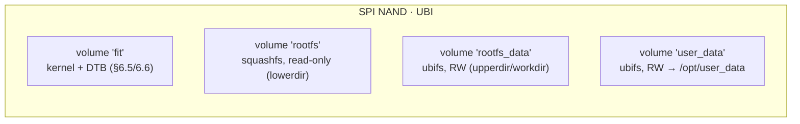
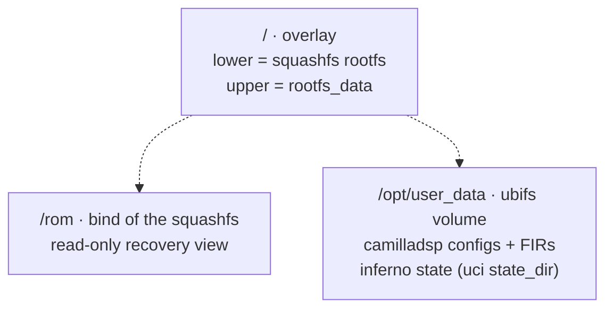

# Plan — production rootfs: squashfs + overlayfs + `/opt/user_data` (UBI/UBIFS)

> **Status 2026-10-02**: implemented on the hw boards (rpi2b + rpi02w):
> squashfs ro root + ext4 `virgilio-data` partition, preinit pivot in
> `virgilio-base` (`docs/architecture.md` §Boot chain). Phase B
> (UBI/UBIFS for the RK3506 SPI-NAND) not started; the QEMU Phase A
> variant was superseded — dev targets keep a plain rw root.

Goal: move from the ext4-RW monolithic rootfs to an OpenWrt-style
production layout for the real RK3506 (SPI NAND boot device), and give
user data (camilladsp configs, FIR files, inferno subscription state) a
dedicated RW home at `/opt/user_data`. `/etc` stays uci-driven and becomes
writable through the overlay, while the base rootfs itself is read-only.

## 0. Target layout (real hardware)



Runtime view:



Why two RW volumes instead of one:

- `rootfs_data` is small, churny (uci commits, /etc edits) and wiped by
  factory reset (`firstboot` equivalent) — restoring pristine defaults.
- `user_data` is bulkier, low-churn and survives factory reset (it is
  *user* data); wiping it is a deliberate separate action.
- inferno state lives in `user_data`, so subscriptions survive even a
  config reset (covers X1 persistently, T1 end state).

OpenWrt mechanisms to mirror (verified in ../openwrt):

| Concern | OpenWrt | Ours |
|---|---|---|
| ro root + rw overlay | `mount_root start` (fstools) exec'd from `lib/preinit/80_mount_root` → mounts rootfs_data, creates overlay, pivots; `/rom` keeps the lower view | shell port in our `/etc/preinit` (fixed layout, no fstools binary) |
| squashfs root | `BR2_TARGET_ROOTFS_SQUASHFS`-equivalent in the OpenWrt image builder | Buildroot `BR2_TARGET_ROOTFS_SQUASHFS` (4 KiB block, zstd) |
| ubifs images | `mkfs.ubifs` + `ubinize` (uboot-os-tools / mtd-utils) | Buildroot `BR2_TARGET_ROOTFS_UBIFS` + a board `ubinize.cfg` |
| factory reset | `firstboot` → `mount_root` format | overlay wipe script (drop upperdir content, reboot) |

## 1. Phase A — QEMU validation without NAND (do this first)

Second virtio-blk disk stands in for the NAND volumes; everything else is
the real mechanism. This keeps the rig bootable and CI-able while the
flash tooling matures.

1. Kernel prerequisites (linux.fragment):
   - `CONFIG_OVERLAY_FS=y` (currently **not set**) + `CONFIG_OVERLAY_FS_REDIRECT_DIR=y`
   - `CONFIG_SQUASHFS=y`, `CONFIG_SQUASHFS_ZSTD=y` (currently absent)
2. Images (defconfig + board):
   - `BR2_TARGET_ROOTFS_SQUASHFS` → `rootfs.squashfs` (booted ro as root=)
   - keep ext2 for the transition; a `data.ext4` disk image built by a
     small board script with two partitions (stand-ins for rootfs_data
     and user_data), attached with `-drive ...if=virtio`
   - `run-qemu.sh`: `--prod-layout` flag adding the second drive
3. preinit overlay pivot (shell, our layout only):
   ```
   root=/ (squashfs, ro) mounted by kernel
   preinit:
     mount /dev/vdb1 /data            (rootfs_data stand-in)
     mkdir -p /data/upper /data/work /rom
     mount --bind / /rom
     mount -t overlay prodroot \
       -o lowerdir=/rom,upperdir=/data/upper,workdir=/data/work /new
     exec switch_root-style move into /new (OpenWrt: pivot + move)
     mount /dev/vdb2 /opt/user_data   (user_data stand-in)
   ```
   NB: doing this from preinit (PID 1 context, before rcS) avoids the
   can't-overlay-onto-a-live-root problem; /rom bind keeps a read-only
   escape hatch for recovery, matching OpenWrt's UX.
4. `fstab`/`/etc/config/fstab` parity is NOT in scope (no hotplug block
   mounting yet — fixed layout only).

Phase A DoD (QEMU):
- boots with squashfs root + overlay; `mount | grep overlay` shows prodroot
- `touch /etc/deleteme && reboot` → survives (overlay works)
- `touch /opt/user_data/x && reboot` → survives (user_data RW)
- base rootfs verifiably ro: `mount -o remount,ro /rom` no-op OK,
  no writes possible outside overlay/user_data
- "factory reset" script wipes /data/upper only → next boot is pristine,
  /opt/user_data untouched (inferno subscription file still there)
- full radio e2e still green (M4/D15 regression)

## 2. Phase B — real flash layout (RK3506 SPI NAND)

1. `ubinize.cfg` (board): volumes fit/rootfs/rootfs_data/user_data with
   sizes from the real NAND geometry (risk: exact RK3506 part TBD,
   plan §6.6). rootfs_data ~32 MiB, user_data ~rest-minus-fit.
2. `mkfs.ubifs -F` (free-space-fixup, required for static squashfs-in-UBI
   quirks in some boot chains) for both RW volumes; empty images.
3. Boot chain decides volume discovery (plan §6.5): kernel cmdline
   `ubi.mtd=rootfs root=/dev/mtdblock_rootfs ro rootfstype=squashfs` or
   fit-config; preinit Phase A logic switches from `/dev/vdb*` to
   `ubi0:rootfs_data` / `ubi0:user_data` mounts (one `case` on the
   device type — shell stays identical otherwise).
4. Optional QEMU parity for Phase B: `nandsim` module with the real
   geometry, running the actual UBI attach + ubifs mounts.

Phase B DoD: image builds via `ubinize`; `file`/`ubinfo` checks; on the
first real board — boot, overlay active, `ubinfo` shows volumes, Phase A
DoD repeated on silicon.

## 3. Files touched

| File | Change |
|---|---|
| `br-external/board/rk3506qemu/linux.fragment` | +OVERLAY_FS, +SQUASHFS(_ZSTD) |
| `br-external/configs/rk3506qemu_defconfig` | +ROOTFS_SQUASHFS (Phase A), +ROOTFS_UBIFS + mtd host tools (Phase B) |
| `br-external/board/rk3506qemu/genimage.cfg` (or new data-img script) | data disk image with 2 partitions |
| `scripts/run-qemu.sh` | `--prod-layout` second drive |
| `…/rootfs-overlay/etc/preinit` | overlay pivot + user_data mount (device-type case) |
| `…/rootfs-overlay/usr/sbin/firstboot` | factory reset (wipe upperdir, keep user_data) |
| `br-external/board/rk3506qemu/ubinize.cfg` | Phase B volume table |

## 4. Risks / open questions

- overlayfs + `switch_root` dance is the delicate part; OpenWrt solved it
  in `mount_root` (C) — our shell port must be tested against power-cut
  mid-boot (workdir/upper journaling is handled by the kernel, but the
  preinit steps must be idempotent).
- squashfs block size vs NAND page size (Phase B performance detail).
- UBIFS wear: uci commits only — fine; avoid moving logs back to flash
  (tmpfs /var from the previous round stays).
- `rootfs_data` sizing: 32 MiB is OpenWrt-typical for config-only; revisit
  if /etc grows (FIR banks must live in user_data, never rootfs_data).
- sysupgrade story (kernel A/B or in-place) is explicitly out of scope;
  interacts with plan §6.6.
