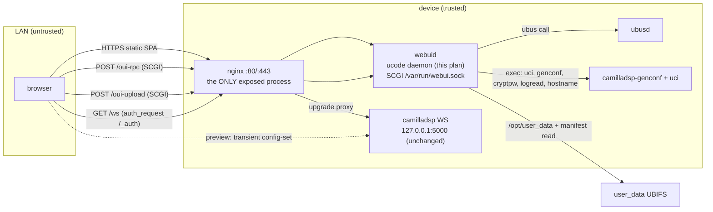

# Plan — webui (nginx front + ucode gateway + vendored OUI frontend)

Status: **COMPLETE — M1..M5 implemented and verified on the rig**
(2026-09-15). Reports: `docs/test-webui-m1..m5.md`, user guide
`docs/webui.md`. Deviations from this plan (all improvements):
user filter steps are uci-native via a genconf extension instead of a
preset daemon (M4); the login view is our own app instead of a second
OUI fork (M5); camillagui under /diag deferred (decision in
`docs/test-webui-m5.md`).

Goal: a minimal, modern web UI for the speaker: linux-credentials login,
camilladsp websocket reachable **only after auth**, basic uci administration,
and policy-constrained user filter editing/uploads for the protected pipeline
(`plan/protected-xover-pipeline.md`). Everything below is grounded in sources
read during the evaluation (OUI master @ 2026-09, ucode = our pinned
8592205, camillaEQ main @ 2026-09) — nothing speculative.

## 0. Requirements

| # | Requirement | Source |
|---|---|---|
| R1 | Login with linux credentials (/etc/shadow; PAM optional later) | user |
| R2 | camilladsp WS routed **only after auth** (WS API has no auth upstream; loopback-bind is today's perimeter — `docs/camilladsp.md` `ws_address`) | user |
| R3 | Basic uci configuration: hostname, timezone, network | user |
| R4 | Upload user filter configurations / FIR files, validated against the protected-pipeline policy | user |
| R5 | Add/remove filters, configure src/mixers — **according to the policies** (manifest-driven) | user |
| R6 | Modern frontend (OUI-like), minimal image impact, no Lua in our stack | user |
| R7 | Page map: login; one combined status route (PTP+DSP+Dante tabs, logs tab); configuration (network, system, audio, filters, files); maintenance (firmware) | user |

## 1. Decision (D18) — options evaluated

| Option | R1 login | R2 WS-gate | R3 uci | R5 policy UI | deps in image | porting | verdict |
|---|---|---|---|---|---|---|---|
| A. LuCI (uhttpd+rpcd) | ✅ sysauth/shadow | ❌ uhttpd can't proxy at all → needs nginx + custom auth subservice | ✅✅ | ❌ no EQ/graph story | uhttpd, rpcd, luci-* | luci feed packaging | no |
| B. OUI stock (lighttpd+lua-eco) | ❌ uci users, **unsalted MD5** | ❌ lighttpd can't enforce oui session on proxied path | ✅ | ⚠️ build from scratch | lighttpd, lua5.4, liblua, libev, lua-cjson, lua-eco+6 modules (~395 KB ipk total, ~9 recipes **not in Buildroot**) | high | no |
| C. OUI + nginx + patched auth endpoint + shadow-fork of rpc.login | ✅ (fork) | ✅ auth_request | ✅ | ⚠️ | as B minus lighttpd, plus nginx | high + Lua fork maintenance | no |
| D. Rust gateway + custom SPA | ✅ sha-crypt | ✅ | ✅ | ✅ | none new (rust already built) | one ~4 MB binary + new codebase | runner-up |
| **E. nginx + ucode gateway + vendored OUI frontend** | ✅ busybox cryptpw via fs.popen | ✅ auth_request + proxy | ✅ generic uci bridge | ✅ manifest-driven | **nginx only** (Buildroot-native) + one ucode flag | ~500–700 lines ucode | **chosen** |

Key verified facts behind the table:

- **OUI's wire contract is tiny and closed-world** (read from
  `oui-ui-core/htdoc/src/oui/index.js` + `oui-rpc-core/files/*.lua`): the SPA
  talks `POST /oui-rpc {method, params}` with methods `challenge/login/
  logout/alive/call`; `call: [sid, mod, func, params]`; modules `ui`
  (get_locale/get_theme/get_menus), `uci` (load/get/set/add/delete/reorder),
  `ubus` (call) + per-app extras. ~16 functions cover the whole core. Apps
  are vendored at a pinned rev → the surface can't drift silently (grep the
  dist, diff against the implementation).
- **OUI's login is not shadow-compatible**: client sends
  `md5(md5(user:pass):nonce)`; verifying requires knowing `md5(user:pass)` —
  impossible from `$6$` shadow hashes. The vendored login app gets a patch
  (POST password; server verifies via cryptpw). It is the **only** forked
  OUI file.
- **OUI menu parser**: a path is either a direct view or a parent of
  children (`parseMenus`: `if (!parent \|\| parent.view) continue`) — so the
  combined status page uses **internal tabs**, not `/status` + `/status/x`
  routes (zero parser patch).
- **OUI has no LuCI-style form DSL** (`Map/ListValue/...`): pages hand-roll
  Element Plus forms over the generic uci bridge — the system page (hostname
  + full zoneinfo picker) is ~100 lines and is vendored as our base. This is
  the transport abstraction only, and that's the layer we reimplement.
- **ucode prerequisites are already in the image** (`br-external/package/
  ucode/ucode.mk`, pinned 8592205 = OpenWrt 25.12.5): `SOCKET_SUPPORT=ON`
  (module provides `socket.create/listen/accept/send/recv`, nonblocking),
  `ULOOP_SUPPORT=ON`, `FS_SUPPORT=ON` (`fs.popen`), `UBUS_SUPPORT=ON`.
  `ptp-monitor` is the in-tree precedent: ucode + uloop + nonblocking
  AF_UNIX streams + ubus publish. Only `UCI_SUPPORT` is OFF (one flag; binds
  libuci, already in image).
- **nginx covers the rest natively**: `ngx_http_scgi_module` (talks to the
  daemon), `auth_request` (gates `/ws` on the daemon's `/_auth`), WS
  upgrade proxying to `127.0.0.1:5000`, `gzip_static` (replaces OUI's
  lighttpd mod_magnet handler), TLS.
- **lua-eco is NOT heavy** (~395 KB ipk for the whole OUI backend stack) —
  option B/E turned on auth model, WS gating, Buildroot porting and Lua
  maintenance, never on weight. Recorded to preempt re-litigation.
- **camillaEQ** (AlfredJKwack, MIT): `client/src/dsp/*.ts`
  (`filterResponse`, `bandwidthMarkers`, `fractionalOctaveSmoothing`) is
  pure TS with zero Svelte deps — vendored for the filters page curves.
  `lib/pipeline*Edit.ts` (add/remove/reorder, 240+ tests) is the reference
  for pipeline edit logic. Their browser→WS-direct, no-auth model is NOT
  adopted — only the math and interaction patterns.
- **camilladsp patch 0003** (`--manifest`) already enforces the protected
  pipeline on **every** config apply — including transient WS previews. The
  webui never re-implements enforcement; it renders the manifest.

Why not D (Rust): E keeps every hard requirement with zero new runtimes, one
new package (nginx), and the backend in a language+pattern already operated
in-tree (ptp-monitor). D remains the fallback if the ucode daemon outgrows
its budget — the wire contract (§4) is Rust-implementable unchanged.

## 2. Architecture



Trust model: nginx is the perimeter; camilladsp stays loopback-only (R2 is
enforced by topology: nothing else listens on the LAN); `webuid` is trusted
local plumbing (exactly the ptp-monitor role).

New in image:

| Component | Size (est.) | Notes |
|---|---|---|
| nginx (+http_ssl, scgi, auth_request, gzip_static) | ~1.2 MB | Buildroot-native, zero porting |
| webuid (ucode daemon + .uc modules) | ~40 KB source | pattern = ptp-monitor |
| ucode `UCI_SUPPORT=ON` | +~15 KB binding | libuci already in image |
| busybox `CRYPTPW` applet | ~10 KB | verify present in our busybox 1.37 fragment |
| SPA dists (OUI core+login, our apps, element-plus) | ~1.5–2 MB | static, gzip_static'd |
| **Total new** | **~3 MB installed** | vs option B ~1 MB + 9 recipes, or D ~4 MB binary |

## 3. Auth, sessions, TLS

- **Verify**: `fs.popen("cryptpw -m sha512 '" … "' '<stored-hash>'")` —
  busybox computes `crypt(pw, stored)` (salt embedded in the hash string);
  constant-time compare with the `/etc/shadow` root field. PAM stays a
  swappable backend behind `webui.login()` (a `pam` variant would link
  linux-pam on musl; deferred — shadow covers R1).
- **Session**: 32-char random token (ucode `rand()` seeded from
  `/dev/urandom` read), RAM map in webuid (gone on respawn — acceptable,
  procd restarts are rare), TTL 300 s sliding via `alive` (the SPA pings
  every 5 s), bound to the client's remote address (OUI semantics, kept:
  token theft across hosts doesn't replay).
- **Cookie**: login also returns a `webui_sid` cookie — `HttpOnly`,
  `SameSite=Strict`, `Secure` when TLS, `Path=/`. The cookie is **only**
  consumed by `/_auth` (nginx auth_request) and thereby `/ws`. The SPA keeps
  using the sid in the JSON body (OUI contract, unchanged).
- **Brute force**: per-address failure counter in webuid → `sleep(1<<min(fails,3))`
  before answering failed logins; counter decays on success.
- **First boot**: today's image is root/no-password. If the shadow root
  field is empty, the login page renders "set root password" instead of
  login (`webui.firstboot` RPC; allowed **only** while the password field is
  empty). Post-setup the page never offers it again.
- **Password change** lives on the system page (verify old → write new via
  `chpasswd`-style popen) — a shipped webui with no way to set root's
  password is a hole.
- **TLS**: uci `webui.tls.{enable,cert,key}` (files under `/etc/webui/`).
  Default v1 ships HTTP-on-LAN with the password-on-wire caveat documented
  (same posture as stock OpenWrt); TLS is an M5 flip, not new code.

## 4. Wire contract (frozen surface)

Endpoints: `POST /oui-rpc`, `POST /oui-upload` (multipart), `GET /ws`
(nginx), `GET /_auth` (nginx internal, SCGI to webuid), static assets.
Error codes: OUI semantics (`-1` not-found … `-6` unknown).

**Top-level** (`/oui-rpc`): `login {username, password}` → `{sid}` (patched:
plaintext password, rides TLS) · `logout {sid}` · `alive {sid}` →
`{alive}` · `call [sid, mod, func, params]`. (`challenge` is **dropped** —
the MD5 dance is shadow-incompatible; the login app patch removes its use.)

**Modules** (`call`):

| mod | funcs | backend |
|---|---|---|
| `ui` | `get_locale`, `get_theme`, `get_menus` | reads `/usr/share/webui/menu.d/*.json`; locale/theme in uci `webui` |
| `uci` | `load get set add delete reorder` | ucode-uci cursor; **write ACL**: only `{system network camilladsp inferno webui}` are writable (generic set on arbitrary configs = config injection — read stays open) |
| `ubus` | `call` | pass-through (ubus ACL = whatever the object allows; loopback caller) |
| `status` | `all` | fan-out: `ubus ptp-monitor status` + `ubus camilladsp status` + `ubus system board` in one reply (status page = 1 request/tick) |
| `dsp` | `status get_settings save_settings get_saved_filters save_filters get_pipeline` | persistent DSP controls and manifest-driven saved filters, §9; realtime EQ owns `/ws` separately |
| `files` | `list read delete activate` + upload | `/opt/user_data/{filters,fir,configs}`, §9 |
| `logs` | `read {n, filter}` | `fs.popen("logread")` tail |
| `webui` | `firstboot set_password reboot` | §3 |

The surface is **append-only by rule**: new pages may add a module or
functions, never widen an existing one; the uci/ubus generic bridges stay
the only config path.

## 5. webuid — ucode daemon (`/usr/bin/webuid`)

- **Process**: procd service (`/etc/init.d/webui`), respawn, root (needs
  shadow read, `uci commit`, genconf exec). SCGI socket
  `/var/run/webui.sock` (tmpfs via `/var→/tmp`), `root:nginx 0660` — nginx's
  worker user connects, nothing else can.
- **SCGI server**: `socket.create(AF_UNIX, SOCK_STREAM|SOCK_NONBLOCK)` +
  `listen/accept` on uloop — the ptp-monitor skeleton. Netstring header
  parse + `CONTENT_LENGTH` body read; one request per connection (SCGI has
  no keep-alive; nginx reconnects). Single-threaded uloop is ample for an
  admin UI.
- **Dispatch**: JSON parse (ucode core) → method table → module `.uc` files
  under `/usr/share/webui/rpc/` loaded once at start (no hot reload).
- **Exec helpers** (all via `fs.popen`, all root-privileged):
  `cryptpw` (login), `camilladsp-genconf` (apply), `hostname -F` (apply),
  `logread` (logs), `chpasswd`-equivalent (password set). No shell string
  interpolation of user input into these — argv arrays only.
- **Apply path** (config doctrine: uci → genconf → process, unchanged):
  any config write = `uci set/commit` → regen if `camilladsp`/`inferno`
  affected → targeted init reload. `reloadConfig()` sugar fires
  `ubus call service event config.change` (procd object — verify our
  `/etc/init.d/system` reacts; else direct `hostname -F` fallback).
- **No WS client in webuid**: transient previews go browser → `/ws` proxy →
  camilladsp directly (patch 0003 still enforces the manifest on those
  applies — preview can never escape the policy).

## 6. nginx (`/etc/nginx/conf.d/webui.conf`)

```nginx
server {
    listen 80;                          # + listen 443 ssl; (uci-driven)
    root /usr/share/webui/ui;
    gzip_static on;  client_max_body_size 16m;
    add_header Content-Security-Policy "default-src 'self'; connect-src 'self' ws: wss:";

    location /oui- { scgi_pass unix:/var/run/webui.sock; include scgi_params; }
    location = /_auth { internal; scgi_pass unix:/var/run/webui.sock; ... }  # GET, cookie → 204/403

    location /ws {
        auth_request /_auth;
        proxy_pass http://127.0.0.1:5000;
        proxy_http_version 1.1;
        proxy_set_header Upgrade $http_upgrade;
        proxy_set_header Connection "upgrade";
        proxy_read_timeout 3600s;
    }
}
```

(Exact `scgi_params` and TLS directives finalized in implementation; the
block above fixes the shape.)

## 7. Frontend — vendoring & apps

- **OUI upstream**: `deps/oui` submodule at a pinned rev + our patch dir
  (`br-external/package/webui/patches/`, generated fuzz-0 like all our
  patches). Patched: **login app only** (password POST, no challenge dance).
  Nothing else is forked — the backend contract is reimplemented, not
  patched into existence.
- **Build**: `WEBUI_BUILD_CMDS` runs `npm ci && vite build` per app with
  **host-nodejs** (host-only toolchain — zero node in the image, keeps the
  build reproducible from pinned sources; alternative: CI-built dists
  committed under `deps/` if host-nodejs hurts build time — decide at M1).
- **Custom apps** (in `br-external/package/webui/src/`, built against
  `oui-ui-core`): `webui-app-status`, `-network`, `-system` (vendored
  upstream system page + password/reboot), `-audio`, `-filters`, `-files`,
  `-firmware` (optional M5, upstream upgrade app as reference). Each =
  `menu.json` + `index.vue` + vite config, mirroring OUI app layout.
- **Filters page deps**: vendored copy of camillaEQ
  `client/src/dsp/{filterResponse,bandwidthMarkers,fractionalOctaveSmoothing}.ts`
  (MIT headers preserved, NOTICE file, pinned-rev provenance comment) +
  reference to its `lib/pipeline*Edit.ts` tests for our edit logic. Canvas/
  SVG rendering directly (no chart lib), like camillaEQ.
- **camillagui (official DSP GUI)**: optional, served under `/diag/` behind
  the same auth as an expert/diagnostic view. Safe by construction — patch
  0003 rejects any manifest-violating apply regardless of client. Decide at
  M4 whether it earns its 1 MB.

## 8. Page specs

```
/login                      patched OUI login (or first-boot password set)
/status                     landing page after login — tabs: [ PTP | DSP | Dante | Logs ]
  PTP tab                   ubus ptp-monitor: lock state, offset sparkline, GM identity
  DSP tab                   ubus camilladsp: config state, rate, queue, volume (+slider via volume_set)
  Dante tab                 uci inferno + rx_subscriptions (read-only v1)
  Logs tab                  logs.read tail, 2 s poll while visible
/config/network             uci network: static/dhcp on mgmt iface; lockout warning
/config/system              vendored system page: hostname, timezone, + password change, reboot
/config/audio               uci camilladsp+inferno basics; source-select presets (user_gains);
                            further knobs rendered only if the policy exposes them
/config/filters             flagship page — manifest-driven slot editor, §9
/config/files               upload/list/activate configs & FIRs; quarantine view
/maintenance/firmware       (optional M5) fw upload, factory reset (keep/wipe /opt/user_data)
```

Rules: read = ubus, write = uci, live = `/ws`. No page adds backend surface
beyond §4 (apps are free, contract is frozen).

## 9. Protected-pipeline integration

The manifest (`--make-manifest`, e.g.
`configs/camilladsp_protected_2way.manifest.json`) is the page schema:

- `dsp.get_saved_filters()` returns it; the page renders editors **only** for
  `child` groups (`allow` list, `max_steps`, `channels`) and `user_gains`
  mixers. Locked groups render as read-only context (structure visible,
  params hidden — vendor may flip an `expose` flag later).
- `dsp.save_filters(steps)`: daemon validates vs manifest (allow/max/
  channels) → writes user steps as uci sections → commit → genconf →
  reload. Genconf re-validates; patch 0003 enforces at apply. Three layers,
  webuid is just the first (never the only one).
- **Preview vs Save** (matches `docs/radio-over-dante.md` §"transient"):
  preview = page pushes a candidate config over `/ws` (transient, instantly
  audible, policy-enforced, lost on reload); save = `dsp.save_filters` (uci →
  genconf → apply, survives reboot). The UI shows which mode is active.
- **Mixer / SRC**: `dsp.set_source` applies `user_gains` entries (source-select
  presets: 100/0, 0/100, 50/50 = gain presets of locked `srcmix`). Policy-
  spec extension (coordinated with protected-xover §4, manifest v3):
  `user_gains: {srcmix: {presets: [...] , free: {min,max}}}` so constrained
  vs free mixer gain is product data, not UI logic. SRC processor params,
  if ever exposed, ride the same mechanism.
  - **Persistent DSP page**: one two-tab page: `General` (samplerate,
    chunksize, format, device bindings, persistent source selection and
    volume) and `Filters` (saved UCI child-slot filters only). Neither tab
    performs transient websocket edits.
  - **Realtime EQ page**: separate from persistent filters. It uses the
    authenticated `/ws` proxy for temporary edits within `child` subchains,
    renders a CamillaEQ-inspired response graph, and has an explicit
    `Save to UCI` action. Numeric input is canonical; drag and scroll-wheel
    adjustment are convenience controls only.
  - **Spectrum**: use camilladsp patch
    `0002-add-built-in-fft-spectrum-analyzer.patch`, not CamillaEQ's
    filter-bank hack. The patch exposes source/capture and destination/
    playback FFT spectra through `GetSpectrumLevels` and runtime controls
    `GetSpectrumConfig`, `SetSpectrumEnabled`, `SetSpectrumChannel`,
    `SetSpectrumBins`, `SetSpectrumSmoothing`, `SetSpectrumFftSize`, and
    `SetSpectrumInterval`. It runs in a dedicated thread and is near-zero
    cost while disabled, so the EQ page owns an enable/disable toggle.
  - **Pipeline page**: Vue Flow diagram derived from the policy model.
    Child slots are editable nodes; each locked subchain is one opaque
    protected node. It never exposes individual locked filters, parameters
    or edit handles.
- **Files**: `POST /oui-upload` → webuid sanitizes (basename only), size
  cap, stores under `/opt/user_data/…`, validates via genconf dry-run;
  failures land in a quarantine list with the error; `activate` swaps into
  place + applies.

## 10. Buildroot / integration changes

| Change | File(s) |
|---|---|
| nginx package on + http_ssl/scgi/auth_request/gzip_static modules | defconfig (`BR2_PACKAGE_NGINX_*`) |
| `UCI_SUPPORT=ON` | `br-external/package/ucode/ucode.mk` (one line) |
| busybox `CRYPTPW` applet | `br-external/board/rk3506qemu/busybox-fragment` |
| webui package (daemon source, rpc .uc, nginx conf, init script, uci defaults, app sources, OUI submodule + patches, build via host-nodejs) | `br-external/package/webui/` |
| menu dists → `/usr/share/webui/ui` | post-install in webui.mk |
| uci default for `webui` config (tls off, locale, theme) | `rootfs-overlay/etc/uci-defaults/` |
| plan.md D18 entry + §11 next-up | `plan/plan.md` |
| user-facing doc | `docs/webui.md` (written at M5) |

## 11. Security model

| Threat | Mitigation |
|---|---|
| LAN attacker hits camilladsp directly | impossible by topology: WS loopback-only; nginx is the only listener; `/ws` behind auth_request |
| Session token theft | RAM-only, addr-bound, 300 s TTL, HttpOnly+SameSite=Strict(+Secure) cookie, logout |
| Password brute force | per-addr exponential sleep; root-only accounts; shadow hashes never leave webuid |
| CSRF on `/oui-rpc` | sid travels in JSON body (not ambient auth); cookie exists solely for `/_auth` and is SameSite=Strict — a cross-site page can neither read responses (CORS) nor carry the cookie |
| XSS | vendored pinned SPA, CSP `default-src 'self'; connect-src 'self' ws: wss:`, no user HTML rendered |
| Config injection via generic uci bridge | write ACL allowlist (§4); uci `import` not exposed |
| Malicious uploads | basename-only paths, size cap, genconf validation before activation, quarantine dir, no eval of file content |
| Root daemon compromise surface | ~700 lines audited ucode, argv-array execs only, no network listener beyond the 0660 unix socket |
| Plaintext password on HTTP (pre-TLS) | documented v1 posture; M5 TLS flip via uci |

## 12. Test plan / milestones (DoD on the bridge rig)

- **M1 — skeleton**: nginx+webuid run under procd on QEMU; `curl` login with
  real shadow password → sid; `alive` keeps it; `/_auth` 204 with cookie /
  403 without; `websocat` through `--fwd` to `/ws` succeeds only with
  cookie; wrong password → 401 + measurable sleep. DoD: scripted in
  `docs/test-webui-m1.md`-style checklist, green twice.
- **M2 — status**: on the two-guest bridge rig, `/status` tabs show real
  ptp-monitor lock/offset, camilladsp state + volume slider, inferno
  subscription table; 1 request/tick verified (nginx access log).
- **M3 — config**: system page sets hostname (visible in `ubus call system
  board` + banner) and timezone (`/etc/TZ`, sysntpd restart); network page
  flips mgmt iface dhcp↔static with lockout warning; `uci changes` clean
  after apply (no deltas left).
- **M4 — filters v1**: against the reference protected policy: add/remove/
  reorder within `allow`+`max_steps`; negative tests (forbidden type,
  over-limit steps, locked-step edit attempt) rejected at webuid **and**
  still enforced with patch 0003 via direct WS; preview audible via `/ws`
  and transient (lost on camilladsp reload); save survives reboot (uci
  sections + genconf output diff); files upload of a valid FIR config
  activates, a malformed one quarantines with the genconf error.
- **M5 — hardening**: TLS on via uci + cert; first-boot password flow;
  CSP/cookie headers verified; login rate-limit test; `docs/webui.md`;
  decision on camillagui under `/diag/`.

## 13. Files touched (estimate)

```
br-external/package/webui/{Config.in,webui.mk,webuid.uc,rpc/*.uc,
    src/webui-app-*/*,patches/0001-login-password-post.patch,
    rootfs-overlay/etc/{init.d/webui,nginx/conf.d/webui.conf,config/webui,
    uci-defaults/50-webui}}
br-external/package/ucode/ucode.mk          (UCI_SUPPORT=ON)
br-external/board/rk3506qemu/busybox-fragment  (CRYPTPW)
configs/*_defconfig                          (nginx, webui, host-nodejs)
deps/oui                                     (submodule, pinned)
plan/plan.md                                 (D18 + next-up)
docs/webui.md, docs/test-webui-*.md
```

Estimated effort: M1–M3 ≈ 2 weeks, M4 ≈ 1–2 weeks (filters page is the
meat), M5 ≈ 1 week.

## 14. Risks / open questions

- **OUI upstream churn**: pinned submodule; contract frozen in §4; the only
  forked file is the login app. Upgrading OUI is a deliberate diff exercise.
- **busybox `CRYPTPW`**: verify the applet in our fragment (busybox ≥1.35
  has it); fallback = 30-line C helper linked to musl `crypt()`.
- **WS proxy behavior of camilladsp v4 through nginx** (chunked/upgrade
  quirks): M1 gate — websocat e2e before anything else is built on it.
- **host-nodejs build cost** vs committed dists: measure at M1; both paths
  keep node out of the image.
- **manifest v3 extension** (`user_gains` presets/free ranges): coordinated
  change with protected-xover-pipeline §4 — needed before `/config/audio`
  grows beyond source-select presets.
- **Root daemon posture**: accepted for v1 (small surface, argv-only execs);
  revisit capabilities split (shadow-read vs uci-write) only if the surface
  grows.
- **Spectrum overlay**: supported by camilladsp's built-in FFT patch rather
  than a filter-bank subchain. Measure its 1024/2048/4096/8192 FFT choices on
  RK3506 before changing the EQ page defaults; start with patch defaults
  (2048, 10 Hz, disabled).
